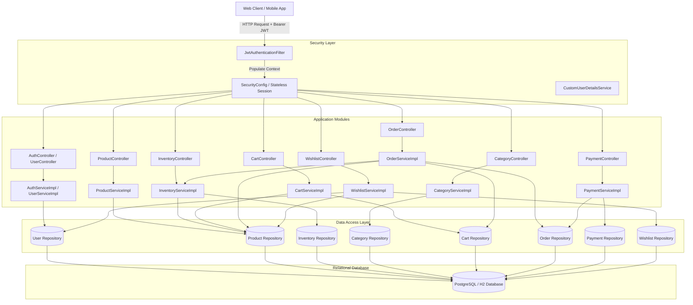
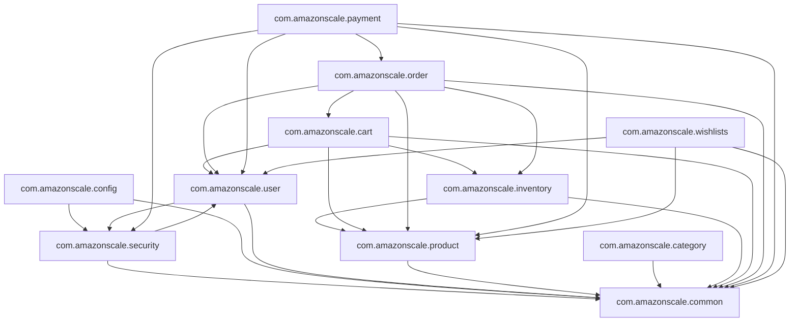
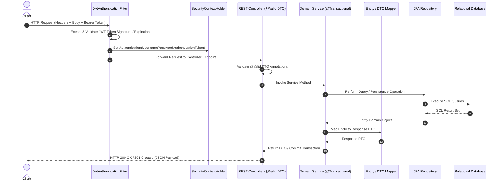
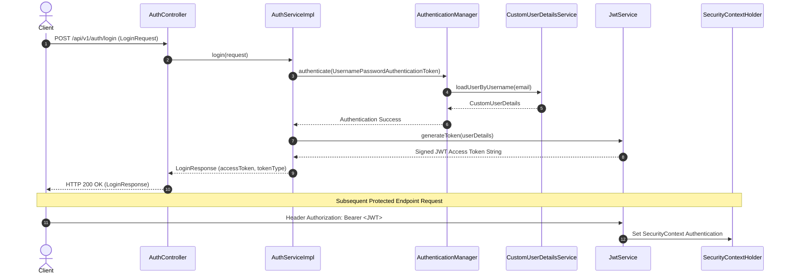
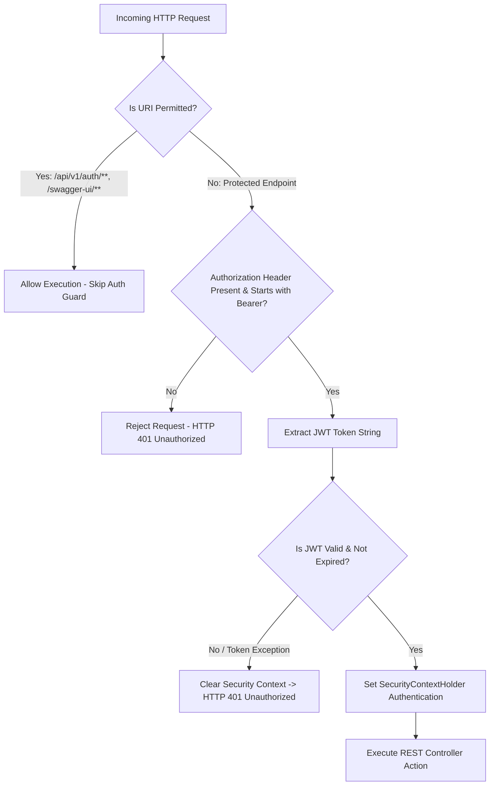
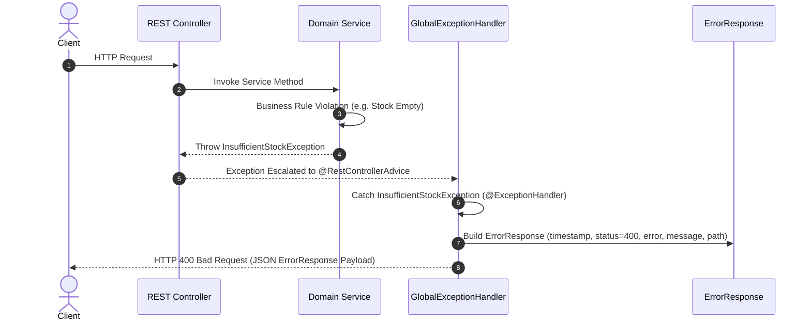
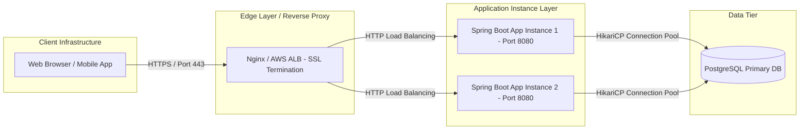

# AmazonScale Architecture Specification

---

## Related Documentation

- [Documentation Index](README.md)
- [Security Architecture](Security.md)
- [Database Schema Specification](Database-Schema.md)
- [REST API Specification](API-Design.md)
- [Common & Infrastructure Module](Common.md)
- [User Module](User.md) | [Product Module](Product.md) | [Category Module](Category.md) | [Inventory Module](Inventory.md) | [Cart Module](Cart.md) | [Order Module](Order.md) | [Payment Module](Payment.md) | [Wishlists Module](Wishlist.md)

---

# Overview

### Purpose of the Architecture
**AmazonScale** is an enterprise-grade e-commerce backend platform engineered for performance, modularity, strict data consistency, and stateless security. The backend is built using **Java 21** and **Spring Boot 4.0.7**.

### System Goals
1. **Domain Isolation**: Maintain clean separation of responsibilities through domain-driven package organization.
2. **Stateless Security**: Eliminate server-side HTTP session state by using cryptographically signed JSON Web Tokens (JWT).
3. **Transaction Safety**: Guarantee financial and inventory integrity using declarative transaction management (`@Transactional`).
4. **Predictable REST Contracts**: Provide clean HTTP endpoints with uniform response formatting and error handling.

### Architectural Principles
- **Package-by-Feature**: Code is organized around business features rather than technical layers.
- **Strict Layering**: Clear flow of responsibility: REST Controllers → Domain Services → JPA Repositories → Relational Database.
- **Fail-Fast Validation**: Incoming requests are validated at the controller boundary using JSR-303 annotations.
- **Centralized Exception Translation**: All domain exceptions are caught by `@RestControllerAdvice` to produce consistent JSON error structures.

---

# High-Level Architecture

The backend operates as a modular monolith. Request traffic is intercepted by security filters before reaching feature controllers, services, repositories, and the database layer.



---

# Package Structure

The codebase is structured under `com.amazonscale`:

```
com.amazonscale
├── cart              Shopping cart state management, line items, cart clearing
├── category          Hierarchical category taxonomy, parent-child tree mapping
├── common            Cross-cutting response DTOs, global exception handling
├── config            Spring configuration (Security, Security Beans, OpenAPI)
├── inventory         Warehouse stock tracking, stock reservation, low stock guards
├── order             Order creation, item snapshots, tax/shipping logic, state machine
├── payment           Payment processing, transaction state management, refunds
├── product           Catalog management, product CRUD, price & stock attributes
├── security          JWT authentication filter, token service, UserDetails adapters
├── user              User identity, registration, BCrypt password encoding, roles
└── wishlists         Custom user wishlists, wishlist items, priority & notes management
```

---

# Package-by-Feature Design

### Rationale
Package-by-feature groups all related classes (Controllers, Services, Repositories, Entities, DTOs, Mappers, Exceptions) together within the same domain package. This increases cohesion, simplifies developer navigation, and reduces cross-package coupling.

### Feature Modules
- **`com.amazonscale.user`**: Identity management, user registration, authentication credentials.
- **`com.amazonscale.product`**: Catalog items, pricing, description, stock status.
- **`com.amazonscale.category`**: Hierarchical classification trees with parent-child linkages.
- **`com.amazonscale.inventory`**: Physical warehouse stock management, reserved stock, thresholds.
- **`com.amazonscale.cart`**: In-memory and persisted shopping cart line items.
- **`com.amazonscale.order`**: Transactional order processing and fulfillment state transitions.
- **`com.amazonscale.payment`**: Financial transaction processing, gateway interaction, refunds.
- **`com.amazonscale.wishlists`**: Multiple custom wishlists, wishlist item prioritization.
- **`com.amazonscale.common`**: Shared response wrappers and exception handling.
- **`com.amazonscale.security`**: Security filters, JWT tokens, Spring Security integration.
- **`com.amazonscale.config`**: Centralized Spring Framework bean declarations.

### Module Dependency Diagram



---

# Layered Architecture

Within each feature module, responsibilities follow strict layer isolation:

1. **Controllers (`@RestController`)**: Parse HTTP requests, validate request bodies (`@Valid`), call services, return HTTP status codes and DTOs.
2. **Services (`@Service`)**: Implement business logic, manage transaction boundaries (`@Transactional`), enforce domain rules, execute mappings.
3. **Repositories (`JpaRepository`)**: Perform database CRUD and custom query operations.
4. **Entities (`@Entity`)**: Map relational database tables using JPA/Hibernate annotations.
5. **DTOs (Data Transfer Objects)**: Encapsulate request and response payloads, isolating domain entities from API contracts.
6. **Mappers**: Convert between Entities and DTOs deterministically.
7. **Utilities**: Provide helper functions (e.g. JWT parsing, date calculations).
8. **Configuration (`@Configuration`)**: Initialize infrastructure beans (PasswordEncoder, SecurityFilterChain).
9. **Security**: Validate JWT tokens and populate Spring Security `SecurityContext`.
10. **Validation**: Enforce constraints using JSR-303 annotations (`@NotNull`, `@NotBlank`, `@Size`, `@Positive`).
11. **Exceptions**: Custom runtime domain exceptions handled by `GlobalExceptionHandler`.

---

# Request Lifecycle



---

# Authentication Lifecycle



---

# Authorization Flow



---

# Dependency Graph


---

# Data Flow

```mermaid
flowchart LR
    Client Request --> Controller
    Controller --> DTO Validation
    DTO Validation --> Service
    Service --> Entity Mapping
    Entity Mapping --> Repository
    Repository --> Database SQL
    Database SQL --> Result Set
    Result Set --> Entity
    Entity --> Response DTO
    Response DTO --> JSON HTTP Response
```

---

# Exception Flow



---

# Configuration

- **Spring Boot Configuration**: `application.yml` configures server port (`8080`), database URL, Hibernate DDL auto behavior, and logging levels.
- **Profiles**: Configured for standard development and testing profiles.
- **Bean Configuration**: `SecurityBeansConfig` defines the `BCryptPasswordEncoder` bean. `OpenApiConfig` initializes Swagger/OpenAPI specifications.
- **Security Configuration**: `SecurityConfig` sets up `SecurityFilterChain`, stateless sessions, permitted paths, and inserts `JwtAuthenticationFilter`.

---

# Database Interaction

- **JPA & Hibernate**: Used for Object-Relational Mapping with entity lifecycle annotations (`@PrePersist`, `@PreUpdate`).
- **Repositories**: Standard `JpaRepository` interfaces providing CRUD and custom derived query methods.
- **Transactions**: Service methods are annotated with `@Transactional`. Read operations use `@Transactional(readOnly = true)`.
- **Relationships**: Configured using `@OneToOne`, `@OneToMany`, `@ManyToOne`, with explicit `@JoinColumn` definitions.
- **Lazy Loading**: `FetchType.LAZY` is applied across entity relationships to prevent unnecessary N+1 queries.
- **Cascade**: `CascadeType.ALL` with `orphanRemoval = true` is used for parent-child aggregates (e.g., `Cart` → `CartItem`, `Order` → `OrderItem`, `Wishlist` → `WishlistItem`).

---

# Testing Architecture

- **Unit Testing**: Standard JUnit 5 tests covering Services, Mappers, and Controllers.
- **Mocking**: Mockito (`@Mock`, `@InjectMocks`, `Mockito.when()`) used to isolate dependencies during unit tests.
- **Spring Boot Test**: MockMvc used for REST API endpoint verification.
- **Database Testing**: In-memory H2 database utilized during automated test execution (`mvn clean test`).

---

# Scalability

Not implemented.

*(The backend is currently structured as a single-instance stateless monolithic service. Distributed caching, message queues, and load balancing are not implemented.)*

---

# Deployment Architecture



---

# Known Limitations

1. **Unpaginated Collection Endpoints**: Endpoints like `/api/v1/products` return raw lists rather than Spring Data `Page` objects.
2. **Dual Stock Maintenance**: Stock counts are stored in both `Product.stock` and `Inventory.quantity`, requiring synchronized manual updates.
3. **Payment Header Dependency**: `PaymentController` expects an explicit `X-User-Id` header rather than deriving the identity solely from the JWT context.
4. **Missing Method Security**: `@EnableMethodSecurity` is not enabled in `SecurityConfig`.

---

# Future Improvements

For detailed recommendations and technical debt issues identified during architecture verification, refer to:

- [Architecture Recommendations](recommendations/Architecture-Recommendations.md)
