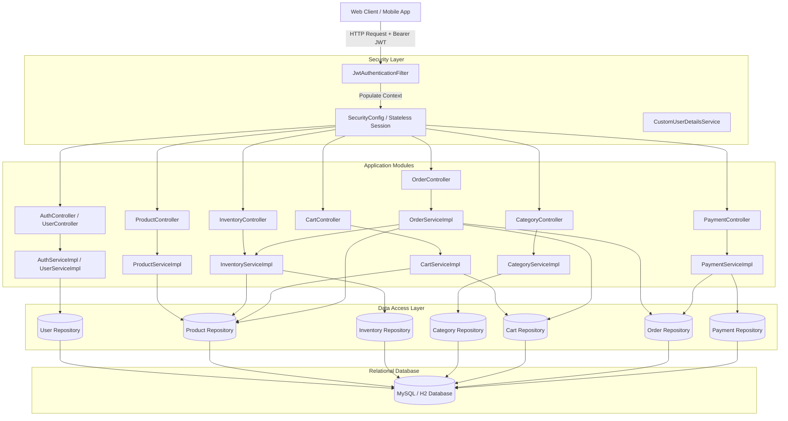
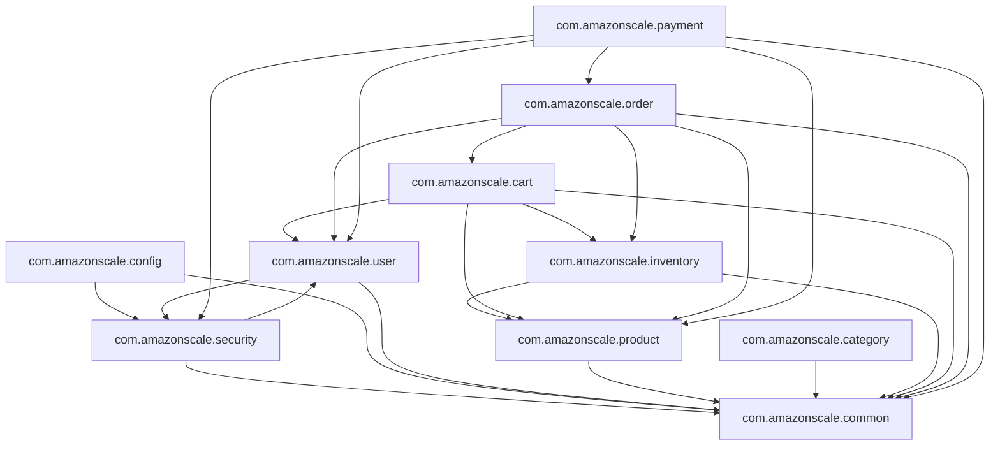
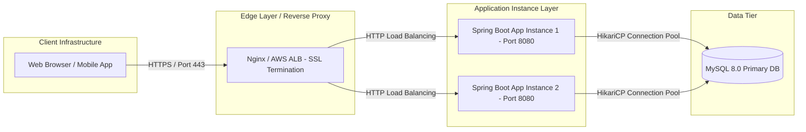
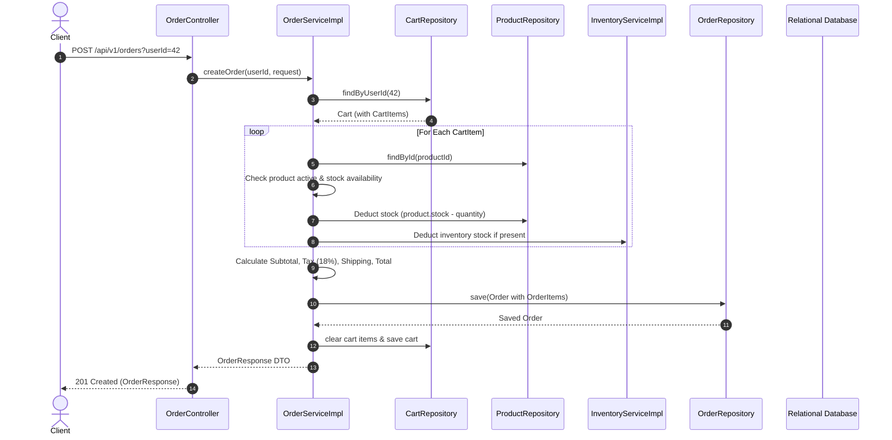
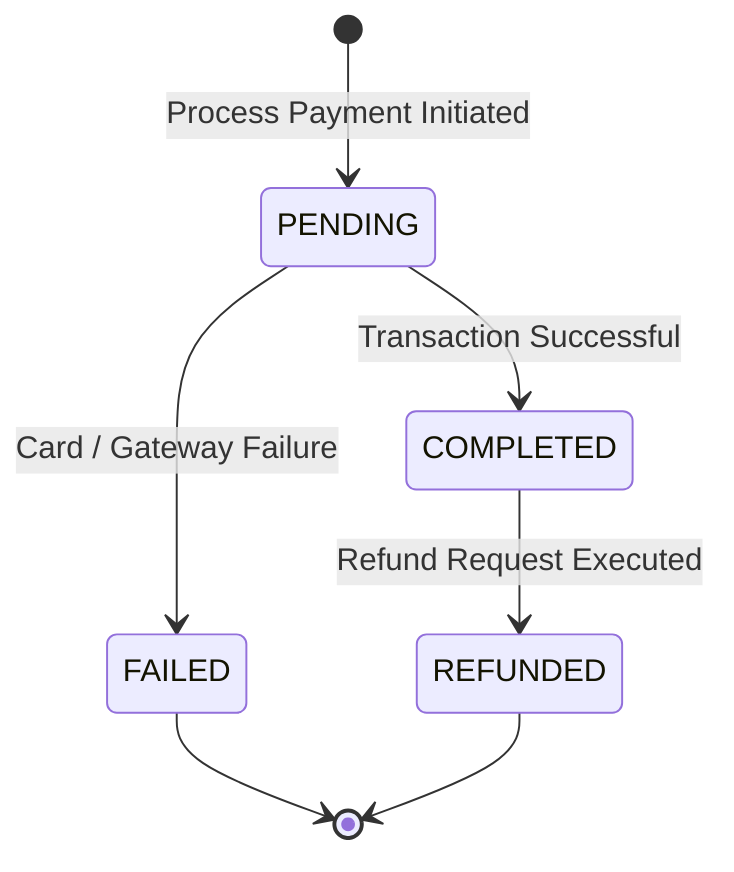
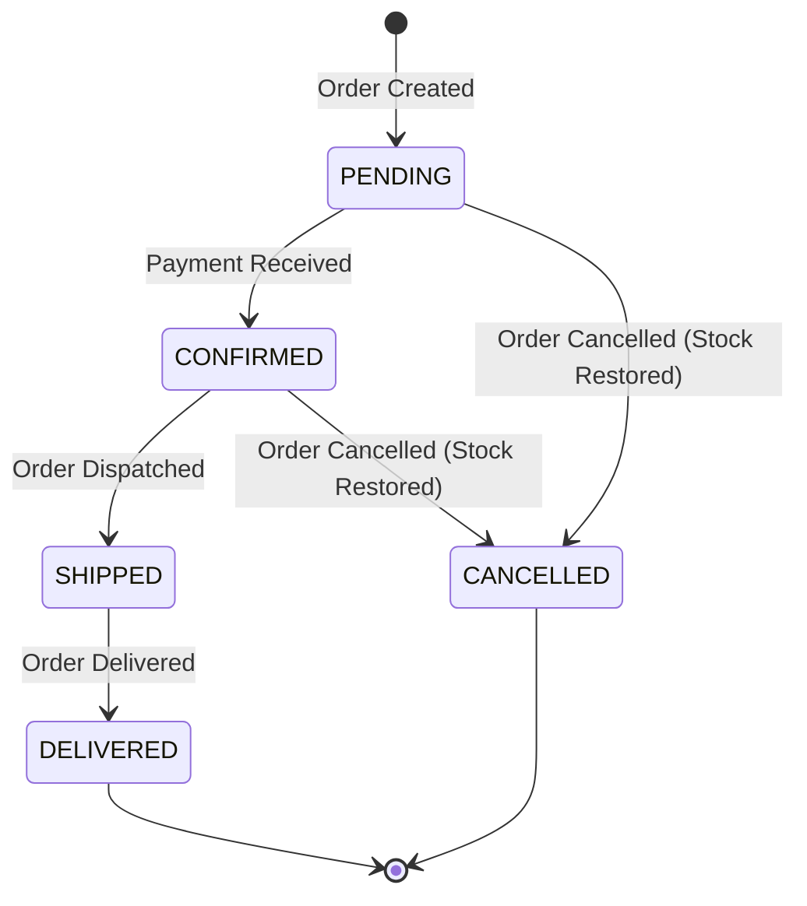
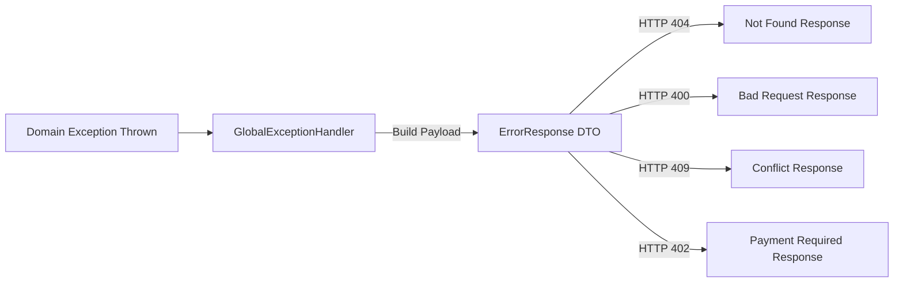

# AmazonScale System Architecture Document

---

## Related Documentation

- [Documentation Index](README.md)
- [Security Architecture](Security.md)
- [Database Schema Specification](Database-Schema.md)
- [REST API Specification](API-Design.md)
- [Common & Infrastructure Module](Common.md)
- [User Module](User.md) | [Product Module](Product.md) | [Category Module](Category.md) | [Inventory Module](Inventory.md) | [Cart Module](Cart.md) | [Order Module](Order.md) | [Payment Module](Payment.md)

---

## Executive Summary & System Goals

**AmazonScale** is a high-performance, modular enterprise e-commerce backend platform built using **Java 21** and **Spring Boot 4.0.7**. The system is architected around clean domain separation, stateless JWT security, robust validation guards, transaction safety, and predictable REST API contracts.

### Core Architectural Principles
1. **Modular Monolith by Domain**: Components are structured strictly into modular domain packages (`cart`, `category`, `common`, `inventory`, `order`, `payment`, `product`, `security`, `user`).
2. **Stateless Security**: Zero HTTP session state stored on backend servers; security context is reconstituted per request using signed JWT bearer tokens.
3. **Strict Layering**: Clean division between Controller (HTTP/REST), Service (Transaction & Business Logic), Repository (Data Access), Entity (ORM), and DTO (API Contracts) layers.
4. **Resilient Error Framework**: Centralized `@RestControllerAdvice` catching custom domain exceptions and producing consistent `ErrorResponse` payloads.

---

## High-Level Architecture Diagram



---

## Package & Module Architecture

The codebase follows a package-by-feature layout under `com.amazonscale`:

```
com.amazonscale
├── cart              Shopping cart management, line items, cart cleanup
├── category          Hierarchical category taxonomy & parent-child trees
├── common            Cross-cutting response DTOs & global exception handling
├── config            Spring configuration (Security, Security Beans, OpenAPI)
├── inventory         Warehouse stock tracking, stock reservation, low stock guards
├── order             Order creation state machine, item snapshots, tax/shipping logic
├── payment           Payment transaction processing, state management, refunds
├── product           Catalog management, product CRUD, price & stock attributes
├── security          JWT authentication filter, token service, UserDetails adapters
└── user              User identity, authentication, registration, role definitions
```

---

## Package Dependency Graph



---

## Deployment Architecture



- **Runtime Runtime**: Java 21 LTS with embedded Tomcat web container.
- **Data Tier**: Primary relational store MySQL 8.0 with HikariCP connection pooling; H2 in-memory DB utilized for automated unit/integration testing.
- **Stateless Application Tier**: Application instances maintain zero session state in local memory, enabling seamless horizontal scalability behind a load balancer.

---

## Security & Authentication Architecture

Security is implemented via Spring Security and JJWT:

### Filter Chain Sequence
1. **Request Interception**: `JwtAuthenticationFilter` (extending `OncePerRequestFilter`) intercepts every incoming HTTP request.
2. **Token Parsing**: Reads standard `Authorization: Bearer <token>` header.
3. **Claim Extraction & Validation**: Calls `JwtService.extractUsername()` and verifies token signature and expiration against `CustomUserDetails`.
4. **Context Population**: Populates `SecurityContextHolder.getContext().setAuthentication(authToken)`.
5. **Permitted Endpoints**: Public access granted to `/api/v1/auth/**`, `/swagger-ui/**`, `/swagger-ui.html`, `/v3/api-docs/**`, `/v3/api-docs.yaml`. All other endpoints require authentication (`anyRequest().authenticated()`).

### End-to-End Request Lifecycle & Security Flow


---

## Transaction Boundaries & Data Management

- **Service-Level Boundary**: Transactions are managed at the service implementation layer using Spring's `@Transactional` annotation.
- **Read-Only Optimization**: Read methods (e.g. `getProduct`, `getCart`, `getOrdersByUserId`) are explicitly annotated `@Transactional(readOnly = true)` to skip dirty-checking overhead and optimize database lock contention.
- **Automated Rollbacks**: Transactions automatically roll back on unhandled `RuntimeException` instances (including all custom domain exceptions like `InsufficientStockException`, `EmptyCartException`, `CategoryAlreadyExistsException`).
- **Isolation Level**: Standard `READ_COMMITTED` default isolation level ensured by standard Relational Database connection configurations.

---

## Key Domain Workflows & Business Rules

### 1. Order Checkout Workflow (`OrderServiceImpl.createOrder`)


---

### 2. Payment State Machine (`PaymentServiceImpl`)

Payment records undergo strictly controlled state transitions:



- **`COMPLETED`**: Reached when payment processing succeeds.
- **`FAILED`**: Occurs if transaction fails or simulated payment failure is triggered (`PaymentFailedException`).
- **`REFUNDED`**: Transitioned from `COMPLETED` upon calling `POST /api/v1/payments/{id}/refund`.

---

### 3. Order Status State Machine (`OrderServiceImpl`)

Order status follows an explicit non-cyclical lifecycle:



---

## Global Exception Handling Framework

`GlobalExceptionHandler` (`@RestControllerAdvice`) provides uniform HTTP response generation across all modules:



---

## Automated Testing Strategy & Metrics

The project maintains an extensive test suite leveraging **JUnit 5**, **Mockito**, and **Spring MockMvc**.

### Automated Test Coverage Summary

| Module | Test Classes | Test Code Lines | Key Test Focus |
|--------|--------------|-----------------|----------------|
| **Cart** | 10 | 569 | Cart creation, add/update/delete items, total price calculation, user cart isolation |
| **Category** | 10 | 566 | Category CRUD, self-parenting hierarchy loop guard, name uniqueness |
| **Common** | 2 | 263 | Global exception handler response translation, ErrorResponse DTO builder |
| **Config** | 3 | 94 | OpenAPI bean creation, SecurityBeansConfig, SecurityConfig |
| **Inventory** | 10 | 536 | Inventory CRUD, available stock calculations, reservation guards, deletion protection |
| **Order** | 10 | 572 | Order creation, stock deduction, tax/shipping logic, status state transitions, cancellation |
| **Payment** | 10 | 549 | Payment processing, transaction verification, refund state rules, X-User-Id validation |
| **Product** | 10 | 548 | Product CRUD, price/stock validation, active status filtering |
| **Security** | 4 | 316 | JWT token parsing/signing, expiration rules, filter execution, UserDetails mapping |
| **User** | 13 | 573 | Registration, BCrypt password encoding, duplicate email detection, login JWT issuance |
| **TOTAL** | **82** | **4,586** | **Full application coverage** |

---

## Technical Debt & Future Enhancement Roadmap

### Technical Debt Identified
1. **`ProductMapper` Bug**: `ProductMapper.toResponse` assigns `response.setImageUrl(product.getImageUrl())` incorrectly in `product` entity field.
2. **Dual Stock Maintenance**: Stock quantities exist separately in `Product.stock` and `Inventory.quantity`, requiring explicit manual synchronization during order checkout.
3. **Category Hierarchy Circularity Check**: Currently only checks direct parent (`id == parentCategoryId`). Recursive ancestor verification is required for deep cycles (`A -> B -> C -> A`).
4. **Header Inconsistency in Payment Module**: Payment endpoints require `X-User-Id` header rather than extracting authenticated identity directly from `SecurityContextHolder`.
5. **Missing Role-Based Method Security**: `@EnableMethodSecurity` is omitted from `SecurityConfig`, preventing `@PreAuthorize("hasRole('ADMIN')")` annotations from restricting admin endpoints.

### Future Roadmap
- **Pagination & Sorting**: Implement `Pageable` parameters across all `getAll` endpoints (`/api/v1/products`, `/api/v1/inventory`, `/api/v1/categories`, `/api/v1/orders`).
- **Role-Based Access Control (RBAC)**: Protect write/delete endpoints in Product, Inventory, and Category modules to allow access only to `ADMIN` and `SELLER` roles.
- **Refresh Token Support**: Implement OAuth2/JWT refresh token rotation to allow secure long-lived user sessions.
- **Distributed Caching**: Integrate Redis for catalog and category caching to reduce database read pressure.
talog and category caching to reduce database read pressure.
