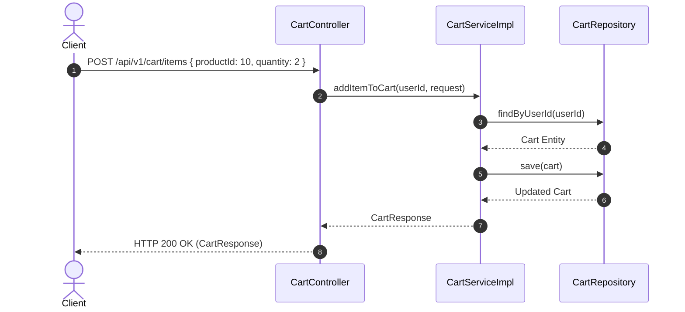
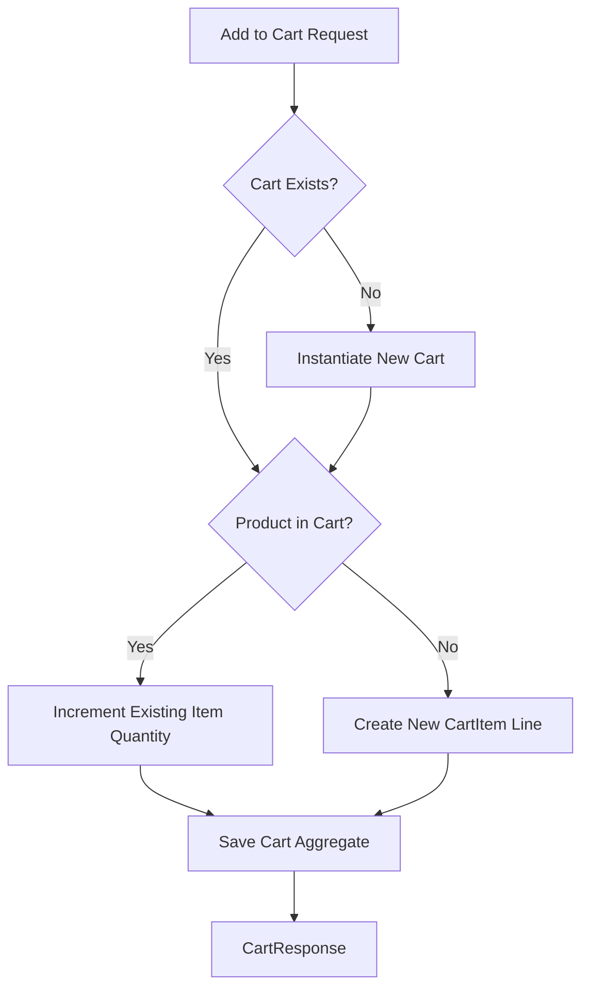

# Cart Module Specification

---

## 1. Overview
The **Cart Module** manages shopping cart state, line item additions, quantity modifications, subtotal calculations, and cart clear operations for **AmazonScale**.

---

## 2. Purpose
Provides real-time shopping cart aggregation and line-item validation prior to order checkout.

---

## 3. Architecture
Located in `com.amazonscale.cart`, isolating cart domain logic, entities, DTOs, and controllers.

---

## 4. Package Structure
```
com.amazonscale.cart
├── controller
│   └── CartController.java
├── dto
│   ├── AddToCartRequest.java
│   ├── CartItemResponse.java
│   ├── CartResponse.java
│   └── UpdateCartItemRequest.java
├── entity
│   ├── Cart.java
│   ├── CartItem.java
│   └── CurrencyCode.java
├── exception
│   ├── CartItemNotFoundException.java
│   ├── CartNotFoundException.java
│   └── InvalidQuantityException.java
├── mapper
│   └── CartMapper.java
├── repository
│   ├── CartItemRepository.java
│   └── CartRepository.java
└── service
    ├── CartService.java
    └── impl
        └── CartServiceImpl.java
```

---

## 5. Components
- **`CartController`**: REST endpoint controller (`/api/v1/cart`).
- **`CartServiceImpl`**: Cart domain service executing stock validation and line item aggregation.
- **`CartRepository`**: Database repository for `carts`.
- **`CartItemRepository`**: Database repository for `cart_items`.
- **`CartMapper`**: Maps cart entities to `CartResponse` and `CartItemResponse`.

---

## 6. Database Design
- **Tables**: `carts`, `cart_items`
- **`carts` Columns**:
  - `id` BIGINT AUTO_INCREMENT PRIMARY KEY
  - `user_id` BIGINT NOT NULL UNIQUE
  - `created_at` DATETIME NOT NULL
  - `updated_at` DATETIME NOT NULL
- **`cart_items` Columns**:
  - `id` BIGINT AUTO_INCREMENT PRIMARY KEY
  - `cart_id` BIGINT NOT NULL
  - `product_id` BIGINT NOT NULL
  - `quantity` INT NOT NULL DEFAULT 1
  - `price_at_addition` DECIMAL(10,2) NOT NULL
  - `created_at` DATETIME NOT NULL
  - `updated_at` DATETIME NOT NULL
- **Indexes**: `idx_cart_user` (carts), `uk_cart_product` (cart_items composite unique: `cart_id, product_id`)

---

## 7. Entity Relationships
- `Cart` 1:1 `User` (`JoinColumn(name = "user_id")`)
- `Cart` 1:N `CartItem` (`mappedBy = "cart"`, `cascade = ALL`, `orphanRemoval = true`)
- `CartItem` N:1 `Product` (`JoinColumn(name = "product_id")`)

---

## 8. DTOs
- **`AddToCartRequest`**: `productId`, `quantity`.
- **`UpdateCartItemRequest`**: `quantity`.
- **`CartItemResponse`**: `id`, `productId`, `productName`, `productImageUrl`, `unitPrice`, `quantity`, `subtotal`, `inStock`, `availableStock`.
- **`CartResponse`**: `id`, `userId`, `items`, `subtotal`, `totalItems`, `createdAt`, `updatedAt`.

---

## 9. Repository Layer
- **`CartRepository`**: `Optional<Cart> findByUserId(Long userId)`
- **`CartItemRepository`**: `Optional<CartItem> findByCartIdAndProductId(Long cartId, Long productId)`

---

## 10. Service Layer
- **`CartService`**:
  - `CartResponse getCartByUserId(Long userId)`
  - `CartResponse addItemToCart(Long userId, AddToCartRequest request)`
  - `CartResponse updateCartItemQuantity(Long userId, Long itemId, UpdateCartItemRequest request)`
  - `CartResponse removeItemFromCart(Long userId, Long itemId)`
  - `void clearCart(Long userId)`

---

## 11. Controller Layer
- `GET /api/v1/cart` -> `getCart()` -> HTTP `200 OK`
- `POST /api/v1/cart/items` -> `addItemToCart()` -> HTTP `200 OK`
- `PUT /api/v1/cart/items/{itemId}` -> `updateCartItemQuantity()` -> HTTP `200 OK`
- `DELETE /api/v1/cart/items/{itemId}` -> `removeItemFromCart()` -> HTTP `200 OK`
- `DELETE /api/v1/cart` -> `clearCart()` -> HTTP `204 No Content`

---

## 12. Business Rules
1. **Cart Ownership**: Users automatically get a cart upon adding their first item.
2. **Item Merging**: Adding an existing product increments line item quantity rather than duplicating records.
3. **Quantity Guards**: Quantities must be positive integers (`quantity >= 1`). Setting quantity to 0 removes the line item (`InvalidQuantityException`).
4. **Stock Validation**: Item addition verifies real-time available inventory stock.

---

## 13. Validation
- `productId`: `@NotNull`.
- `quantity`: `@NotNull`, `@Min(1)`.

---

## 14. Exception Handling
- `CartNotFoundException` -> HTTP `404 Not Found`.
- `CartItemNotFoundException` -> HTTP `404 Not Found`.
- `InvalidQuantityException` -> HTTP `400 Bad Request`.

---

## 15. Security
Identity is extracted from Spring Security context via authenticated user principal.

---

## 16. API Reference

### `GET /api/v1/cart`
- **Response**: `200 OK` (`CartResponse`)

### `POST /api/v1/cart/items`
- **Request**: `AddToCartRequest`
- **Response**: `200 OK` (`CartResponse`)

### `PUT /api/v1/cart/items/{itemId}`
- **Request**: `UpdateCartItemRequest`
- **Response**: `200 OK` (`CartResponse`)

### `DELETE /api/v1/cart/items/{itemId}`
- **Response**: `200 OK` (`CartResponse`)

### `DELETE /api/v1/cart`
- **Response**: `204 No Content`

---

## 17. Request Flow
Client Request -> `CartController` -> `CartServiceImpl` (`@Transactional`) -> `CartRepository` & `CartItemRepository` -> `CartMapper` -> JSON Response.

---

## 18. Sequence Diagram



---

## 19. Mermaid Diagrams



---

## 20. Testing Overview
Verified via unit tests in `src/test/java/com/amazonscale/cart`:
- `CartServiceImplTest`: Item addition, quantity updates, line item removal, subtotal aggregation.
- `CartControllerTest`: REST API MockMvc tests.

---

## 21. Known Limitations
1. In-memory subtotal calculation without multi-currency exchange rate conversion.

---

## 22. Future Improvements
See technical recommendations:
- [Cart Recommendations](recommendations/Cart-Recommendations.md)

---

## 23. References
- [Architecture Documentation](Architecture.md)
- [Database Schema Documentation](Database-Schema.md)
