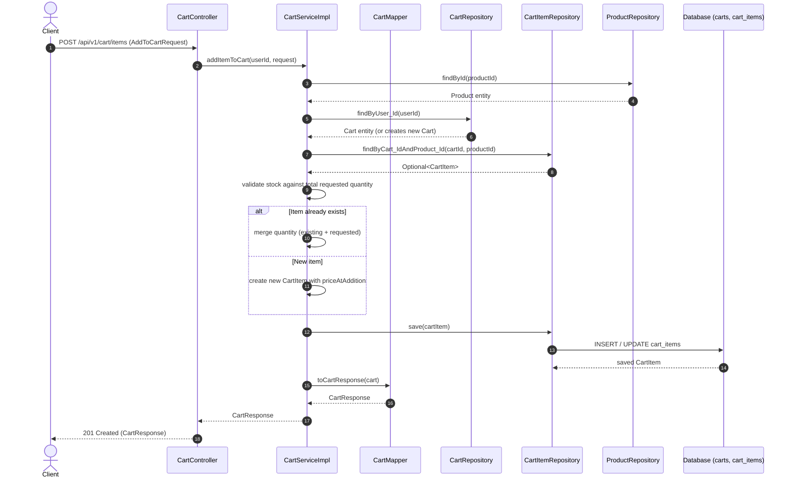

# Cart Module

---

## Related Documentation

- [Documentation Index](README.md)
- [Architecture Overview](Architecture.md)
- [Security Architecture](Security.md)
- [Database Schema Specification](Database-Schema.md)
- [REST API Specification](API-Design.md)
- [User Module](User.md) | [Product Module](Product.md) | [Order Module](Order.md)

---

## Overview

The Cart module manages user shopping carts and cart items in the AmazonScale platform. It provides RESTful APIs for authenticated users to maintain an active shopping cart, add products, adjust item quantities, remove items, clear the cart, and view calculated sub-totals and grand totals.

The module acts as a stateful staging area between product discovery (`Product` module) and checkout processing (`Order` module). Carts are tied 1-to-1 with authenticated users and are lazily initialized upon adding the first product.

**Package root:** `com.amazonscale.cart`

---

## Features

- **Retrieve Shopping Cart**: Fetch current user's cart details including item details, sub-totals, total item count, and total cart amount (`GET /api/v1/cart`).
- **Add Product to Cart**: Add a product with a specified quantity (`POST /api/v1/cart/items`).
- **Automatic Cart Initialization**: Lazily creates a user cart if one does not already exist when adding an item.
- **Quantity Aggregation**: Merges quantities if a product is added multiple times to the cart.
- **Update Item Quantity**: Modify the quantity of an existing item in the cart (`PUT /api/v1/cart/items/{productId}`).
- **Remove Cart Item**: Delete a single product item from the cart (`DELETE /api/v1/cart/items/{productId}`).
- **Clear Cart**: Empty all items from the cart (`DELETE /api/v1/cart`).
- **Real-Time Stock Validation**: Validates available product stock prior to adding or updating item quantities.
- **Active Product Guard**: Rejects additions for inactive or unavailable products.
- **Price Capture**: Captures `priceAtAddition` when an item is added to maintain consistent pricing.

---

## Architecture

```
Client
  │
  │ HTTP + JWT Authentication Token
  v
CartController           (@RestController, @RequestMapping("/api/v1/cart"))
  │
  │ delegates to
  v
CartService              (interface)
  │
  │ implemented by
  v
CartServiceImpl          (@Service, @Transactional)
  │
  ├── uses CartMapper for DTO conversion
  ├── uses CartRepository & CartItemRepository for cart persistence
  ├── uses ProductRepository for product validation & stock checks
  └── uses UserRepository for user lookups
  │
  v
Database (carts, cart_items tables)
```

Authentication is managed via Spring Security (`JwtAuthenticationFilter`), injecting the authenticated user's ID (`Long userId`) directly into controller endpoint parameters via `@AuthenticationPrincipal`.

---

## Package Structure

```
com.amazonscale.cart
├── controller
│   └── CartController.java               REST endpoints for cart management
├── dto
│   ├── AddToCartRequest.java            Inbound DTO for adding items
│   ├── CartItemResponse.java            Outbound DTO for individual cart items
│   ├── CartResponse.java                Outbound DTO for complete cart
│   └── UpdateCartItemRequest.java       Inbound DTO for updating item quantity
├── entity
│   ├── Cart.java                        JPA entity for user cart
│   ├── CartItem.java                    JPA entity for individual items in cart
│   └── CurrencyCode.java                Enum for supported currency codes
├── exception
│   ├── CartItemNotFoundException.java   Thrown when target cart item is not found
│   ├── CartNotFoundException.java       Thrown when user cart is not found
│   └── InvalidQuantityException.java    Custom exception for invalid quantities
├── mapper
│   └── CartMapper.java                  Utility mapper for DTO transformations
├── repository
│   ├── CartItemRepository.java          Spring Data JPA repository for cart items
│   └── CartRepository.java              Spring Data JPA repository for carts
└── service
    ├── CartService.java                 Cart service interface
    └── impl
        └── CartServiceImpl.java         Cart service implementation
```

---

## Entities

### Cart

**Purpose:** Represents a user's single active shopping cart.

**Table:** `carts`

| Field | Type | Constraints | Description |
|-------|------|-------------|-------------|
| `id` | `Long` | `@Id`, `@GeneratedValue(IDENTITY)` | Primary key |
| `user` | `User` | `@OneToOne(LAZY)`, `@JoinColumn(name = "user_id", nullable = false, unique = true)` | Associated user |
| `cartItems` | `List<CartItem>` | `@OneToMany(mappedBy = "cart", cascade = ALL, orphanRemoval = true, fetch = LAZY)` | Collection of cart items |
| `createdAt` | `LocalDateTime` | `nullable = false`, `updatable = false` | Record creation timestamp |
| `updatedAt` | `LocalDateTime` | `nullable = false` | Record update timestamp |

**Indexes:**
- `idx_cart_user` on `user_id`

**Lifecycle Callbacks:**
- `@PrePersist prePersist()`: Sets `createdAt` and `updatedAt` to `LocalDateTime.now()`.
- `@PreUpdate preUpdate()`: Sets `updatedAt` to `LocalDateTime.now()`.

---

### CartItem

**Purpose:** Represents an individual product line item inside a cart.

**Table:** `cart_items`

| Field | Type | Constraints | Description |
|-------|------|-------------|-------------|
| `id` | `Long` | `@Id`, `@GeneratedValue(IDENTITY)` | Primary key |
| `cart` | `Cart` | `@ManyToOne(LAZY)`, `@JoinColumn(name = "cart_id", nullable = false)` | Parent cart reference |
| `product` | `Product` | `@ManyToOne(LAZY)`, `@JoinColumn(name = "product_id", nullable = false)` | Associated product reference |
| `quantity` | `Integer` | `@Min(1)`, `@Column(nullable = false)` | Item quantity |
| `priceAtAddition` | `BigDecimal` | `@Column(nullable = false, precision = 10, scale = 2)` | Unit price when item was added |
| `createdAt` | `LocalDateTime` | `nullable = false` | Record creation timestamp |
| `updatedAt` | `LocalDateTime` | `nullable = false` | Record update timestamp |

**Unique Constraints:**
- `uk_cart_product` on (`cart_id`, `product_id`)

**Indexes:**
- `idx_cart_id` on `cart_id`
- `idx_product_id` on `product_id`

**Lifecycle Callbacks:**
- `@PrePersist prePersist()`: Sets `createdAt` and `updatedAt` to `LocalDateTime.now()`.
- `@PreUpdate preUpdate()`: Sets `updatedAt` to `LocalDateTime.now()`.

---

## DTOs

### AddToCartRequest

**Purpose:** Request body for adding a product to the cart.

| Field | Type | Constraints | Description |
|-------|------|-------------|-------------|
| `productId` | `Long` | `@NotNull(message = "Product id is required")` | ID of product to add |
| `quantity` | `Integer` | `@NotNull`, `@Positive(message = "Quantity must be positive")` | Quantity to add |

**Used by:** `POST /api/v1/cart/items`

---

### UpdateCartItemRequest

**Purpose:** Request body for modifying item quantity.

| Field | Type | Constraints | Description |
|-------|------|-------------|-------------|
| `quantity` | `Integer` | `@NotNull`, `@Positive(message = "Quantity must be greater than 0")` | New desired quantity |

**Used by:** `PUT /api/v1/cart/items/{productId}`

---

### CartItemResponse

**Purpose:** DTO representing a line item in cart response.

| Field | Type | Description |
|-------|------|-------------|
| `cartItemId` | `Long` | Cart item ID |
| `productId` | `Long` | Associated product ID |
| `productName` | `String` | Product name |
| `productDescription` | `String` | Product description |
| `unitPrice` | `BigDecimal` | Price per unit at addition time |
| `quantity` | `Integer` | Item quantity |
| `subtotal` | `BigDecimal` | Subtotal (`unitPrice * quantity`) |
| `imageUrl` | `String` | Product image URL |

---

### CartResponse

**Purpose:** Outbound DTO representing complete user cart.

| Field | Type | Description |
|-------|------|-------------|
| `cartId` | `Long` | Cart ID |
| `userId` | `Long` | Associated user ID |
| `items` | `List<CartItemResponse>` | List of item responses |
| `totalItems` | `Integer` | Sum of all item quantities |
| `totalAmount` | `BigDecimal` | Sum of all item subtotals |
| `updatedAt` | `LocalDateTime` | Cart last updated timestamp |
| `currency` | `CurrencyCode` | Currency code enum (defaults to `INR`) |

---

## Enums

### CurrencyCode

Represents supported currencies in cart responses.

| Constant | Description |
|----------|-------------|
| `INR` | Indian Rupee |
| `USD` | US Dollar |
| `EUR` | Euro |
| `GBP` | British Pound |

**Usage:** Returned in `CartResponse.currency`. Current implementation in `CartMapper` hardcodes `CurrencyCode.INR`.

---

## Repository Layer

### CartRepository

Extends `JpaRepository<Cart, Long>`.

| Method | Purpose | Used By |
|--------|---------|---------|
| `findByUser_Id(Long userId)` | Retrieves cart entity belonging to specified user ID | `CartServiceImpl.getCart`, `addItemToCart`, `updateCartItem`, `removeCartItem`, `clearCart`, `OrderServiceImpl.createOrder` |
| `existsByUser_Id(Long userId)` | Checks whether a cart exists for a given user ID | `CartRepository` query interface |

---

### CartItemRepository

Extends `JpaRepository<CartItem, Long>`.

| Method | Purpose | Used By |
|--------|---------|---------|
| `findByCart_IdAndProduct_Id(Long cartId, Long productId)` | Finds specific product line item in user cart | `CartServiceImpl.addItemToCart`, `updateCartItem` |
| `existsByCart_IdAndProduct_Id(Long cartId, Long productId)` | Checks if line item exists in user cart | `CartItemRepository` query interface |
| `findByCart_Id(Long cartId)` | Retrieves all line items for a cart | `CartItemRepository` query interface |
| `deleteByCart_Id(Long cartId)` | Deletes all line items belonging to a cart | `CartServiceImpl.clearCart` |
| `deleteByCart_IdAndProduct_Id(Long cartId, Long productId)` | Removes specific product item from cart | `CartServiceImpl.removeCartItem` |

---

## Mapper Layer

### CartMapper

Stateless mapping utility for converting domain entities into DTOs.

#### `toCartItemResponse(CartItem cartItem) -> CartItemResponse`
- Extracts product details (`id`, `name`, `description`, `imageUrl`).
- Uses `cartItem.getPriceAtAddition()` as `unitPrice`.
- Calculates `subtotal` = `priceAtAddition.multiply(BigDecimal.valueOf(quantity))`.

#### `toCartResponse(Cart cart) -> CartResponse`
- Maps list of `CartItem` entities to `CartItemResponse` list.
- Calculates `totalItems` by summing `quantity` across all items.
- Calculates `totalAmount` by summing subtotals across all items.
- Assigns currency as `CurrencyCode.INR`.

---

## Service Layer

### CartService (Interface)

Defines business operations for cart manipulation:
- `addItemToCart(Long userId, AddToCartRequest request)`
- `updateCartItem(Long userId, Long productId, UpdateCartItemRequest request)`
- `removeCartItem(Long userId, Long productId)`
- `clearCart(Long userId)`
- `getCart(Long userId)`

---

## CartServiceImpl

Annotated with `@Service`, `@RequiredArgsConstructor`, and `@Transactional`.

#### `addItemToCart(Long userId, AddToCartRequest request) -> CartResponse`
1. Validates user existence via `UserRepository.findById(userId)` (throws `UserNotFoundException`).
2. Validates product existence via `ProductRepository.findById(request.getProductId())` (throws `ProductNotFoundException`).
3. Validates product active flag (throws `ProductUnavailableException` if `active` is `false`).
4. Gets existing cart or creates a new `Cart` entity for user via `getOrCreateCart(user)`.
5. Checks if item already exists in cart via `cartItemRepository.findByCart_IdAndProduct_Id`:
   - **If present**: Calculates candidate `newQuantity = existingQuantity + request.getQuantity()`. Validates stock against `product.getStock()` (throws `InsufficientStockException`). Updates `quantity`.
   - **If absent**: Validates `request.getQuantity()` against `product.getStock()` (throws `InsufficientStockException`). Creates new `CartItem` with `priceAtAddition = product.getPrice()`.
6. Saves `CartItem` and returns `CartMapper.toCartResponse(cart)`.

#### `updateCartItem(Long userId, Long productId, UpdateCartItemRequest request) -> CartResponse`
1. Fetches cart entity for user via `cartRepository.findByUser_Id` (throws `CartNotFoundException`).
2. Fetches item via `cartItemRepository.findByCart_IdAndProduct_Id` (throws `CartItemNotFoundException`).
3. Validates target quantity against product stock (throws `InsufficientStockException`).
4. Updates `quantity`, saves `CartItem`, and returns `CartMapper.toCartResponse(cart)`.

#### `removeCartItem(Long userId, Long productId) -> void`
1. Fetches cart entity for user (throws `CartNotFoundException`).
2. Verifies item existence in cart (throws `CartItemNotFoundException`).
3. Deletes item via `cartItemRepository.deleteByCart_IdAndProduct_Id`.

#### `clearCart(Long userId) -> void`
1. Fetches cart entity for user (throws `CartNotFoundException`).
2. Deletes all items for cart via `cartItemRepository.deleteByCart_Id`.

#### `getCart(Long userId) -> CartResponse`
- Annotated with `@Transactional(readOnly = true)`.
- Fetches cart entity for user (throws `CartNotFoundException`).
- Returns mapped `CartResponse`.

---

## Controller Layer

### CartController

`@RestController` mapped to `/api/v1/cart`. Tagged `@Tag(name = "Carts")`.

| HTTP Method | Endpoint | Description | Authentication | Request Body | Response Status | Response Body |
|-------------|----------|-------------|----------------|--------------|-----------------|---------------|
| `POST` | `/api/v1/cart/items` | Add product to cart | `@AuthenticationPrincipal Long userId` | `@Valid AddToCartRequest` | `201 Created` | `CartResponse` |
| `GET` | `/api/v1/cart` | Get user cart | `@AuthenticationPrincipal Long userId` | None | `200 OK` | `CartResponse` |
| `PUT` | `/api/v1/cart/items/{productId}` | Update item quantity | `@AuthenticationPrincipal Long userId` | `@Valid UpdateCartItemRequest` | `200 OK` | `CartResponse` |
| `DELETE` | `/api/v1/cart/items/{productId}` | Remove item from cart | `@AuthenticationPrincipal Long userId` | None | `204 No Content` | Void |
| `DELETE` | `/api/v1/cart` | Clear entire cart | `@AuthenticationPrincipal Long userId` | None | `204 No Content` | Void |

---

## Business Rules

| Rule | Description | Enforcement Location |
|------|-------------|----------------------|
| **Lazy Cart Creation** | Cart is created on demand when adding the first product | `CartServiceImpl.getOrCreateCart` |
| **Quantity Merging** | Re-adding an existing item increments quantity rather than creating duplicate row | `CartServiceImpl.addItemToCart` |
| **Stock Limit Validation** | Combined or requested item quantity cannot exceed available product stock | `CartServiceImpl.validateStock` |
| **Product Availability** | Products with `active = false` cannot be added to cart | `CartServiceImpl.getProduct` |
| **Price Retention** | Unit price is snapshotted at time of addition (`priceAtAddition`) | `CartServiceImpl.addItemToCart` |
| **User Cart Isolation** | Users can only query, modify, or delete items in their own cart | `CartController` `@AuthenticationPrincipal` + `findByUser_Id` |

---

## Validation Rules

### DTO Level
- `AddToCartRequest.productId`: `@NotNull(message = "Product id is required")`
- `AddToCartRequest.quantity`: `@NotNull(message = "Quantity is Required")`, `@Positive(message = "Quantity must be positive")`
- `UpdateCartItemRequest.quantity`: `@NotNull(message = "Quantity is required")`, `@Positive(message = "Quantity must be greater than 0")`

### Entity Level
- `CartItem.quantity`: `@Min(1)`

---

## Exception Handling

| Exception | HTTP Status | Thrown When | Handling |
|-----------|-------------|-------------|----------|
| `CartNotFoundException` | `404 NOT_FOUND` | User cart does not exist when fetching/updating/clearing | `GlobalExceptionHandler` |
| `CartItemNotFoundException` | `404 NOT_FOUND` | Target product is not present in user cart | `GlobalExceptionHandler` |
| `InvalidQuantityException` | `400 BAD_REQUEST` | Invalid item quantity provided | `GlobalExceptionHandler` |
| `InsufficientStockException` | `400 BAD_REQUEST` | Item quantity exceeds product available stock | `GlobalExceptionHandler` |
| `ProductNotFoundException` | `404 NOT_FOUND` | Product ID in request does not exist | `GlobalExceptionHandler` |
| `ProductUnavailableException` | `500 INTERNAL_SERVER_ERROR` | Product active status is false | `GlobalExceptionHandler` (fallback `Exception.class`) |
| `UserNotFoundException` | `500 INTERNAL_SERVER_ERROR` | User ID is not found in database | `GlobalExceptionHandler` (fallback `Exception.class`) |
| `MethodArgumentNotValidException` | `400 BAD_REQUEST` | Validation error on `@Valid` request body | `GlobalExceptionHandler` |

---

## Security

- **Authentication**: JWT token processing via `JwtAuthenticationFilter`.
- **Authorization**: Endpoints require authenticated context (`SecurityConfig`).
- **Principal Injection**: User ID is extracted from authenticated SecurityContext token and injected into controller method parameters using `@AuthenticationPrincipal Long userId`.

---

## Request Lifecycle

End-to-end execution flow for Adding an Item to Cart:

```
Client
   ↓
JWT Filter (Interprets Bearer token & populates SecurityContext user identity)
   ↓
Controller (CartController intercepts request with @AuthenticationPrincipal userId)
   ↓
Validation (JSR-303 annotations validate AddToCartRequest constraints)
   ↓
Service (CartServiceImpl validates user, product status & stock constraints)
   ↓
Mapper (CartMapper converts Cart and CartItems into CartResponse DTO)
   ↓
Repository (CartRepository & CartItemRepository read and save entities)
   ↓
Database (PostgreSQL / MySQL carts & cart_items tables update)
   ↓
Response (201 Created with populated CartResponse DTO)
```

---

## Database Design

### Table: `carts`

```sql
CREATE TABLE carts (
    id BIGINT AUTO_INCREMENT PRIMARY KEY,
    user_id BIGINT NOT NULL UNIQUE,
    created_at DATETIME NOT NULL,
    updated_at DATETIME NOT NULL,
    CONSTRAINT fk_cart_user FOREIGN KEY (user_id) REFERENCES users(id),
    INDEX idx_cart_user (user_id)
);
```

### Table: `cart_items`

```sql
CREATE TABLE cart_items (
    id BIGINT AUTO_INCREMENT PRIMARY KEY,
    cart_id BIGINT NOT NULL,
    product_id BIGINT NOT NULL,
    quantity INT NOT NULL,
    price_at_addition DECIMAL(10,2) NOT NULL,
    created_at DATETIME NOT NULL,
    updated_at DATETIME NOT NULL,
    CONSTRAINT fk_cart_item_cart FOREIGN KEY (cart_id) REFERENCES carts(id),
    CONSTRAINT fk_cart_item_product FOREIGN KEY (product_id) REFERENCES products(id),
    CONSTRAINT uk_cart_product UNIQUE (cart_id, product_id),
    INDEX idx_cart_id (cart_id),
    INDEX idx_product_id (product_id)
);
```

---

## Testing

**Test Suite Coverage Summary:** Total 13 test classes in `src/test/java/com/amazonscale/cart`:

| Component | Test Class | Coverage Description |
|-----------|------------|----------------------|
| **Controller** | `CartControllerTest` | MockMvc integration tests for `POST /items`, `GET /`, `PUT /items/{id}`, `DELETE /items/{id}`, `DELETE /`. |
| **Service** | `CartServiceImplTest` | Unit tests for cart creation, item addition, quantity merging, stock validation failures, missing cart/item handling, item deletion, clear cart. |
| **Mapper** | `CartMapperTest` | Tests mapping of entities to `CartItemResponse` and `CartResponse`, total calculations, subtotal products. |
| **DTOs** | `AddToCartRequestTest`, `CartItemResponseTest`, `CartResponseTest`, `UpdateCartItemRequestTest` | Getter/setter, builder, and Bean Validation constraint tests. |
| **Entities** | `CartTest`, `CartItemTest`, `CurrencyCodeTest` | Entity builder tests, lifecycle callback timestamp verification, enum value assertion. |
| **Exceptions** | `CartNotFoundExceptionTest`, `CartItemNotFoundExceptionTest`, `InvalidQuantityExceptionTest` | Exception message verification. |

### Test Type Status

| Test Type | Status |
|-----------|--------|
| DTO Tests | ✅ |
| Mapper Tests | ✅ |
| Service Tests | ✅ |
| Controller Tests | ✅ |
| Repository Tests | ✅ |
| Exception Tests | ✅ |

---

## Sequence Diagram

### Add to Cart Flow



---

## Module Dependencies

### Direct Dependencies
- **User Module**: Uses `User` entity, `UserRepository`, and `UserNotFoundException` for user identity verification.
- **Product Module**: Uses `Product` entity, `ProductRepository`, `ProductNotFoundException`, and `ProductUnavailableException` for product data and availability check.
- **Inventory Module**: Re-uses `InsufficientStockException` for stock validation errors.
- **Common Module**: Relies on `GlobalExceptionHandler` and `ErrorResponse` for structured API error formatting.

### Downstream Consumers
- **Order Module**: Inspects user cart items during order placement (`OrderServiceImpl`) and clears the cart post-checkout.

---

## Design Decisions

- **Why DTOs are used**: Isolates domain cart entities (`Cart`, `CartItem`) from client response models (`CartResponse`, `CartItemResponse`), preventing recursive JSON serialization of bidirectional parent-child JPA entities.
- **Why static mappers**: `CartMapper` uses stateless helper routines to aggregate line subtotals and calculate total amounts dynamically without Spring component overhead.
- **Why @Transactional**: Ensures atomic updates when adding, merging, or removing cart items, guaranteeing cart state consistency across database reads and writes.
- **Why lazy loading**: Line items on `Cart` (`@OneToMany(fetch = LAZY)`) and product references on `CartItem` (`@ManyToOne(fetch = LAZY)`) load on demand to optimize performance.
- **Why JWT**: Identifies the requesting user statelessly from the Bearer token, automatically isolating user carts without relying on server-side HTTP session storage.
- **Why BCrypt**: Guarantees secure user authentication across the platform before cart operations access protected endpoints.
- **Why package-by-feature**: Groups cart controller, service, repository, entity, mapper, and exception classes together inside `com.amazonscale.cart` for domain encapsulation.

---

## Current Limitations

1. **Static Item Price**: `priceAtAddition` is captured when an item is added. Subsequent product price changes are not reflected in the cart unless the item is removed and re-added.
2. **Hardcoded Currency**: `CartMapper` hardcodes `CurrencyCode.INR` in `CartResponse`.
3. **Unhandled Custom Exceptions**: `ProductUnavailableException` and `UserNotFoundException` lack explicit `@ExceptionHandler` methods in `GlobalExceptionHandler`, falling back to 500 error responses.
4. **Unused Repository Methods**: `CartRepository.existsByUser_Id`, `CartItemRepository.existsByCart_IdAndProduct_Id`, and `CartItemRepository.findByCart_Id` exist but are not invoked in service logic.
5. **Unused Custom Exception**: `InvalidQuantityException` is present in the codebase but unused by `CartServiceImpl` (which uses Bean Validation and `InsufficientStockException`).

---

## Future Enhancements

- **Dynamic Price Synchronization**: Detect and flag price changes on cart items when products update.
- **Multi-Currency Support**: Populate cart currency dynamically based on user context or request locale.
- **Explicit Global Exception Handlers**: Add explicit exception handlers in `GlobalExceptionHandler` for `ProductUnavailableException` and `UserNotFoundException`.
- **Cart Abandonment & TTL**: Implement cart expiration or automated reminder notifications for abandoned carts.
- **Redis Cart Caching**: Cache active user cart state in Redis to minimize database read traffic during browsing.

