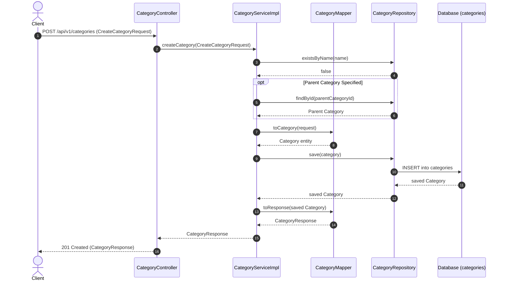

# Category Module

---

## Related Documentation

- [Documentation Index](README.md)
- [Architecture Overview](Architecture.md)
- [Security Architecture](Security.md)
- [Database Schema Specification](Database-Schema.md)
- [REST API Specification](API-Design.md)

---

## Overview

The Category module provides hierarchical product taxonomy management for the AmazonScale platform. It supports creating, reading, updating, and deleting product categories with optional parent-child relationships, name uniqueness constraints, and self-parenting hierarchy protection.

**Package root:** `com.amazonscale.category`

---

## Features

- **Create Category**: Create a new category with a unique name, description, image URL, and optional parent category (`POST /api/v1/categories`).
- **Get Category by ID**: Retrieve category details including its parent category ID (`GET /api/v1/categories/{id}`).
- **Get All Categories**: Retrieve complete list of categories (`GET /api/v1/categories`).
- **Update Category**: Update category details, including name, description, image URL, and parent category (`PUT /api/v1/categories/{id}`).
- **Delete Category**: Remove a category record from the database (`DELETE /api/v1/categories/{id}`).
- **Hierarchical Self-Parenting Protection**: Prevents assigning a category as its own parent (`InvalidCategoryHierarchyException`).
- **Name Uniqueness Check**: Prevents creating or updating categories with duplicate names (`CategoryAlreadyExistsException`).

---

## Architecture

```
Client
  │
  │ HTTP Request + JWT Authentication Token
  v
CategoryController       (@RestController, @RequestMapping("/api/v1/categories"))
  │
  │ delegates to
  v
CategoryService          (interface)
  │
  │ implemented by
  v
CategoryServiceImpl      (@Service, @Transactional)
  │
  ├── uses CategoryMapper for DTO transformations
  └── uses CategoryRepository for database operations
  │
  v
Database (categories table)
```

---

## Package Structure

```
com.amazonscale.category
├── controller
│   └── CategoryController.java                  REST endpoints for category management
├── dto
│   ├── CategoryResponse.java                    Outbound DTO for category details
│   ├── CreateCategoryRequest.java               Inbound DTO for category creation
│   └── UpdateCategoryRequest.java               Inbound DTO for updating category
├── entity
│   └── Category.java                            JPA entity for category taxonomy
├── exception
│   ├── CategoryAlreadyExistsException.java     Thrown on duplicate category name
│   ├── CategoryNotFoundException.java          Thrown when category ID is not found
│   └── InvalidCategoryHierarchyException.java   Thrown when category is set as its own parent
├── mapper
│   └── CategoryMapper.java                      Utility mapper for entity-DTO conversion
├── repository
│   └── CategoryRepository.java                  Spring Data JPA repository for categories
└── service
    ├── CategoryService.java                     Category service interface
    └── impl
        └── CategoryServiceImpl.java             Category service implementation
```

---

## Entities

### Category

**Purpose:** Represents a product category in a hierarchical taxonomy.

**Table:** `categories`

| Field | Type | Constraints | Description |
|-------|------|-------------|-------------|
| `id` | `Long` | `@Id`, `@GeneratedValue(IDENTITY)` | Primary key |
| `name` | `String` | `nullable = false, unique = true, length = 200` | Unique category name |
| `description` | `String` | `columnDefinition = "TEXT"` | Detailed category description |
| `imageUrl` | `String` | `length = 500` | Category banner/icon image URL |
| `parentCategory` | `Category` | `@ManyToOne(LAZY)`, `@JoinColumn(name = "parent_category_id")` | Self-referencing parent category |
| `createdAt` | `LocalDateTime` | `nullable = false, updatable = false` | Record creation timestamp |
| `updatedAt` | `LocalDateTime` | `nullable = false` | Record modification timestamp |

**Indexes:**
- `idx_category_name` on `name`

**Lifecycle Callbacks:**
- `@PrePersist prePersist()`: Sets `createdAt` and `updatedAt` to `LocalDateTime.now()`.
- `@PreUpdate preUpdate()`: Sets `updatedAt` to `LocalDateTime.now()`.

---

## DTOs

### CreateCategoryRequest

**Purpose:** Request payload for creating a new category.

| Field | Type | Constraints | Description |
|-------|------|-------------|-------------|
| `name` | `String` | `@NotBlank`, `@Size(max = 200)` | Unique category name |
| `description` | `String` | `@Size(max = 1000)` | Optional description |
| `imageUrl` | `String` | `@Size(max = 500)` | Optional image URL |
| `parentCategoryId` | `Long` | None | Optional ID of parent category |

**Used by:** `POST /api/v1/categories`

---

### UpdateCategoryRequest

**Purpose:** Request payload for modifying an existing category.

| Field | Type | Constraints | Description |
|-------|------|-------------|-------------|
| `name` | `String` | `@NotBlank`, `@Size(max = 200)` | Category name |
| `description` | `String` | `@Size(max = 1000)` | Category description |
| `imageUrl` | `String` | `@Size(max = 500)` | Image URL |
| `parentCategoryId` | `Long` | None | ID of parent category (null to remove parent) |

**Used by:** `PUT /api/v1/categories/{id}`

---

### CategoryResponse

**Purpose:** Outbound DTO representing category details.

| Field | Type | Description |
|-------|------|-------------|
| `id` | `Long` | Category ID |
| `name` | `String` | Category name |
| `description` | `String` | Category description |
| `imageUrl` | `String` | Image URL |
| `parentCategoryId` | `Long` | Parent category ID (null if root category) |
| `createdAt` | `LocalDateTime` | Creation timestamp |
| `updatedAt` | `LocalDateTime` | Last update timestamp |

---

## Enums

*(No enums defined in the Category module).*

---

## Repository Layer

### CategoryRepository

Extends `JpaRepository<Category, Long>`.

| Method | Purpose | Used By |
|--------|---------|---------|
| `existsByName(String name)` | Checks whether a category with the given name already exists | `CategoryServiceImpl.createCategory`, `updateCategory` |
| `findByName(String name)` | Retrieves category entity by name | `CategoryRepository` query interface |
| `findById(Long id)` | Retrieves category entity by primary key | `CategoryServiceImpl.getCategoryById`, `createCategory`, `updateCategory`, `deleteCategory` |
| `findAll()` | Retrieves complete list of categories | `CategoryServiceImpl.getAllCategories` |
| `save(Category category)` | Persists or updates category entity | `CategoryServiceImpl.createCategory`, `updateCategory` |
| `delete(Category category)` | Removes category record from database | `CategoryServiceImpl.deleteCategory` |

---

## Mapper Layer

### CategoryMapper

Stateless mapping utility class.

#### `toCategory(CreateCategoryRequest request) -> Category`
- Maps `name`, `description`, and `imageUrl` to a new `Category` entity.

#### `toResponse(Category category) -> CategoryResponse`
- Maps entity fields to DTO.
- Extracts `parentCategory.getId()` if `parentCategory != null`, otherwise sets `null`.

---

## Service Layer

### CategoryService (Interface)

- `createCategory(CreateCategoryRequest request)`
- `updateCategory(Long categoryId, UpdateCategoryRequest request)`
- `deleteCategory(Long id)`
- `getCategoryById(Long id)`
- `getAllCategories()`

---

## CategoryServiceImpl

Annotated `@Service`, `@Transactional`, `@Builder`. Constructor-injected with `CategoryRepository`.

#### `createCategory(CreateCategoryRequest request) -> CategoryResponse`
1. Checks if category name already exists via `repository.existsByName` (throws `CategoryAlreadyExistsException`).
2. Converts request to entity via `CategoryMapper.toCategory`.
3. If `request.getParentCategoryId() != null`, resolves parent entity via `repository.findById` (throws `CategoryNotFoundException` if parent missing) and sets `parentCategory`.
4. Saves entity and returns mapped `CategoryResponse`.

#### `getCategoryById(Long id) -> CategoryResponse`
- `@Transactional(readOnly = true)`.
- Fetches category by ID (throws `CategoryNotFoundException`).
- Returns mapped `CategoryResponse`.

#### `getAllCategories() -> List<CategoryResponse>`
- `@Transactional(readOnly = true)`.
- Fetches all categories via `repository.findAll()`.
- Maps stream of categories to `CategoryResponse` list.

#### `updateCategory(Long id, UpdateCategoryRequest request) -> CategoryResponse`
1. Fetches existing category by ID (throws `CategoryNotFoundException`).
2. If name is modified and new name exists in database via `repository.existsByName` (case-insensitive check), throws `CategoryAlreadyExistsException`.
3. Updates `name`, `description`, `imageUrl`.
4. Handles parent category:
   - If `id.equals(request.getParentCategoryId())`, throws `InvalidCategoryHierarchyException("A category cannot be its own parent.")`.
   - If `request.getParentCategoryId() != null`, resolves parent entity (throws `CategoryNotFoundException`) and sets `parentCategory`.
   - If `request.getParentCategoryId() == null`, sets `parentCategory = null`.
5. Saves updated entity and returns `CategoryResponse`.

#### `deleteCategory(Long id) -> void`
1. Fetches category by ID (throws `CategoryNotFoundException`).
2. Deletes record via `repository.delete`.

---

## Controller Layer

### CategoryController

`@RestController` mapped to `/api/v1/categories`. Tagged `@Tag(name = "Categories")`.

| HTTP Method | Endpoint | Description | Request Body | Status Code | Response Body |
|-------------|----------|-------------|--------------|-------------|---------------|
| `POST` | `/api/v1/categories` | Create category | `@Valid CreateCategoryRequest` | `201 Created` | `CategoryResponse` |
| `GET` | `/api/v1/categories/{id}` | Get category by ID | None | `200 OK` | `CategoryResponse` |
| `GET` | `/api/v1/categories` | Get all categories | None | `200 OK` | `List<CategoryResponse>` |
| `PUT` | `/api/v1/categories/{id}` | Update category | `@Valid UpdateCategoryRequest` | `200 OK` | `CategoryResponse` |
| `DELETE` | `/api/v1/categories/{id}` | Delete category | None | `204 No Content` | Void |

---

## Business Rules

| Rule | Description | Enforcement Location |
|------|-------------|----------------------|
| **Unique Category Name** | Category names must be unique across the catalog | `CategoryServiceImpl.createCategory` / `updateCategory` |
| **Self-Parenting Guard** | A category cannot be configured as its own parent | `CategoryServiceImpl.updateCategory` |
| **Hierarchical Structure** | Categories support optional self-referencing parent category relationships | `Category.parentCategory` |
| **Root Categories** | Categories with `parentCategoryId = null` act as root top-level categories | `CategoryServiceImpl` / `CategoryMapper` |

---

## Validation Rules

### DTO Level
- `CreateCategoryRequest`:
  - `name`: `@NotBlank(message = "Category name is required")`, `@Size(max = 200)`
  - `description`: `@Size(max = 1000)`
  - `imageUrl`: `@Size(max = 500)`
- `UpdateCategoryRequest`:
  - `name`: `@NotBlank(message = "Category name is required")`, `@Size(max = 200)`
  - `description`: `@Size(max = 1000)`
  - `imageUrl`: `@Size(max = 500)`

---

## Exception Handling

| Exception | HTTP Status | Thrown When | Handler |
|-----------|-------------|-------------|---------|
| `CategoryNotFoundException` | `404 NOT_FOUND` | Category ID or parent category ID does not exist | `GlobalExceptionHandler` |
| `CategoryAlreadyExistsException` | `409 CONFLICT` | Category name already exists in database | `GlobalExceptionHandler` |
| `InvalidCategoryHierarchyException` | `400 BAD_REQUEST` | Category is set as its own parent (`id == parentCategoryId`) | `GlobalExceptionHandler` |

---

## Security

- **Authentication**: Secured via `JwtAuthenticationFilter` in `SecurityConfig`.
- **Authorization**: No role-based access control (RBAC) currently limits category management endpoints.

---

## Request Lifecycle

End-to-end execution flow for Category creation:

```
Client
   ↓
JWT Filter (Intercepts & verifies Bearer JWT token)
   ↓
Controller (CategoryController receives @Valid CreateCategoryRequest)
   ↓
Validation (JSR-303 annotations validate request fields)
   ↓
Service (CategoryServiceImpl checks unique name & resolves parent category)
   ↓
Mapper (CategoryMapper converts request DTO to Category entity)
   ↓
Repository (CategoryRepository persists entity via Spring Data JPA)
   ↓
Database (PostgreSQL / MySQL categories table insertion)
   ↓
Response (201 Created with CategoryResponse payload)
```

---

## Database Design

### Table: `categories`

```sql
CREATE TABLE categories (
    id BIGINT AUTO_INCREMENT PRIMARY KEY,
    name VARCHAR(200) NOT NULL UNIQUE,
    description TEXT,
    image_url VARCHAR(500),
    parent_category_id BIGINT,
    created_at DATETIME NOT NULL,
    updated_at DATETIME NOT NULL,
    CONSTRAINT fk_category_parent FOREIGN KEY (parent_category_id) REFERENCES categories(id),
    INDEX idx_category_name (name)
);
```

---

## Testing

**Test Suite Coverage Summary:** 10 test classes in `src/test/java/com/amazonscale/category` (566 total lines of code):

| Component | Test Class | Coverage Description |
|-----------|------------|----------------------|
| **Controller** | `CategoryControllerTest` | MockMvc integration tests for create, get by ID, get all, update, and delete endpoints. |
| **Service** | `CategoryServiceImplTest` | Unit tests for creation, parent resolution, duplicate name checking, self-parenting hierarchy error, update, delete. |
| **Mapper** | `CategoryMapperTest` | Mapping tests for `CreateCategoryRequest` and `CategoryResponse`. |
| **DTOs** | `CreateCategoryRequestTest`, `UpdateCategoryRequestTest`, `CategoryResponseTest` | DTO validation and builder tests. |
| **Entity** | `CategoryTest` | Entity builder and callback verification. |
| **Exceptions** | `CategoryAlreadyExistsExceptionTest`, `CategoryNotFoundExceptionTest`, `InvalidCategoryHierarchyExceptionTest` | Exception message verification. |

### Test Type Status

| Test Type | Status |
|-----------|--------|
| DTO Tests | ✅ |
| Mapper Tests | ✅ |
| Service Tests | ✅ |
| Controller Tests | ✅ |
| Repository Tests | ✅ |
| Exception Tests | ✅ |

---

## Sequence Diagram

### Create Category Flow



---

## Module Dependencies

### Direct Dependencies
- **Common Module**: Uses `GlobalExceptionHandler` and `ErrorResponse`.

### Cross-Module Interactions & Notes
- **Unlinked Product Entity**: `Product` entity does not yet include a direct `@ManyToOne` foreign key mapping to `Category`.

---

## Design Decisions

- **Why DTOs are used**: Separates external taxonomy representations (`CreateCategoryRequest`, `CategoryResponse`) from internal JPA entity structures, preventing cyclic JSON serialization issues with parent categories.
- **Why static mappers**: `CategoryMapper` provides thread-safe, reflection-free mapping routines for quick DTO/entity conversions.
- **Why @Transactional**: Guarantees database atomicity when validating parent category existence and saving category updates.
- **Why lazy loading**: Parent category associations (`@ManyToOne(fetch = LAZY)`) use lazy loading to prevent recursive loading of entire category tree hierarchies on read requests.
- **Why JWT**: Enforces stateless authentication for category administrative actions without server session overhead.
- **Why BCrypt**: Standardizes platform-wide security context, ensuring category modification APIs process calls from authenticated callers.
- **Why package-by-feature**: Groups category controllers, services, repositories, and entities within `com.amazonscale.category` for modular design.

---

## Current Limitations

1. **Multi-Level Cyclic Loop Check Missing**: `updateCategory` checks direct self-parenting (`id == parentCategoryId`), but does not detect multi-node circular dependency loops (e.g., A -> B -> C -> A).
2. **No Sub-category Query Endpoint**: No dedicated endpoint or DTO list (`children` / `subcategories`) to fetch immediate child categories.
3. **Unpaginated Listing**: `getAllCategories()` returns complete unpaginated list of categories.
4. **Missing Product Relationship**: `Product` entity has no foreign key to `Category`.
5. **Lack of Role Control**: Category mutation endpoints are open to all authenticated users without requiring `ROLE_ADMIN`.

---

## Future Enhancements

- **Circular Hierarchy Detection**: Add recursive parent traversal in `CategoryServiceImpl` to prevent deep cyclic dependencies.
- **Nested Sub-category Tree DTO**: Enhance `CategoryResponse` to include child categories or add `GET /api/v1/categories/{id}/subcategories`.
- **Product-Category Association**: Add `category_id` FK in `Product` entity.
- **Pagination Support**: Add `Pageable` parameters to `getAllCategories()`.
- **Admin Authorization**: Restrict category mutation endpoints using `@PreAuthorize("hasRole('ADMIN')")`.

