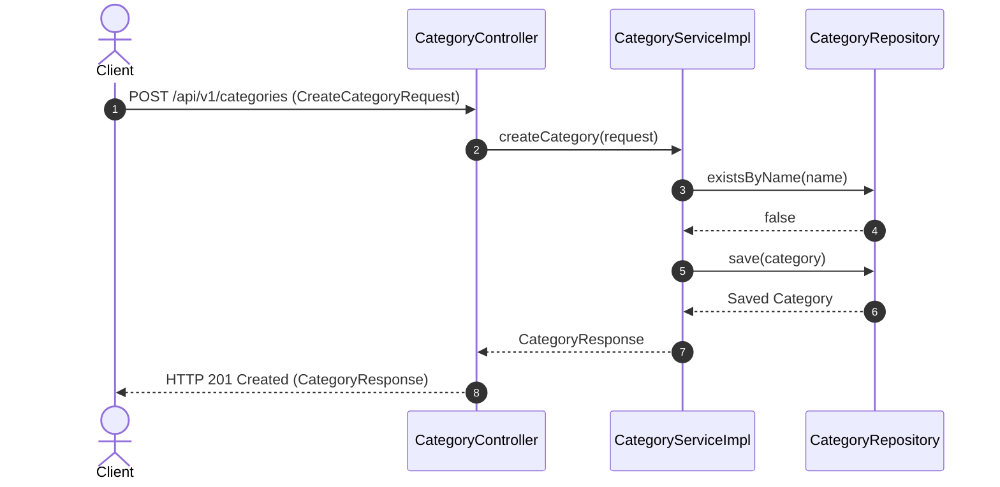
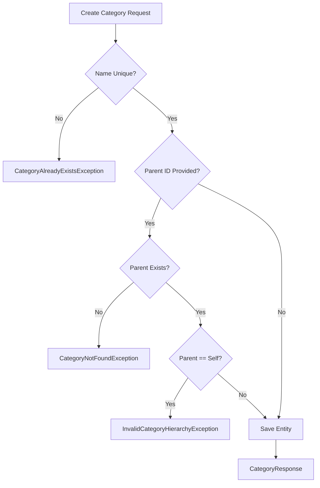

# Category Module Specification

---

## 1. Overview
The **Category Module** manages hierarchical product categories, parent-child taxonomy structures, category metadata, and catalog classifications for the **AmazonScale** e-commerce platform.

---

## 2. Purpose
Enables organizing products into structured subcategories and parent categories for discovery, filtering, and catalog management.

---

## 3. Architecture
Organized within package `com.amazonscale.category`, following clean package-by-feature conventions.

---

## 4. Package Structure
```
com.amazonscale.category
├── controller
│   └── CategoryController.java
├── dto
│   ├── CategoryResponse.java
│   ├── CreateCategoryRequest.java
│   └── UpdateCategoryRequest.java
├── entity
│   └── Category.java
├── exception
│   ├── CategoryAlreadyExistsException.java
│   ├── CategoryNotFoundException.java
│   └── InvalidCategoryHierarchyException.java
├── mapper
│   └── CategoryMapper.java
├── repository
│   └── CategoryRepository.java
└── service
    ├── CategoryService.java
    └── impl
        └── CategoryServiceImpl.java
```

---

## 5. Components
- **`CategoryController`**: REST controller exposing category management endpoints (`/api/v1/categories`).
- **`CategoryServiceImpl`**: Core service enforcing unique category names and hierarchy loop rules.
- **`CategoryRepository`**: Data access interface for `categories` table.
- **`CategoryMapper`**: Converts between request DTOs, entities, and response DTOs.

---

## 6. Database Design
- **Table Name**: `categories`
- **Primary Key**: `id` (`BIGINT`, Auto-Increment)
- **Columns**:
  - `id` BIGINT AUTO_INCREMENT PRIMARY KEY
  - `name` VARCHAR(200) NOT NULL UNIQUE
  - `description` TEXT NULL
  - `image_url` VARCHAR(500) NULL
  - `parent_category_id` BIGINT NULL
  - `created_at` DATETIME NOT NULL
  - `updated_at` DATETIME NOT NULL
- **Indexes**: `idx_category_name` (`name`)

---

## 7. Entity Relationships
- `Category` N:1 `Category` (`parentCategory` - self reference)
- `Category` 1:N `Product` (`mappedBy = "category"`)

---

## 8. DTOs
- **`CreateCategoryRequest`**: `name`, `description`, `imageUrl`, `parentCategoryId`.
- **`UpdateCategoryRequest`**: `name`, `description`, `imageUrl`, `parentCategoryId`.
- **`CategoryResponse`**: `id`, `name`, `description`, `imageUrl`, `parentCategoryId`, `createdAt`, `updatedAt`.

---

## 9. Repository Layer
- **`CategoryRepository`**: Extends `JpaRepository<Category, Long>`
  - `Optional<Category> findByName(String name)`
  - `boolean existsByName(String name)`
  - `List<Category> findByParentCategoryId(Long parentId)`

---

## 10. Service Layer
- **`CategoryService`**:
  - `CategoryResponse createCategory(CreateCategoryRequest request)`
  - `CategoryResponse getCategoryById(Long id)`
  - `List<CategoryResponse> getAllCategories()`
  - `CategoryResponse updateCategory(Long id, UpdateCategoryRequest request)`
  - `void deleteCategory(Long id)`

---

## 11. Controller Layer
- `POST /api/v1/categories` -> `createCategory()` -> HTTP `201 Created`
- `GET /api/v1/categories/{id}` -> `getCategoryById()` -> HTTP `200 OK`
- `GET /api/v1/categories` -> `getAllCategories()` -> HTTP `200 OK`
- `PUT /api/v1/categories/{id}` -> `updateCategory()` -> HTTP `200 OK`
- `DELETE /api/v1/categories/{id}` -> `deleteCategory()` -> HTTP `204 No Content`

---

## 12. Business Rules
1. **Name Uniqueness**: Category names must be unique (`CategoryAlreadyExistsException`).
2. **Hierarchy Protection**: A category cannot be designated as its own parent (`InvalidCategoryHierarchyException`).
3. **Parent Validation**: If `parentCategoryId` is specified, the parent category must exist in the database.

---

## 13. Validation
- `name`: `@NotBlank`, `@Size(max = 200)`.
- `description`: `@Size(max = 2000)`.
- `imageUrl`: `@Size(max = 500)`.

---

## 14. Exception Handling
- `CategoryNotFoundException` -> HTTP `404 Not Found`.
- `CategoryAlreadyExistsException` -> HTTP `400 Bad Request`.
- `InvalidCategoryHierarchyException` -> HTTP `400 Bad Request`.

---

## 15. Security
Requires valid JWT Bearer Token for category creation, modification, and deletion.

---

## 16. API Reference

### `POST /api/v1/categories`
- **Request**: `CreateCategoryRequest`
- **Response**: `201 Created` (`CategoryResponse`)

### `GET /api/v1/categories/{id}`
- **Response**: `200 OK` (`CategoryResponse`)

### `GET /api/v1/categories`
- **Response**: `200 OK` (`List<CategoryResponse>`)

### `PUT /api/v1/categories/{id}`
- **Request**: `UpdateCategoryRequest`
- **Response**: `200 OK` (`CategoryResponse`)

### `DELETE /api/v1/categories/{id}`
- **Response**: `204 No Content`

---

## 17. Request Flow
Client HTTP Request -> `CategoryController` -> `CategoryServiceImpl` -> `@Transactional` DB Read/Write -> `CategoryMapper` -> JSON Response.

---

## 18. Sequence Diagram



---

## 19. Mermaid Diagrams



---

## 20. Testing Overview
Verified via unit tests in `src/test/java/com/amazonscale/category`:
- `CategoryServiceImplTest`: Validates creation, loop prevention, parent linkages.
- `CategoryControllerTest`: Validates endpoint bindings and status codes.

---

## 21. Known Limitations
1. Single-level self-parent loop check without multi-tier ancestor cycle traversal.
2. Unpaginated collection endpoint returning raw lists.

---

## 22. Future Improvements
See technical recommendations:
- [Category Recommendations](recommendations/Category-Recommendations.md)

---

## 23. References
- [Architecture Documentation](Architecture.md)
- [Database Schema Documentation](Database-Schema.md)
