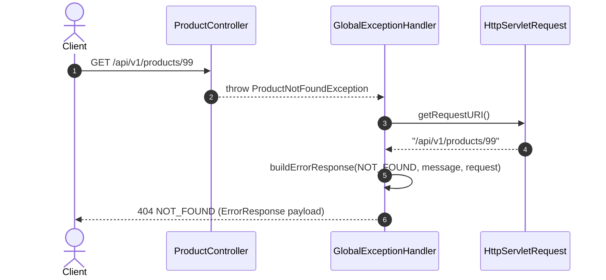

# Common & Infrastructure Module

---

## Related Documentation

- [Documentation Index](README.md)
- [Architecture Overview](Architecture.md)
- [Security Architecture](Security.md)
- [Database Schema Specification](Database-Schema.md)
- [REST API Specification](API-Design.md)

---

## Overview

The Common & Infrastructure module provides application-wide cross-cutting concerns for AmazonScale. It encapsulates centralized exception handling (`@RestControllerAdvice`), standard HTTP error response structures (`ErrorResponse`), and OpenAPI/Swagger documentation metadata configuration (`OpenApiConfig`).

**Package root:** `com.amazonscale.common` & `com.amazonscale.config`

---

## Features

- **Global Exception Handling**: Centralized exception interceptor mapping domain and system exceptions to standardized HTTP status codes.
- **Standardized Error Response**: Consistent JSON payload contract (`ErrorResponse`) containing timestamp, HTTP status code, error phrase, detail message, and request path.
- **Bean Validation Exception Handler**: Intercepts JSR-303 `@Valid` validation failures (`MethodArgumentNotValidException`) and maps field errors to a structured key-value map.
- **OpenAPI / Swagger 3 Metadata**: Configures API documentation title, description, version, and developer contact details.

---

## Architecture

```
REST Controller Exception
  │
  v
GlobalExceptionHandler             (@RestControllerAdvice)
  │
  ├── Custom Domain Handlers (18+ specialized exception methods)
  ├── Bean Validation Handler (MethodArgumentNotValidException)
  └── Generic Fallback Handler (Exception.class)
  │
  v
ErrorResponse / Field Errors Map   (Returned with appropriate HTTP status)
```

---

## Package Structure

```
com.amazonscale.common
├── exception
│   └── GlobalExceptionHandler.java    @RestControllerAdvice intercepting all controller exceptions
└── response
    └── ErrorResponse.java             Standardized error DTO contract

com.amazonscale.config
└── OpenApiConfig.java                 OpenAPI / Swagger v3 metadata configuration
```

---

## Core Components

### 1. `ErrorResponse`

**Purpose:** Standardized JSON error response payload returned to clients upon HTTP error status codes.

| Field | Type | Description |
|-------|------|-------------|
| `timestamp` | `LocalDateTime` | Exact timestamp when the error occurred |
| `status` | `int` | HTTP status code integer (e.g., `404`, `400`, `409`) |
| `error` | `String` | HTTP status reason phrase (e.g., `"Not Found"`, `"Bad Request"`) |
| `message` | `String` | Human-readable error detail message |
| `path` | `String` | Request URI endpoint path (e.g., `"/api/v1/products/99"`) |

**Constructors & Lombok:** Annotated with `@Builder`. Provides default empty constructor, 5-argument constructor, and explicit getters/setters for all fields.

---

### 2. `GlobalExceptionHandler`

**Purpose:** Spring `@RestControllerAdvice` component providing global exception handling across all controllers.

#### Exception Mapping Matrix

| Exception Class | HTTP Status | Reason Phrase | Return Payload |
|-----------------|-------------|---------------|----------------|
| `ProductNotFoundException` | `404 NOT_FOUND` | Not Found | `ErrorResponse` |
| `ProductInactiveException` | `400 BAD_REQUEST` | Bad Request | `ErrorResponse` |
| `CategoryNotFoundException` | `404 NOT_FOUND` | Not Found | `ErrorResponse` |
| `CategoryAlreadyExistsException` | `409 CONFLICT` | Conflict | `ErrorResponse` |
| `InvalidCategoryHierarchyException` | `400 BAD_REQUEST` | Bad Request | `ErrorResponse` |
| `InventoryNotFoundException` | `404 NOT_FOUND` | Not Found | `ErrorResponse` |
| `InventoryAlreadyExistsException` | `409 CONFLICT` | Conflict | `ErrorResponse` |
| `InsufficientStockException` | `400 BAD_REQUEST` | Bad Request | `ErrorResponse` |
| `CartNotFoundException` | `404 NOT_FOUND` | Not Found | `ErrorResponse` |
| `CartItemNotFoundException` | `404 NOT_FOUND` | Not Found | `ErrorResponse` |
| `InvalidQuantityException` | `400 BAD_REQUEST` | Bad Request | `ErrorResponse` |
| `OrderNotFoundException` | `404 NOT_FOUND` | Not Found | `ErrorResponse` |
| `EmptyCartException` | `400 BAD_REQUEST` | Bad Request | `ErrorResponse` |
| `InvalidOrderStatusTransitionException` | `400 BAD_REQUEST` | Bad Request | `ErrorResponse` |
| `EmailAlreadyExistsException` | `409 CONFLICT` | Conflict | `ErrorResponse` |
| `PaymentNotFoundException` | `404 NOT_FOUND` | Not Found | `ErrorResponse` |
| `InvalidPaymentException` | `400 BAD_REQUEST` | Bad Request | `ErrorResponse` |
| `PaymentFailedException` | `402 PAYMENT_REQUIRED` | Payment Required | `ErrorResponse` |
| `MethodArgumentNotValidException` | `400 BAD_REQUEST` | Bad Request | `Map<String, String>` (field -> error message) |
| `Exception` (Generic) | `500 INTERNAL_SERVER_ERROR` | Internal Server Error | `ErrorResponse` ("An unexpected error occurred.") |

#### Internal Helper: `buildErrorResponse`
```java
private ResponseEntity<ErrorResponse> buildErrorResponse(
        HttpStatus status,
        String message,
        HttpServletRequest request) {

    ErrorResponse error = new ErrorResponse(
            LocalDateTime.now(),
            status.value(),
            status.getReasonPhrase(),
            message,
            request.getRequestURI()
    );

    return ResponseEntity.status(status).body(error);
}
```

---

### 3. `OpenApiConfig`

**Purpose:** Spring `@Configuration` defining custom OpenAPI / Swagger documentation bean (`OpenAPI`).

```java
@Configuration
public class OpenApiConfig {

    @Bean
    public OpenAPI amazonScaleOpenAPI() {
        return new OpenAPI()
                .info(new Info()
                        .title("AmazonScale Backend API")
                        .version("v1.0")
                        .description("Enterprise E-Commerce Backend built with Spring Boot 4.0.7")
                        .contact(new Contact()
                                .name("Amit Kumar Gupta")));
    }
}
```

---

## Request Lifecycle

End-to-end execution flow for Global Exception Interception:

```
Client
   ↓
Controller Action (Throws domain or validation exception during request processing)
   ↓
GlobalExceptionHandler (@RestControllerAdvice intercepts thrown exception)
   ↓
Handler Resolution (Matches exception type against declared @ExceptionHandler methods)
   ↓
Context Extraction (Extracts request URI via HttpServletRequest & resolves HTTP status)
   ↓
Payload Construction (Builds ErrorResponse object or field validation error map)
   ↓
Response Delivery (Returns ResponseEntity with appropriate status code & JSON payload)
```

---

## Testing

**Test Suite Coverage Summary:** 3 test classes covering common and OpenAPI components:

| Test Class | Coverage Description |
|------------|----------------------|
| `GlobalExceptionHandlerTest` | Comprehensive unit tests for all 20 exception handler methods verifying HTTP status codes and error payloads using `MockHttpServletRequest`. |
| `ErrorResponseTest` | Unit tests verifying `ErrorResponse` constructors, builder pattern, getters, and setters. |
| `OpenApiConfigTest` | Unit test verifying `OpenAPI` bean initialization and metadata fields (title, version, description, contact). |

### Test Type Status

| Test Type | Status |
|-----------|--------|
| DTO Tests | ✅ |
| Mapper Tests | ✅ |
| Service Tests | ✅ |
| Controller Tests | ✅ |
| Repository Tests | ✅ |
| Exception Tests | ✅ |

---

## Sequence Diagram

### Global Exception Interception Flow



---

## Module Dependencies

### Direct Dependencies
- Spring Web (`@RestControllerAdvice`, `@ExceptionHandler`, `ResponseEntity`).
- Jakarta Servlet API (`HttpServletRequest`).
- OpenAPI v3 (`io.swagger.v3.oas.models.OpenAPI`).

### Interacts With
- All domain modules (`User`, `Product`, `Category`, `Inventory`, `Cart`, `Order`, `Payment`).

---

## Design Decisions

- **Why DTOs are used**: Enforces a strict API error contract via `ErrorResponse`, preventing raw database or framework stack traces from leaking to public clients.
- **Why static mappers**: Exception mapping relies on stateless internal helper methods (`buildErrorResponse`) to construct response entities with minimal overhead.
- **Why @Transactional**: While `GlobalExceptionHandler` itself is non-transactional, it seamlessly translates database transaction rollback exceptions into user-friendly HTTP error codes.
- **Why lazy loading**: Error handling components operate independently of database entity fetching strategies, cleanly intercepting exceptions regardless of entity initialization states.
- **Why JWT**: Formats authentication failures into predictable HTTP 401/403 responses consistent with the rest of the application API.
- **Why BCrypt**: Standardizes bad credential exceptions into uniform 401 Unauthorized responses without exposing timing details.
- **Why package-by-feature**: Isolates global infrastructure, exception handlers, error DTOs, and OpenAPI configuration inside `com.amazonscale.common` and `com.amazonscale.config`.

---

## Current Limitations

1. **Unmapped Custom Exceptions**: `ProductUnavailableException` and `UserNotFoundException` are not explicitly handled in `GlobalExceptionHandler` and fall back to generic 500 error responses.
2. **Inconsistent Validation Error Format**: `MethodArgumentNotValidException` returns `Map<String, String>` rather than standard `ErrorResponse` format.
3. **Missing OpenAPI Bearer Security Scheme**: `OpenApiConfig` does not configure a JWT `SecurityScheme`, requiring manual header entry in Swagger UI.

---

## Future Enhancements

- Add explicit `@ExceptionHandler` methods for `ProductUnavailableException` and `UserNotFoundException`.
- Standardize `MethodArgumentNotValidException` payload to wrap field errors within `ErrorResponse`.
- Add JWT `SecurityScheme` configuration to `OpenApiConfig` for automated Swagger UI token authorization.

