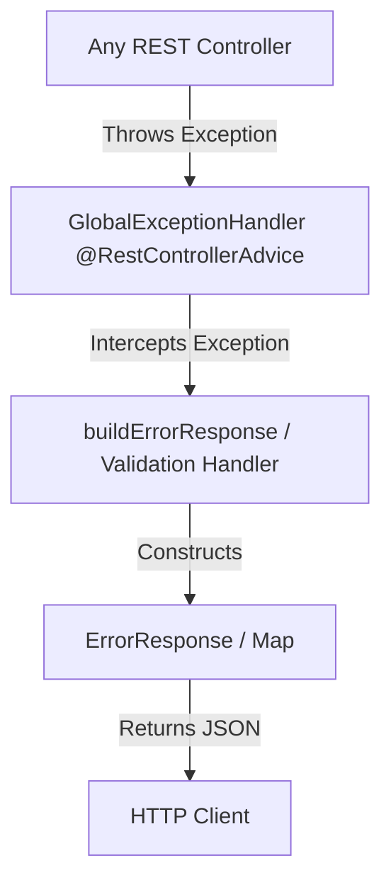
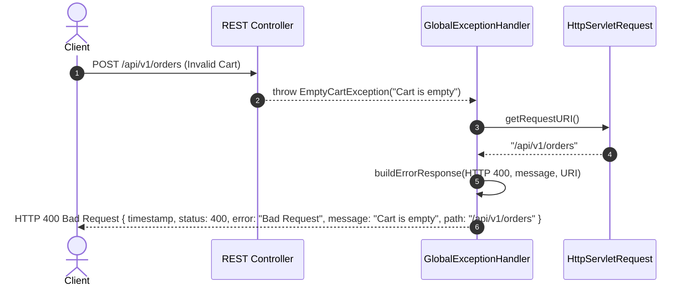
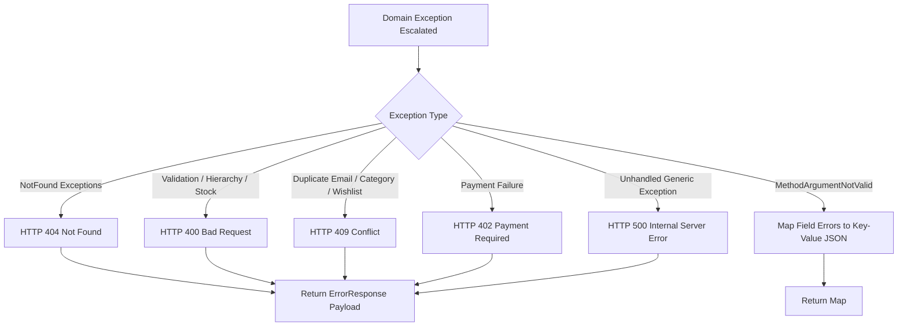

# Common Module Specification

---

## 1. Overview
The **Common Module** provides core infrastructure components, centralized global exception handling (`@RestControllerAdvice`), standard HTTP error response structures (`ErrorResponse`), JSR-303 Bean Validation error translation, and OpenAPI 3 / Swagger documentation configuration for **AmazonScale**.

---

## 2. Purpose
Centralizes cross-cutting error handling, HTTP status translation, and API documentation configurations across all domain feature modules to ensure uniform client response contracts and robust error reporting.

---

## 3. Architecture
Located under `com.amazonscale.common` and `com.amazonscale.config`, operating as a global aspect and utility layer across all controllers and services.



---

## 4. Package Structure
```
com.amazonscale
├── common
│   ├── exception
│   │   └── GlobalExceptionHandler.java
│   └── response
│       └── ErrorResponse.java
└── config
    └── OpenApiConfig.java
```

---

## 5. Components
- **`GlobalExceptionHandler`**: Intercepts domain and framework exceptions thrown by any `@RestController` bean across all modules.
- **`ErrorResponse`**: Standardized JSON response payload model returned during exception events.
- **`OpenApiConfig`**: Configures OpenAPI 3 info metadata, contact specifications, and JWT Bearer security scheme for Swagger UI.

---

## 6. Database Design
Not applicable (Infrastructure module without persistent database tables).

---

## 7. Entity Relationships
Not applicable (Non-persistent infrastructure component).

---

## 8. DTOs

### `ErrorResponse`
Standard JSON structure returned for all handled API errors (except Bean Validation errors):

| Field | Type | Description |
|-------|------|-------------|
| `timestamp` | `LocalDateTime` | Date and time when the error occurred |
| `status` | `int` | HTTP status code (e.g. 400, 404, 409, 500) |
| `error` | `String` | Official HTTP status reason phrase (e.g. "Not Found") |
| `message` | `String` | Human-readable exception message |
| `path` | `String` | Request URI that triggered the exception |

---

## 9. Repository Layer
Not applicable (Infrastructure module).

---

## 10. Service Layer
Not applicable (Infrastructure module).

---

## 11. Controller Layer
Operates globally across all controller beans using Spring's `@RestControllerAdvice`.

---

## 12. Business Rules
1. **Uniform Response Structure**: Every exception thrown within controller request processing is intercepted and formatted into a consistent JSON `ErrorResponse` or field-error map.
2. **Bean Validation Field Mapping**: JSR-303 `@Valid` failures (`MethodArgumentNotValidException`) are mapped to a `Map<String, String>` where keys are field names and values are validation messages.
3. **No Leaked Stack Traces**: Production runtime exceptions return clean user-facing error messages while logging stack traces via `@Slf4j`.

---

## 13. Validation
Intercepts `@Valid` annotation failures via `handleValidationExceptions()`:
- Input Payload: `MethodArgumentNotValidException`
- Output Payload: `Map<String, String>` (e.g., `{"email": "Invalid email format", "password": "Password must be at least 8 characters"}`)
- HTTP Status: `400 Bad Request`

---

## 14. Exception Handling

`GlobalExceptionHandler` handles 20+ distinct domain and framework exceptions:

| Handled Exception | Target Module | Mapped HTTP Status |
|-------------------|---------------|--------------------|
| `ProductNotFoundException` | Product | `404 Not Found` |
| `ProductInactiveException` | Product | `400 Bad Request` |
| `CategoryNotFoundException` | Category | `404 Not Found` |
| `CategoryAlreadyExistsException` | Category | `409 Conflict` |
| `InvalidCategoryHierarchyException` | Category | `400 Bad Request` |
| `InventoryNotFoundException` | Inventory | `404 Not Found` |
| `InventoryAlreadyExistsException` | Inventory | `409 Conflict` |
| `InsufficientStockException` | Inventory | `400 Bad Request` |
| `CartNotFoundException` | Cart | `404 Not Found` |
| `CartItemNotFoundException` | Cart | `404 Not Found` |
| `InvalidQuantityException` | Cart | `400 Bad Request` |
| `OrderNotFoundException` | Order | `404 Not Found` |
| `EmptyCartException` | Order | `400 Bad Request` |
| `InvalidOrderStatusTransitionException` | Order | `400 Bad Request` |
| `PaymentNotFoundException` | Payment | `404 Not Found` |
| `InvalidPaymentException` | Payment | `400 Bad Request` |
| `PaymentFailedException` | Payment | `402 Payment Required` |
| `EmailAlreadyExistsException` | User | `409 Conflict` |
| `WishlistNotFoundException` | Wishlists | `404 Not Found` |
| `WishlistAlreadyExistsException` | Wishlists | `409 Conflict` |
| `WishlistItemAlreadyExistsException` | Wishlists | `409 Conflict` |
| `WishlistItemNotFoundException` | Wishlists | `404 Not Found` |
| `DefaultWishlistModificationException` | Wishlists | `400 Bad Request` |
| `MethodArgumentNotValidException` | Framework | `400 Bad Request` |
| `Exception` (Fallback) | Framework | `500 Internal Server Error` |

---

## 15. Security
OpenAPI documentation endpoints (`/swagger-ui/**`, `/v3/api-docs/**`) are explicitly configured as public in `SecurityConfig`. Swagger UI includes Bearer JWT authentication controls defined in `OpenApiConfig`.

---

## 16. API Reference
- **Swagger UI Interactive Portal**: `GET /swagger-ui/index.html`
- **OpenAPI 3 JSON Schema**: `GET /v3/api-docs`

---

## 17. Request Flow
Client HTTP Request -> Controller Action Throws Exception -> `GlobalExceptionHandler` Interception -> `buildErrorResponse()` or `handleValidationExceptions()` -> Serialized JSON Payload.

---

## 18. Sequence Diagram



---

## 19. Mermaid Diagrams



---

## 20. Testing Overview
Covered by JUnit 5 tests in `src/test/java/com/amazonscale/common`:
- `GlobalExceptionHandlerTest`: Validates exception interceptors, status codes, and error payload structures across all 20+ handled exceptions.
- `ErrorResponseTest`: Validates builder pattern and getter/setter methods.

---

## 21. Known Limitations
1. `ErrorResponse` does not include a distributed trace ID / correlation UUID for multi-service log tracing.

---

## 22. Future Improvements
See technical recommendations:
- [Common Recommendations](recommendations/Common-Recommendations.md)

---

## 23. References
- [Architecture Documentation](Architecture.md)
- [Security Documentation](Security.md)
- [REST API Specification](API-Design.md)
