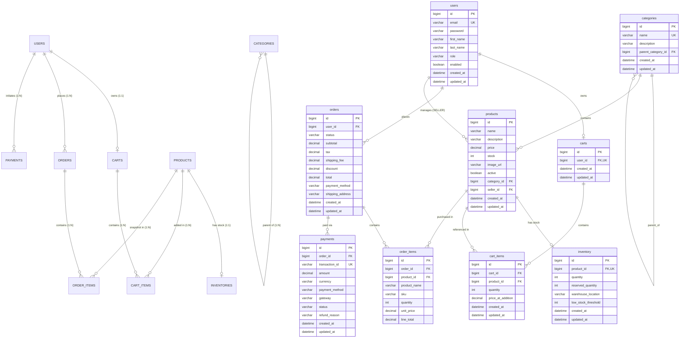
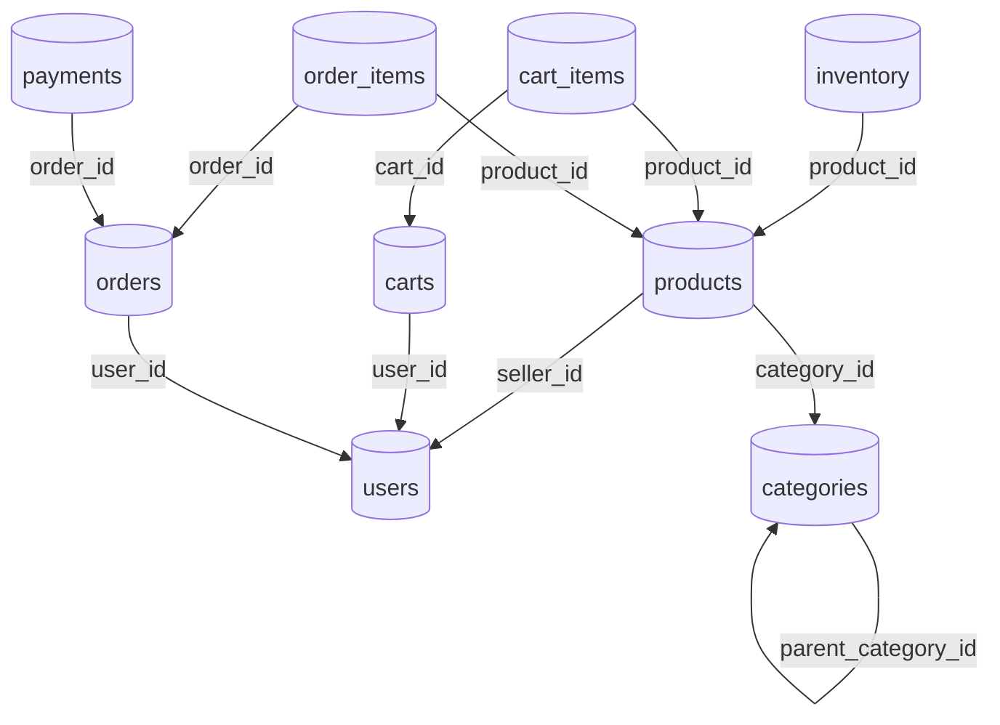

# AmazonScale Relational Database Schema Specification

---

## Overview

This document specifies the complete relational database schema for the **AmazonScale** platform. The database design supports full ACID compliance, enforces foreign key referential integrity, utilizes JPA/Hibernate lifecycle entity callbacks (`@PrePersist`, `@PreUpdate`), and enforces unique constraints across critical domain attributes.

**Target DBMS:** MySQL 8.0+ / H2 (Development & Testing)

---

## Entity-Relationship (ER) Diagram



---

## Foreign Key Dependency Graph



---

## Table Relationship Summary

| Parent Table | Child Table | Relationship | FK Column | Cascade / Constraint Behavior |
|--------------|-------------|--------------|-----------|-------------------------------|
| `users` | `carts` | 1-to-1 (Optional) | `user_id` | Unique FK; Lazily created on first add to cart. |
| `users` | `orders` | 1-to-Many | `user_id` | Foreign Key; Deletion restricted if orders exist. |
| `users` | `products` | 1-to-Many | `seller_id` | Foreign Key; Identifies listing seller. |
| `categories` | `categories` | 1-to-Many (Self) | `parent_category_id` | Self-referencing FK; Nullable root categories. |
| `categories` | `products` | 1-to-Many | `category_id` | Foreign Key; Grouping taxonomy association. |
| `products` | `inventory` | 1-to-1 | `product_id` | Unique FK; Physical warehouse stock record. |
| `carts` | `cart_items` | 1-to-Many | `cart_id` | `cascade = ALL`, `orphanRemoval = true`. |
| `products` | `cart_items` | 1-to-Many | `product_id` | Foreign Key; Reference to added catalog item. |
| `orders` | `order_items` | 1-to-Many | `order_id` | `cascade = ALL`, `orphanRemoval = true`. |
| `products` | `order_items` | 1-to-Many | `product_id` | Foreign Key; Historical record of ordered item. |
| `orders` | `payments` | 1-to-Many | `order_id` | Foreign Key; Supports initial payment & retry attempts. |

---

## Indexing Strategy & Performance Tuning

| Index Name | Table | Column(s) | Index Type | Purpose |
|------------|-------|-----------|------------|---------|
| `uk_users_email` | `users` | `email` | Unique | Fast authentication lookup by email string. |
| `uk_category_name` | `categories` | `name` | Unique | Enforces category name uniqueness across system. |
| `idx_category_parent` | `categories` | `parent_category_id` | Non-Unique B-Tree | Accelerates parent-child taxonomy tree traversal queries. |
| `idx_product_category` | `products` | `category_id` | Non-Unique B-Tree | Optimizes product listing queries filtered by category. |
| `idx_product_seller` | `products` | `seller_id` | Non-Unique B-Tree | Speeds up seller catalog management queries. |
| `idx_product_active` | `products` | `active` | Non-Unique B-Tree | Filters active vs inactive product listings. |
| `idx_inventory_product` | `inventory` | `product_id` | Unique | Enforces 1-to-1 constraint and fast inventory lookups. |
| `idx_cart_user` | `carts` | `user_id` | Unique | Rapid 1-to-1 user cart retrieval. |
| `uk_cart_product` | `cart_items` | `(cart_id, product_id)` | Unique Composite | Guarantees single line item per product in cart. |
| `idx_cart_id` | `cart_items` | `cart_id` | Non-Unique B-Tree | Joins cart line items efficiently. |
| `idx_order_user` | `orders` | `user_id` | Non-Unique B-Tree | Optimizes user order history listing queries. |
| `idx_order_status` | `orders` | `status` | Non-Unique B-Tree | Accelerates administrative order filtering by status. |
| `idx_order_item_order` | `order_items` | `order_id` | Non-Unique B-Tree | Rapid fetch of line items for specific order. |
| `uk_payment_txn` | `payments` | `transaction_id` | Unique | Fast lookup and duplicate transaction protection. |
| `idx_payment_order` | `payments` | `order_id` | Non-Unique B-Tree | Fetches payment history tied to order. |

---

## Detailed Schema DDL Specifications

### 1. `users` Table
```sql
CREATE TABLE users (
    id BIGINT AUTO_INCREMENT PRIMARY KEY,
    email VARCHAR(255) NOT NULL UNIQUE,
    password VARCHAR(255) NOT NULL,
    first_name VARCHAR(100) NOT NULL,
    last_name VARCHAR(100) NOT NULL,
    role VARCHAR(20) NOT NULL DEFAULT 'CUSTOMER',
    enabled BOOLEAN NOT NULL DEFAULT TRUE,
    created_at DATETIME NOT NULL,
    updated_at DATETIME NOT NULL,
    INDEX idx_user_email (email)
);
```

### 2. `categories` Table
```sql
CREATE TABLE categories (
    id BIGINT AUTO_INCREMENT PRIMARY KEY,
    name VARCHAR(100) NOT NULL UNIQUE,
    description VARCHAR(500),
    parent_category_id BIGINT NULL,
    created_at DATETIME NOT NULL,
    updated_at DATETIME NOT NULL,
    CONSTRAINT fk_category_parent FOREIGN KEY (parent_category_id) REFERENCES categories(id) ON DELETE SET NULL,
    INDEX idx_category_parent (parent_category_id)
);
```

### 3. `products` Table
```sql
CREATE TABLE products (
    id BIGINT AUTO_INCREMENT PRIMARY KEY,
    name VARCHAR(255) NOT NULL,
    description TEXT,
    price DECIMAL(10,2) NOT NULL,
    stock INT NOT NULL DEFAULT 0,
    image_url VARCHAR(500),
    active BOOLEAN NOT NULL DEFAULT TRUE,
    category_id BIGINT NOT NULL,
    seller_id BIGINT NOT NULL,
    created_at DATETIME NOT NULL,
    updated_at DATETIME NOT NULL,
    CONSTRAINT fk_product_category FOREIGN KEY (category_id) REFERENCES categories(id),
    CONSTRAINT fk_product_seller FOREIGN KEY (seller_id) REFERENCES users(id),
    INDEX idx_product_category (category_id),
    INDEX idx_product_seller (seller_id),
    INDEX idx_product_active (active)
);
```

### 4. `inventory` Table
```sql
CREATE TABLE inventory (
    id BIGINT AUTO_INCREMENT PRIMARY KEY,
    product_id BIGINT NOT NULL UNIQUE,
    quantity INT NOT NULL DEFAULT 0,
    reserved_quantity INT NOT NULL DEFAULT 0,
    warehouse_location VARCHAR(200) NOT NULL,
    low_stock_threshold INT NOT NULL DEFAULT 10,
    created_at DATETIME NOT NULL,
    updated_at DATETIME NOT NULL,
    CONSTRAINT fk_inventory_product FOREIGN KEY (product_id) REFERENCES products(id),
    INDEX idx_inventory_product (product_id)
);
```

### 5. `carts` Table
```sql
CREATE TABLE carts (
    id BIGINT AUTO_INCREMENT PRIMARY KEY,
    user_id BIGINT NOT NULL UNIQUE,
    created_at DATETIME NOT NULL,
    updated_at DATETIME NOT NULL,
    CONSTRAINT fk_cart_user FOREIGN KEY (user_id) REFERENCES users(id),
    INDEX idx_cart_user (user_id)
);
```

### 6. `cart_items` Table
```sql
CREATE TABLE cart_items (
    id BIGINT AUTO_INCREMENT PRIMARY KEY,
    cart_id BIGINT NOT NULL,
    product_id BIGINT NOT NULL,
    quantity INT NOT NULL DEFAULT 1,
    price_at_addition DECIMAL(10,2) NOT NULL,
    created_at DATETIME NOT NULL,
    updated_at DATETIME NOT NULL,
    CONSTRAINT fk_cart_item_cart FOREIGN KEY (cart_id) REFERENCES carts(id) ON DELETE CASCADE,
    CONSTRAINT fk_cart_item_product FOREIGN KEY (product_id) REFERENCES products(id),
    CONSTRAINT uk_cart_product UNIQUE (cart_id, product_id),
    INDEX idx_cart_id (cart_id),
    INDEX idx_product_id (product_id)
);
```

### 7. `orders` Table
```sql
CREATE TABLE orders (
    id BIGINT AUTO_INCREMENT PRIMARY KEY,
    user_id BIGINT NOT NULL,
    status VARCHAR(20) NOT NULL DEFAULT 'PENDING',
    subtotal DECIMAL(12,2) NOT NULL DEFAULT 0.00,
    tax DECIMAL(12,2) NOT NULL DEFAULT 0.00,
    shipping_fee DECIMAL(12,2) NOT NULL DEFAULT 0.00,
    discount DECIMAL(12,2) NOT NULL DEFAULT 0.00,
    total DECIMAL(12,2) NOT NULL DEFAULT 0.00,
    payment_method VARCHAR(30) NOT NULL,
    shipping_address VARCHAR(500) NOT NULL,
    created_at DATETIME NOT NULL,
    updated_at DATETIME NOT NULL,
    CONSTRAINT fk_order_user FOREIGN KEY (user_id) REFERENCES users(id),
    INDEX idx_order_user (user_id),
    INDEX idx_order_status (status)
);
```

### 8. `order_items` Table
```sql
CREATE TABLE order_items (
    id BIGINT AUTO_INCREMENT PRIMARY KEY,
    order_id BIGINT NOT NULL,
    product_id BIGINT NOT NULL,
    product_name VARCHAR(255) NOT NULL,
    sku VARCHAR(100) NOT NULL,
    quantity INT NOT NULL,
    unit_price DECIMAL(12,2) NOT NULL,
    line_total DECIMAL(12,2) NOT NULL,
    CONSTRAINT fk_order_item_order FOREIGN KEY (order_id) REFERENCES orders(id) ON DELETE CASCADE,
    CONSTRAINT fk_order_item_product FOREIGN KEY (product_id) REFERENCES products(id),
    INDEX idx_order_item_order (order_id)
);
```

### 9. `payments` Table
```sql
CREATE TABLE payments (
    id BIGINT AUTO_INCREMENT PRIMARY KEY,
    order_id BIGINT NOT NULL,
    transaction_id VARCHAR(100) NOT NULL UNIQUE,
    amount DECIMAL(12,2) NOT NULL,
    currency VARCHAR(3) NOT NULL DEFAULT 'INR',
    payment_method VARCHAR(30) NOT NULL,
    gateway VARCHAR(30) NOT NULL,
    status VARCHAR(20) NOT NULL DEFAULT 'PENDING',
    refund_reason VARCHAR(255) NULL,
    created_at DATETIME NOT NULL,
    updated_at DATETIME NOT NULL,
    CONSTRAINT fk_payment_order FOREIGN KEY (order_id) REFERENCES orders(id),
    INDEX idx_payment_order (order_id),
    INDEX idx_payment_txn (transaction_id)
);
```

---

## Migration & Seeding Considerations

- **Flyway / Liquibase Strategy**: Database DDL migrations should be managed via versioned migration scripts located under `src/main/resources/db/migration`.
- **FK Cascading Protection**: Deletions on critical domain tables (`users`, `products`, `orders`) strictly disallow cascading deletions to prevent financial ledger data loss. Child tables (`cart_items`, `order_items`) cascade deletion only from their parent aggregate roots (`carts`, `orders`).
