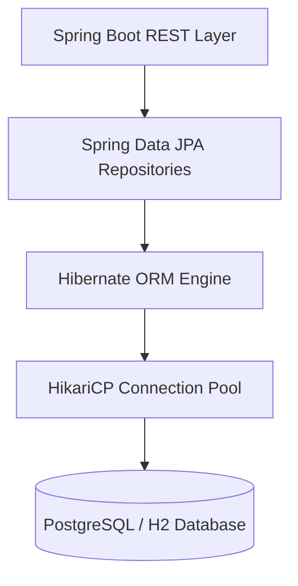
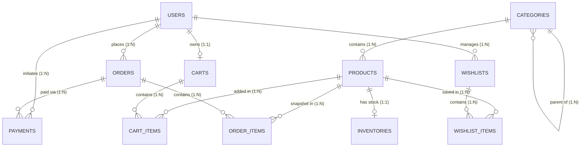
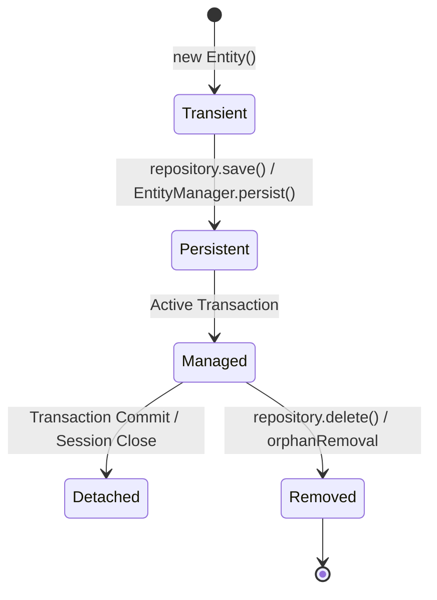
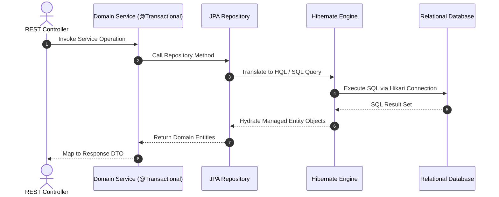

# AmazonScale Database Architecture & Schema Specification

---

## Related Documentation

- [Documentation Index](README.md)
- [Architecture Overview](Architecture.md)
- [Security Architecture](Security.md)
- [REST API Specification](API-Design.md)
- [Database Recommendations](recommendations/Database-Recommendations.md)

---

# Overview

### Purpose of the Database
The database layer for **AmazonScale** provides durable, relational persistence for user identities, catalog products, hierarchical categories, warehouse inventories, shopping carts, order state fulfillment records, payment transactions, and user wishlists.

### Persistence Strategy
Persistence is managed via standard **Spring Data JPA** and **Hibernate ORM**. Entity persistence utilizes auto-incremented primary keys, explicit foreign key mappings, and entity lifecycle hooks (`@PrePersist`, `@PreUpdate`).

### Supported Database Engine
- **Production / Development**: PostgreSQL 16+
- **Testing**: H2 In-Memory Relational Database

### ORM Used
Hibernate ORM version 7.x (integrated via Spring Boot 4.0.7 Starter Data JPA).

---

# Database Architecture



---

# Entity Overview

### 1. `User`
- **Purpose**: Represents registered user identities and credentials.
- **Primary Key**: `id` (`BIGINT`, Auto-Increment)
- **Relationships**: `1-to-1` with `Cart`, `1-to-Many` with `Order`, `1-to-Many` with `Product` (as seller), `1-to-Many` with `Wishlist`.
- **Lifecycle**: Managed via `@PrePersist` and `@PreUpdate`.
- **Repository**: `UserRepository`
- **Related DTOs**: `UserRequest`, `UserResponse`, `LoginRequest`, `LoginResponse`
- **Related Services**: `UserServiceImpl`, `AuthServiceImpl`

### 2. `Category`
- **Purpose**: Defines hierarchical product taxonomies.
- **Primary Key**: `id` (`BIGINT`, Auto-Increment)
- **Relationships**: `1-to-Many` self-reference (`parentCategory`), `1-to-Many` with `Product`.
- **Lifecycle**: Managed via `@PrePersist` and `@PreUpdate`.
- **Repository**: `CategoryRepository`
- **Related DTOs**: `CreateCategoryRequest`, `UpdateCategoryRequest`, `CategoryResponse`
- **Related Services**: `CategoryServiceImpl`

### 3. `Product`
- **Purpose**: Catalog product items listed for sale.
- **Primary Key**: `id` (`BIGINT`, Auto-Increment)
- **Relationships**: `Many-to-1` with `Category`, `Many-to-1` with `User` (seller), `1-to-1` with `Inventory`, `1-to-Many` with `CartItem`, `1-to-Many` with `OrderItem`, `1-to-Many` with `WishlistItem`.
- **Lifecycle**: Managed via `@PrePersist` and `@PreUpdate`.
- **Repository**: `ProductRepository`
- **Related DTOs**: `ProductRequest`, `ProductResponse`
- **Related Services**: `ProductServiceImpl`

### 4. `Inventory`
- **Purpose**: Warehouse physical stock tracking and thresholds.
- **Primary Key**: `id` (`BIGINT`, Auto-Increment)
- **Relationships**: `1-to-1` with `Product`.
- **Lifecycle**: Managed via `@PrePersist` and `@PreUpdate`.
- **Repository**: `InventoryRepository`
- **Related DTOs**: `InventoryRequest`, `InventoryUpdateRequest`, `InventoryResponse`
- **Related Services**: `InventoryServiceImpl`

### 5. `Cart`
- **Purpose**: User shopping cart state container.
- **Primary Key**: `id` (`BIGINT`, Auto-Increment)
- **Relationships**: `1-to-1` with `User`, `1-to-Many` with `CartItem` (`cascade = ALL`, `orphanRemoval = true`).
- **Lifecycle**: Managed via `@PrePersist` and `@PreUpdate`.
- **Repository**: `CartRepository`
- **Related DTOs**: `CartResponse`
- **Related Services**: `CartServiceImpl`

### 6. `CartItem`
- **Purpose**: Single product line item in a shopping cart.
- **Primary Key**: `id` (`BIGINT`, Auto-Increment)
- **Relationships**: `Many-to-1` with `Cart`, `Many-to-1` with `Product`.
- **Lifecycle**: Managed via `@PrePersist` and `@PreUpdate`.
- **Repository**: `CartItemRepository`
- **Related DTOs**: `AddToCartRequest`, `UpdateCartItemRequest`, `CartItemResponse`
- **Related Services**: `CartServiceImpl`

### 7. `Order`
- **Purpose**: Placed order transaction header and status.
- **Primary Key**: `id` (`BIGINT`, Auto-Increment)
- **Relationships**: `Many-to-1` with `User`, `1-to-Many` with `OrderItem` (`cascade = ALL`, `orphanRemoval = true`), `1-to-Many` with `Payment`.
- **Lifecycle**: Managed via `@PrePersist` and `@PreUpdate`.
- **Repository**: `OrderRepository`
- **Related DTOs**: `CreateOrderRequest`, `OrderResponse`
- **Related Services**: `OrderServiceImpl`

### 8. `OrderItem`
- **Purpose**: Historical line item snapshot within a placed order.
- **Primary Key**: `id` (`BIGINT`, Auto-Increment)
- **Relationships**: `Many-to-1` with `Order`, `Many-to-1` with `Product`.
- **Lifecycle**: Created during order creation.
- **Repository**: `OrderItemRepository`
- **Related DTOs**: `OrderItemResponse`
- **Related Services**: `OrderServiceImpl`

### 9. `Payment`
- **Purpose**: Financial transaction record for order payments.
- **Primary Key**: `id` (`BIGINT`, Auto-Increment)
- **Relationships**: `Many-to-1` with `Order`.
- **Lifecycle**: Managed via `@PrePersist` and `@PreUpdate`.
- **Repository**: `PaymentRepository`
- **Related DTOs**: `CreatePaymentRequest`, `PaymentResponse`, `RefundRequest`
- **Related Services**: `PaymentServiceImpl`

### 10. `Wishlist`
- **Purpose**: User-curated list of saved items.
- **Primary Key**: `id` (`BIGINT`, Auto-Increment)
- **Relationships**: `Many-to-1` with `User`, `1-to-Many` with `WishlistItem` (`cascade = ALL`, `orphanRemoval = true`).
- **Lifecycle**: Managed via `@PrePersist` and `@PreUpdate`.
- **Repository**: `WishlistRepository`
- **Related DTOs**: `CreateWishlistRequest`, `UpdateWishlistRequest`, `WishlistResponse`, `WishlistSummaryResponse`, `UserWishlistsResponse`
- **Related Services**: `WishlistServiceImpl`

### 11. `WishlistItem`
- **Purpose**: Single saved product line item in a wishlist.
- **Primary Key**: `id` (`BIGINT`, Auto-Increment)
- **Relationships**: `Many-to-1` with `Wishlist`, `Many-to-1` with `Product`.
- **Lifecycle**: Managed via `@PrePersist` and `@PreUpdate`.
- **Repository**: `WishlistItemRepository`
- **Related DTOs**: `AddToWishlistRequest`, `MoveWishlistItemRequest`, `WishlistItemResponse`
- **Related Services**: `WishlistServiceImpl`

---

# Tables

### 1. `users`
- **Purpose**: User account storage.
- **Columns**:
  - `id` BIGINT AUTO_INCREMENT PRIMARY KEY
  - `email` VARCHAR(255) NOT NULL UNIQUE
  - `password` VARCHAR(255) NOT NULL
  - `first_name` VARCHAR(100) NOT NULL
  - `last_name` VARCHAR(100) NOT NULL
  - `role` VARCHAR(20) NOT NULL DEFAULT 'CUSTOMER'
  - `enabled` BOOLEAN NOT NULL DEFAULT TRUE
  - `created_at` DATETIME NOT NULL
  - `updated_at` DATETIME NOT NULL
- **Indexes**: `uk_users_email` (UNIQUE)

### 2. `categories`
- **Purpose**: Category hierarchy storage.
- **Columns**:
  - `id` BIGINT AUTO_INCREMENT PRIMARY KEY
  - `name` VARCHAR(100) NOT NULL UNIQUE
  - `description` VARCHAR(500) NULL
  - `parent_category_id` BIGINT NULL
  - `created_at` DATETIME NOT NULL
  - `updated_at` DATETIME NOT NULL
- **Indexes**: `uk_category_name` (UNIQUE), `idx_category_parent` (B-Tree)
- **Foreign Keys**: `fk_category_parent` → `categories(id)`

### 3. `products`
- **Purpose**: Catalog items.
- **Columns**:
  - `id` BIGINT AUTO_INCREMENT PRIMARY KEY
  - `name` VARCHAR(255) NOT NULL
  - `description` TEXT NULL
  - `price` DECIMAL(10,2) NOT NULL
  - `stock` INT NOT NULL DEFAULT 0
  - `image_url` VARCHAR(500) NULL
  - `active` BOOLEAN NOT NULL DEFAULT TRUE
  - `category_id` BIGINT NOT NULL
  - `seller_id` BIGINT NOT NULL
  - `created_at` DATETIME NOT NULL
  - `updated_at` DATETIME NOT NULL
- **Indexes**: `idx_product_category`, `idx_product_seller`, `idx_product_active`
- **Foreign Keys**: `fk_product_category` → `categories(id)`, `fk_product_seller` → `users(id)`

### 4. `inventory`
- **Purpose**: Warehouse stock tracking.
- **Columns**:
  - `id` BIGINT AUTO_INCREMENT PRIMARY KEY
  - `product_id` BIGINT NOT NULL UNIQUE
  - `quantity` INT NOT NULL DEFAULT 0
  - `reserved_quantity` INT NOT NULL DEFAULT 0
  - `warehouse_location` VARCHAR(200) NOT NULL
  - `low_stock_threshold` INT NOT NULL DEFAULT 10
  - `created_at` DATETIME NOT NULL
  - `updated_at` DATETIME NOT NULL
- **Indexes**: `idx_inventory_product` (UNIQUE)
- **Foreign Keys**: `fk_inventory_product` → `products(id)`

### 5. `carts`
- **Purpose**: Active shopping carts.
- **Columns**:
  - `id` BIGINT AUTO_INCREMENT PRIMARY KEY
  - `user_id` BIGINT NOT NULL UNIQUE
  - `created_at` DATETIME NOT NULL
  - `updated_at` DATETIME NOT NULL
- **Indexes**: `idx_cart_user` (UNIQUE)
- **Foreign Keys**: `fk_cart_user` → `users(id)`

### 6. `cart_items`
- **Purpose**: Line items in active shopping cart.
- **Columns**:
  - `id` BIGINT AUTO_INCREMENT PRIMARY KEY
  - `cart_id` BIGINT NOT NULL
  - `product_id` BIGINT NOT NULL
  - `quantity` INT NOT NULL DEFAULT 1
  - `price_at_addition` DECIMAL(10,2) NOT NULL
  - `created_at` DATETIME NOT NULL
  - `updated_at` DATETIME NOT NULL
- **Indexes**: `uk_cart_product` (UNIQUE composite: `cart_id, product_id`), `idx_cart_id`
- **Foreign Keys**: `fk_cart_item_cart` → `carts(id)`, `fk_cart_item_product` → `products(id)`

### 7. `orders`
- **Purpose**: Placed order transactions.
- **Columns**:
  - `id` BIGINT AUTO_INCREMENT PRIMARY KEY
  - `user_id` BIGINT NOT NULL
  - `status` VARCHAR(20) NOT NULL DEFAULT 'PENDING'
  - `subtotal` DECIMAL(12,2) NOT NULL DEFAULT 0.00
  - `tax` DECIMAL(12,2) NOT NULL DEFAULT 0.00
  - `shipping_fee` DECIMAL(12,2) NOT NULL DEFAULT 0.00
  - `discount` DECIMAL(12,2) NOT NULL DEFAULT 0.00
  - `total` DECIMAL(12,2) NOT NULL DEFAULT 0.00
  - `payment_method` VARCHAR(30) NOT NULL
  - `shipping_address` VARCHAR(500) NOT NULL
  - `created_at` DATETIME NOT NULL
  - `updated_at` DATETIME NOT NULL
- **Indexes**: `idx_order_user`, `idx_order_status`
- **Foreign Keys**: `fk_order_user` → `users(id)`

### 8. `order_items`
- **Purpose**: Purchased item snapshots.
- **Columns**:
  - `id` BIGINT AUTO_INCREMENT PRIMARY KEY
  - `order_id` BIGINT NOT NULL
  - `product_id` BIGINT NOT NULL
  - `product_name` VARCHAR(255) NOT NULL
  - `sku` VARCHAR(100) NOT NULL
  - `quantity` INT NOT NULL
  - `unit_price` DECIMAL(12,2) NOT NULL
  - `line_total` DECIMAL(12,2) NOT NULL
- **Indexes**: `idx_order_item_order`
- **Foreign Keys**: `fk_order_item_order` → `orders(id)`, `fk_order_item_product` → `products(id)`

### 9. `payments`
- **Purpose**: Financial transaction records.
- **Columns**:
  - `id` BIGINT AUTO_INCREMENT PRIMARY KEY
  - `order_id` BIGINT NOT NULL
  - `transaction_id` VARCHAR(100) NOT NULL UNIQUE
  - `amount` DECIMAL(12,2) NOT NULL
  - `currency` VARCHAR(3) NOT NULL DEFAULT 'INR'
  - `payment_method` VARCHAR(30) NOT NULL
  - `gateway` VARCHAR(30) NOT NULL
  - `status` VARCHAR(20) NOT NULL DEFAULT 'PENDING'
  - `refund_reason` VARCHAR(255) NULL
  - `created_at` DATETIME NOT NULL
  - `updated_at` DATETIME NOT NULL
- **Indexes**: `uk_payment_txn` (UNIQUE), `idx_payment_order`
- **Foreign Keys**: `fk_payment_order` → `orders(id)`

### 10. `wishlists`
- **Purpose**: Customer wishlist collections.
- **Columns**:
  - `id` BIGINT AUTO_INCREMENT PRIMARY KEY
  - `user_id` BIGINT NOT NULL
  - `name` VARCHAR(100) NOT NULL
  - `description` VARCHAR(500) NULL
  - `type` VARCHAR(20) NOT NULL
  - `is_default` BOOLEAN NOT NULL DEFAULT FALSE
  - `created_at` DATETIME NOT NULL
  - `updated_at` DATETIME NOT NULL
- **Indexes**: `uk_user_wishlist_name` (UNIQUE composite: `user_id, name`), `idx_wishlist_user`, `idx_wishlist_type`
- **Foreign Keys**: `fk_wishlist_user` → `users(id)`

### 11. `wishlist_items`
- **Purpose**: Products saved inside wishlists.
- **Columns**:
  - `id` BIGINT AUTO_INCREMENT PRIMARY KEY
  - `wishlist_id` BIGINT NOT NULL
  - `product_id` BIGINT NOT NULL
  - `note` VARCHAR(500) NULL
  - `priority` VARCHAR(20) NOT NULL DEFAULT 'MEDIUM'
  - `created_at` DATETIME NOT NULL
  - `updated_at` DATETIME NOT NULL
- **Indexes**: `uk_wishlist_product` (UNIQUE composite: `wishlist_id, product_id`), `idx_wishlist_item_wishlist`, `idx_wishlist_item_product`
- **Foreign Keys**: `fk_wishlist_item_wishlist` → `wishlists(id)`, `fk_wishlist_item_product` → `products(id)`

---

# Relationships



- **`User` → `Cart`**: `@OneToOne`, lazy fetch.
- **`Cart` → `CartItem`**: `@OneToMany`, mappedBy = `"cart"`, `cascade = CascadeType.ALL`, `orphanRemoval = true`, lazy fetch.
- **`Order` → `OrderItem`**: `@OneToMany`, mappedBy = `"order"`, `cascade = CascadeType.ALL`, `orphanRemoval = true`, lazy fetch.
- **`Wishlist` → `WishlistItem`**: `@OneToMany`, mappedBy = `"wishlist"`, `cascade = CascadeType.ALL`, `orphanRemoval = true`, lazy fetch.

---

# Entity Lifecycle



- **Create**: `@PrePersist` assigns `createdAt` and `updatedAt`.
- **Read**: Managed by Spring Data JPA interfaces.
- **Update**: `@PreUpdate` refreshes `updatedAt`.
- **Delete**: Executes database delete. Aggregate children deleted via `orphanRemoval = true`.
- **Soft Delete**: Not implemented.

---

# Repository Layer

Every repository interface extends `JpaRepository<Entity, Long>`:

1. `UserRepository`: `findByEmail(String email)`, `existsByEmail(String email)`.
2. `CategoryRepository`: `findByName(String name)`, `existsByName(String name)`, `findByParentCategoryId(Long parentId)`.
3. `ProductRepository`: `findByCategoryId(Long categoryId)`, `findByActiveTrue()`.
4. `InventoryRepository`: `findByProductId(Long productId)`.
5. `CartRepository`: `findByUserId(Long userId)`.
6. `CartItemRepository`: `findByCartIdAndProductId(Long cartId, Long productId)`.
7. `OrderRepository`: `findByUserId(Long userId)`, `findByStatus(OrderStatus status)`.
8. `OrderItemRepository`: `findByOrderId(Long orderId)`.
9. `PaymentRepository`: `findByOrderId(Long orderId)`, `findByTransactionId(String transactionId)`.
10. `WishlistRepository`: `findByUserId(Long userId)`, `findByUserIdAndIsDefaultTrue(Long userId)`.
11. `WishlistItemRepository`: `findByWishlistId(Long wishlistId)`.

---

# Transactions

- **Transaction Boundary**: Defined on Service layer methods using `@Transactional`.
- **Read-Only**: Read methods use `@Transactional(readOnly = true)`.
- **Rollback Behavior**: Rollbacks trigger automatically on all `RuntimeException` subclasses.
- **Propagation**: Default `PROPAGATION_REQUIRED`.
- **Isolation**: Standard database default (`READ_COMMITTED`).

---

# Constraints

- **`@NotNull` / `@NotBlank`**: Enforces non-null column rules on entity properties.
- **Unique Constraints**:
  - `users.email`
  - `categories.name`
  - `inventory.product_id`
  - `carts.user_id`
  - `cart_items(cart_id, product_id)`
  - `payments.transaction_id`
  - `wishlists(user_id, name)`
  - `wishlist_items(wishlist_id, product_id)`
- **Check Constraints**: Not explicitly defined in DDL.

---

# Indexes

Implemented indexes:
- `users`: `uk_users_email` (UNIQUE)
- `categories`: `uk_category_name` (UNIQUE), `idx_category_parent`
- `products`: `idx_product_category`, `idx_product_seller`, `idx_product_active`
- `inventory`: `idx_inventory_product` (UNIQUE)
- `carts`: `idx_cart_user` (UNIQUE)
- `cart_items`: `uk_cart_product` (UNIQUE composite), `idx_cart_id`
- `orders`: `idx_order_user`, `idx_order_status`
- `order_items`: `idx_order_item_order`
- `payments`: `uk_payment_txn` (UNIQUE), `idx_payment_order`
- `wishlists`: `uk_user_wishlist_name` (UNIQUE composite), `idx_wishlist_user`, `idx_wishlist_type`
- `wishlist_items`: `uk_wishlist_product` (UNIQUE composite), `idx_wishlist_item_wishlist`, `idx_wishlist_item_product`

---

# Performance

- **Lazy Loading**: Applied to all entity associations (`FetchType.LAZY`).
- **Eager Loading**: Not used by default.
- **Batch Fetching**: Not implemented.
- **N+1 Prevention**: Resolved using explicit JPQL joins in queries where necessary.
- **Pagination Support**: Not implemented on collection endpoints.
- **Sorting Support**: Handled via standard query ordering.

---

# Query Flow



---

# Database Package Structure

```
com.amazonscale
├── <domain>
│   ├── entity/        JPA @Entity class definitions
│   ├── repository/    Spring Data JpaRepository interfaces
│   ├── dto/           Request & Response DTOs
│   ├── mapper/        DTO <-> Entity mappers
│   └── service/       Domain service interfaces & implementations
```

---

# Validation

Entity fields validate inputs using JSR-303 annotations:
- `@NotNull`: Non-null mandatory fields (`createdAt`, `updatedAt`, `price`, `status`).
- `@NotBlank`: Mandatory non-empty strings (`email`, `firstName`, `name`).
- `@Email`: Validates email string format.
- `@Size`: Restricts string lengths (`@Size(min = 8, max = 100)` for password).
- `@Positive` / `@PositiveOrZero`: Validates numeric amounts and quantities.

---

# Known Limitations

1. **Missing DDL Migration Scripts**: Relies on Hibernate schema initialization.
2. **Soft Delete Not Implemented**: Direct database deletions remove audit records.
3. **No Unpaginated Result Limits**: Large queries return full result sets.

---

# Future Improvements

For recommendations on database migrations, indexing, and soft deletion patterns, see:

- [Database Recommendations](recommendations/Database-Recommendations.md)
