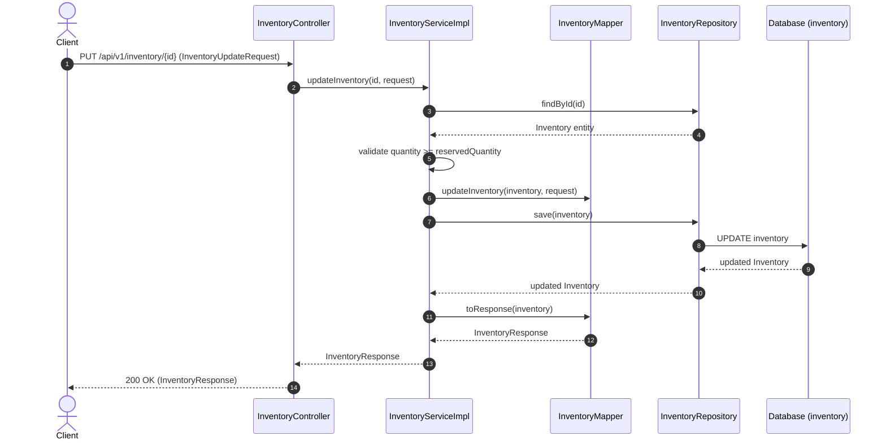

# Inventory Module

---

## Related Documentation

- [Documentation Index](README.md)
- [Architecture Overview](Architecture.md)
- [Security Architecture](Security.md)
- [Database Schema Specification](Database-Schema.md)
- [REST API Specification](API-Design.md)
- [Product Module](Product.md)

---

## Overview

The Inventory module provides warehouse inventory tracking and stock management for AmazonScale products. It manages 1-to-1 associations with products, tracking total stock quantity, reserved stock quantity (held for active orders), dynamic available quantity, warehouse storage locations, and low stock alert thresholds.

**Package root:** `com.amazonscale.inventory`

---

## Features

- **Create Inventory**: Establish a warehouse inventory record for a product (`POST /api/v1/inventory`).
- **Get Inventory by ID**: Retrieve inventory details by primary key (`GET /api/v1/inventory/{id}`).
- **Get Inventory by Product ID**: Lookup inventory details using the associated product ID (`GET /api/v1/inventory/product/{productId}`).
- **Get All Inventories**: Fetch list of all inventory records (`GET /api/v1/inventory`).
- **Update Inventory**: Modify stock quantity, warehouse location, and low stock threshold (`PUT /api/v1/inventory/{id}`).
- **Delete Inventory**: Remove an inventory record (`DELETE /api/v1/inventory/{id}`).
- **Dynamic Available Stock Calculation**: Dynamically computes `availableQuantity = max(0, quantity - reservedQuantity)`.
- **Stock Reservation Guards**: Prevents reducing total quantity below reserved quantity and blocks deleting inventory records with active reserved stock.

---

## Architecture

```
Client
  │
  │ HTTP Request + JWT Token
  v
InventoryController      (@RestController, @RequestMapping("/api/v1/inventory"))
  │
  │ delegates to
  v
InventoryService         (interface)
  │
  │ implemented by
  v
InventoryServiceImpl     (@Service, @Transactional)
  │
  ├── uses InventoryMapper for DTO transformations
  ├── uses InventoryRepository for inventory persistence
  └── uses ProductRepository for product validation
  │
  v
Database (inventory table)
```

---

## Package Structure

```
com.amazonscale.inventory
├── controller
│   └── InventoryController.java                REST endpoints for inventory management
├── dto
│   ├── InventoryRequest.java                   Inbound DTO for inventory creation
│   ├── InventoryResponse.java                  Outbound DTO for inventory responses
│   └── InventoryUpdateRequest.java             Inbound DTO for updating inventory
├── entity
│   └── Inventory.java                          JPA entity for warehouse stock
├── exception
│   ├── InsufficientStockException.java         Thrown on stock validation failures
│   ├── InventoryAlreadyExistsException.java   Thrown when duplicate inventory is created
│   └── InventoryNotFoundException.java        Thrown when inventory record is not found
├── mapper
│   └── InventoryMapper.java                    Utility mapper for entity-DTO conversion
├── repository
│   └── InventoryRepository.java                Spring Data JPA repository for inventory
└── service
    ├── InventoryService.java                   Inventory service interface
    └── impl
        └── InventoryServiceImpl.java           Inventory service implementation
```

---

## Entities

### Inventory

**Purpose:** Represents warehouse stock tracking for a single product.

**Table:** `inventory`

| Field | Type | Constraints | Description |
|-------|------|-------------|-------------|
| `id` | `Long` | `@Id`, `@GeneratedValue(IDENTITY)` | Primary key |
| `product` | `Product` | `@OneToOne(LAZY, optional = false)`, `@JoinColumn(name = "product_id", nullable = false, unique = true)` | Associated product (1-to-1) |
| `quantity` | `Integer` | `@NotNull`, `@PositiveOrZero`, `nullable = false` | Total physical stock in warehouse |
| `reservedQuantity` | `Integer` | `@NotNull`, `@PositiveOrZero`, default `0`, `nullable = false` | Quantity reserved for pending orders |
| `warehouseLocation` | `String` | `@NotBlank`, `@Size(max = 200)`, `nullable = false, length = 200` | Physical warehouse location code |
| `lowStockThreshold` | `Integer` | `@NotNull`, `@PositiveOrZero`, default `10`, `nullable = false` | Threshold trigger for low stock alert |
| `createdAt` | `LocalDateTime` | `@NotNull`, `nullable = false, updatable = false` | Creation timestamp |
| `updatedAt` | `LocalDateTime` | `@NotNull`, `nullable = false` | Last update timestamp |

**Indexes:**
- `idx_inventory_product` on `product_id`

**Transient Helper Methods:**
- `getAvailableQuantity()`: `@Transient` method returning `Math.max(0, (quantity == null ? 0 : quantity) - (reservedQuantity == null ? 0 : reservedQuantity))`.

**Lifecycle Callbacks:**
- `@PrePersist prePersist()`: Sets `createdAt` and `updatedAt` to `LocalDateTime.now()`.
- `@PreUpdate preUpdate()`: Sets `updatedAt` to `LocalDateTime.now()`.

---

## DTOs

### InventoryRequest

**Purpose:** Request payload for creating a new inventory record.

| Field | Type | Constraints | Description |
|-------|------|-------------|-------------|
| `productId` | `Long` | `@NotNull(message = "Product Id is required")` | ID of target product |
| `quantity` | `Integer` | `@NotNull`, `@PositiveOrZero(message = "Quantity cannot be negative")` | Total initial quantity |
| `warehouseLocation` | `String` | `@NotBlank`, `@Size(max = 200)` | Warehouse location code |
| `lowStockThreshold` | `Integer` | `@NotNull`, `@PositiveOrZero` | Threshold for low stock |

**Used by:** `POST /api/v1/inventory`

---

### InventoryUpdateRequest

**Purpose:** Request payload for modifying an existing inventory record.

| Field | Type | Constraints | Description |
|-------|------|-------------|-------------|
| `quantity` | `Integer` | `@NotNull`, `@PositiveOrZero` | New total quantity |
| `warehouseLocation` | `String` | `@NotBlank`, `@Size(max = 200)` | Updated warehouse location |
| `lowStockThreshold` | `Integer` | `@NotNull`, `@PositiveOrZero` | Updated low stock threshold |

**Used by:** `PUT /api/v1/inventory/{id}`

---

### InventoryResponse

**Purpose:** Outbound DTO representing inventory status.

| Field | Type | Description |
|-------|------|-------------|
| `id` | `Long` | Inventory record ID |
| `productId` | `Long` | Product ID |
| `productName` | `String` | Product name |
| `quantity` | `Integer` | Total physical stock |
| `reservedQuantity` | `Integer` | Quantity reserved |
| `availableQuantity` | `Integer` | Available stock (`quantity - reservedQuantity`) |
| `warehouseLocation` | `String` | Warehouse location |
| `lowStockThreshold` | `Integer` | Low stock threshold limit |
| `lowStock` | `Boolean` | Flag indicating low stock alert status |
| `createdAt` | `LocalDateTime` | Creation timestamp |
| `updatedAt` | `LocalDateTime` | Last updated timestamp |

---

## Enums

*(No enums defined in the Inventory module).*

---

## Repository Layer

### InventoryRepository

Extends `JpaRepository<Inventory, Long>`.

| Method | Purpose | Used By |
|--------|---------|---------|
| `findByProductId(Long id)` | Retrieves inventory record by associated product ID | `InventoryServiceImpl.getInventoryByProductId` |
| `existsByProductId(Long id)` | Checks if an inventory record exists for product ID | `InventoryServiceImpl.createInventory` |
| `findById(Long id)` | Retrieves inventory record by primary key | `InventoryServiceImpl.getInventoryById`, `updateInventory`, `deleteInventoryById` |
| `findAll()` | Retrieves complete list of warehouse inventory records | `InventoryServiceImpl.getAllInventory` |
| `save(Inventory inventory)` | Persists or updates inventory record state | `InventoryServiceImpl.createInventory`, `updateInventory` |
| `delete(Inventory inventory)` | Hard deletes inventory record from database | `InventoryServiceImpl.deleteInventoryById` |

---

## Mapper Layer

### InventoryMapper

Stateless mapping utility class.

#### `toInventory(InventoryRequest request) -> Inventory`
- Maps `quantity`, `warehouseLocation`, `lowStockThreshold` into new `Inventory` entity.

#### `toResponse(Inventory inventory) -> InventoryResponse`
- Maps entity fields to `InventoryResponse` (includes `availableQuantity` via transient getter).

#### `updateInventory(Inventory inventory, InventoryUpdateRequest request) -> void`
- In-place update of `quantity`, `warehouseLocation`, and `lowStockThreshold`.

---

## Service Layer

### InventoryService (Interface)

- `createInventory(InventoryRequest request)`
- `updateInventory(Long id, InventoryUpdateRequest request)`
- `getInventoryById(Long id)`
- `getInventoryByProductId(Long productId)`
- `getAllInventory()`
- `deleteInventoryById(Long id)`

---

## InventoryServiceImpl

Annotated `@Service`, `@Transactional`. Injected with `InventoryRepository` and `ProductRepository`.

#### `createInventory(InventoryRequest request) -> InventoryResponse`
1. Validates product existence via `productRepository.findById` (throws `ProductNotFoundException`).
2. Checks for existing inventory for product via `inventoryRepository.existsByProductId` (throws `InventoryAlreadyExistsException`).
3. Maps request to entity, sets product reference, saves inventory record.
4. Returns mapped `InventoryResponse`.

#### `updateInventory(Long id, InventoryUpdateRequest request) -> InventoryResponse`
1. Fetches inventory entity by ID (throws `InventoryNotFoundException`).
2. Validates new quantity: `if (request.getQuantity() < inventory.getReservedQuantity())` throws `InsufficientStockException("Quantity cannot be less than reserved quantity.")`.
3. Updates entity via `InventoryMapper.updateInventory`.
4. Saves entity and returns mapped `InventoryResponse`.

#### `getInventoryById(Long id) -> InventoryResponse`
- `@Transactional(readOnly = true)`.
- Fetches inventory by ID (throws `InventoryNotFoundException`).
- Returns mapped `InventoryResponse`.

#### `getInventoryByProductId(Long productId) -> InventoryResponse`
- `@Transactional(readOnly = true)`.
- Fetches inventory by product ID (throws `InventoryNotFoundException`).
- Returns mapped `InventoryResponse`.

#### `deleteInventoryById(Long id) -> void`
1. Fetches inventory by ID (throws `InventoryNotFoundException`).
2. Validates reserved stock: `if (inventory.getReservedQuantity() > 0)` throws `InsufficientStockException("Cannot delete inventory with reserved stock.")`.
3. Deletes record via `inventoryRepository.delete`.

#### `getAllInventory() -> List<InventoryResponse>`
- `@Transactional(readOnly = true)`.
- Fetches all inventory records, maps to `InventoryResponse` list, and returns.

---

## Controller Layer

### InventoryController

`@RestController` at `/api/v1/inventory`. Tagged `@Tag(name = "Inventories")`.

| HTTP Method | Endpoint | Description | Request Body | Status Code | Response Body |
|-------------|----------|-------------|--------------|-------------|---------------|
| `POST` | `/api/v1/inventory` | Create inventory record | `@Valid InventoryRequest` | `201 Created` | `InventoryResponse` |
| `GET` | `/api/v1/inventory/{id}` | Get inventory by ID | None | `200 OK` | `InventoryResponse` |
| `GET` | `/api/v1/inventory` | Get all inventory records | None | `200 OK` | `List<InventoryResponse>` |
| `GET` | `/api/v1/inventory/product/{productId}` | Get inventory by Product ID | None | `200 OK` | `InventoryResponse` |
| `PUT` | `/api/v1/inventory/{id}` | Update inventory record | `@Valid InventoryUpdateRequest` | `200 OK` | `InventoryResponse` |
| `DELETE` | `/api/v1/inventory/{id}` | Delete inventory record | None | `204 No Content` | Void |

---

## Business Rules

| Rule | Description | Enforcement Location |
|------|-------------|----------------------|
| **1-to-1 Product Binding** | Each product can have at most one inventory record | `Inventory.product` (`unique = true`) & `createInventory` |
| **Quantity Floor Enforcement** | Total quantity cannot be updated below currently reserved quantity | `InventoryServiceImpl.updateInventory` |
| **Deletion Guard** | Inventory records with active `reservedQuantity > 0` cannot be deleted | `InventoryServiceImpl.deleteInventoryById` |
| **Dynamic Available Stock** | `availableQuantity` is calculated dynamically as `max(0, quantity - reservedQuantity)` | `Inventory.getAvailableQuantity()` |
| **Default Reserved Stock** | `reservedQuantity` defaults to 0 on entity creation | `Inventory.reservedQuantity` |
| **Default Low Stock Threshold** | `lowStockThreshold` defaults to 10 on entity creation | `Inventory.lowStockThreshold` |

---

## Validation Rules

### DTO Level
- `InventoryRequest`:
  - `productId`: `@NotNull(message = "Product Id is required")`
  - `quantity`: `@NotNull`, `@PositiveOrZero(message = "Quantity cannot be negative")`
  - `warehouseLocation`: `@NotBlank`, `@Size(max = 200)`
  - `lowStockThreshold`: `@NotNull`, `@PositiveOrZero`
- `InventoryUpdateRequest`:
  - `quantity`: `@NotNull`, `@PositiveOrZero`
  - `warehouseLocation`: `@NotBlank`, `@Size(max = 200)`
  - `lowStockThreshold`: `@NotNull`, `@PositiveOrZero`

---

## Exception Handling

| Exception | HTTP Status | Thrown When | Handler |
|-----------|-------------|-------------|---------|
| `InventoryNotFoundException` | `404 NOT_FOUND` | Inventory ID or product ID does not exist | `GlobalExceptionHandler` |
| `InventoryAlreadyExistsException` | `409 CONFLICT` | Attempting to create duplicate inventory for product | `GlobalExceptionHandler` |
| `InsufficientStockException` | `400 BAD_REQUEST` | Quantity < reserved stock or deleting reserved stock | `GlobalExceptionHandler` |

---

## Security

- **Authentication**: Secured via `JwtAuthenticationFilter` in `SecurityConfig`.
- **Authorization**: No role-based access control (RBAC) currently restricts warehouse endpoints.

---

## Request Lifecycle

End-to-end execution flow for Inventory updates:

```
Client
   ↓
JWT Filter (Validates Bearer token identity)
   ↓
Controller (InventoryController receives @Valid InventoryUpdateRequest)
   ↓
Validation (JSR-303 annotations enforce non-negative stock constraints)
   ↓
Service (InventoryServiceImpl validates quantity >= reservedQuantity)
   ↓
Mapper (InventoryMapper updates entity fields in-place)
   ↓
Repository (InventoryRepository persists entity via Spring Data JPA)
   ↓
Database (PostgreSQL / MySQL inventory table modification)
   ↓
Response (200 OK with InventoryResponse payload)
```

---

## Database Design

### Table: `inventory`

```sql
CREATE TABLE inventory (
    id BIGINT AUTO_INCREMENT PRIMARY KEY,
    product_id BIGINT NOT NULL UNIQUE,
    quantity INT NOT NULL,
    reserved_quantity INT NOT NULL DEFAULT 0,
    warehouse_location VARCHAR(200) NOT NULL,
    low_stock_threshold INT NOT NULL DEFAULT 10,
    created_at DATETIME NOT NULL,
    updated_at DATETIME NOT NULL,
    CONSTRAINT fk_inventory_product FOREIGN KEY (product_id) REFERENCES products(id),
    INDEX idx_inventory_product (product_id)
);
```

---

## Testing

**Test Suite Coverage Summary:** 10 test classes in `src/test/java/com/amazonscale/inventory` (705 total lines):

| Component | Test Class | Coverage Description |
|-----------|------------|----------------------|
| **Controller** | `InventoryControllerTest` | MockMvc integration tests for all 6 endpoints. |
| **Service** | `InventoryServiceImplTest` | Unit tests for creation, duplicate check, quantity vs reserved validation, deletion guards, queries. |
| **Mapper** | `InventoryMapperTest` | DTO-entity conversion and update mapping tests. |
| **DTOs** | `InventoryRequestTest`, `InventoryResponseTest`, `InventoryUpdateRequestTest` | Validation constraints, getter/setter, and builder tests. |
| **Entity** | `InventoryTest` | Transient `availableQuantity` calculation and callback tests. |
| **Exceptions** | `InsufficientStockExceptionTest`, `InventoryAlreadyExistsExceptionTest`, `InventoryNotFoundExceptionTest` | Exception message assertion tests. |

### Test Type Status

| Test Type | Status |
|-----------|--------|
| DTO Tests | ✅ |
| Mapper Tests | ✅ |
| Service Tests | ✅ |
| Controller Tests | ✅ |
| Repository Tests | ✅ |
| Exception Tests | ✅ |

---

## Sequence Diagram

### Update Stock / Inventory Flow



---

## Module Dependencies

### Direct Dependencies
- **Product Module**: Uses `Product` entity, `ProductRepository`, `ProductNotFoundException`.
- **Common Module**: Uses `GlobalExceptionHandler` and `ErrorResponse`.

### Cross-Module Interactions & Notes
- **Dual Stock Tracking**: `Product` entity maintains a `stock` field, while `Inventory` entity maintains `quantity` and `reservedQuantity`. `OrderServiceImpl` currently modifies `Product.stock` directly upon order placement.

---

## Design Decisions

- **Why DTOs are used**: Decouples warehouse representation DTOs (`InventoryRequest`, `InventoryUpdateRequest`, `InventoryResponse`) from JPA database entities, shielding internal storage structures like `reservedQuantity` management.
- **Why static mappers**: `InventoryMapper` performs fast, stateless field conversions and in-place updates without dynamic proxy creation or Spring container overhead.
- **Why @Transactional**: Protects stock update boundaries against concurrent dirty writes, rolling back changes if reservation constraints are violated.
- **Why lazy loading**: Product entity mapping (`@OneToOne(fetch = LAZY)`) delays product table joins until explicit product metadata access is required.
- **Why JWT**: Authenticates stock management APIs statelessly without requiring sticky HTTP session management across warehouse servers.
- **Why BCrypt**: Secures backend API requests across all modules, ensuring inventory modification calls execute within valid security contexts.
- **Why package-by-feature**: Aggregates warehouse inventory controllers, service implementations, repositories, DTOs, and exception handlers within `com.amazonscale.inventory`.

---

## Current Limitations

1. **Unsynchronized Dual Stock Systems**: Stock exists in both `Product.stock` and `Inventory.quantity` without an active synchronization mechanism.
2. **`InventoryResponse.lowStock` Unpopulated**: `InventoryMapper.toResponse` does not compute or set `lowStock` boolean flag on response DTOs.
3. **No Stock Reservation Operations**: `InventoryService` lacks dedicated `reserveStock()` or `releaseStock()` operations for `OrderServiceImpl` integration.
4. **Unpaginated Listing**: `getAllInventory()` returns an unpaginated list of records.
5. **Lack of Role Control**: Warehouse inventory APIs are accessible to any authenticated user without requiring administrative or warehouse manager roles.

---

## Future Enhancements

- **Stock System Consolidation**: Synchronize `Product.stock` with `Inventory.availableQuantity` via domain events or database triggers.
- **Stock Reservation API**: Introduce explicit `reserveStock(productId, quantity)` and `releaseStock(productId, quantity)` methods for Order module integration.
- **Populate Low Stock Alert**: Compute and assign `lowStock = (availableQuantity <= lowStockThreshold)` in `InventoryMapper.toResponse()`.
- **Pagination Support**: Implement `Pageable` parameters for `getAllInventory()`.
- **Warehouse RBAC**: Restrict inventory mutation endpoints with `@PreAuthorize("hasRole('WAREHOUSE_MANAGER')")`.

