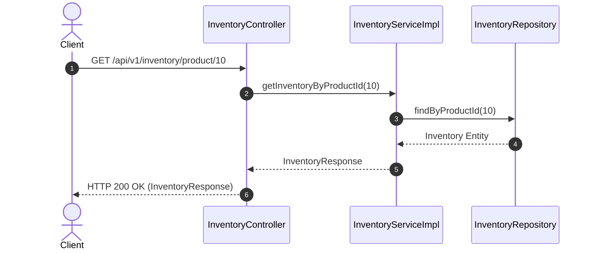
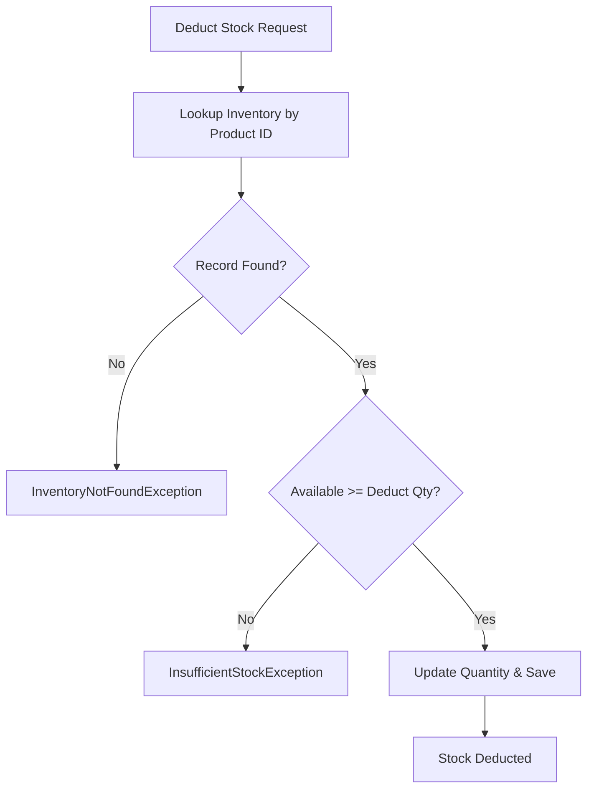

# Inventory Module Specification

---

## 1. Overview
The **Inventory Module** manages physical warehouse stock levels, reserved quantity tracking, warehouse location mapping, low-stock threshold alerts, and stock deductions for **AmazonScale**.

---

## 2. Purpose
Provides physical inventory availability guards preventing overselling during customer checkout pipelines.

---

## 3. Architecture
Contained within `com.amazonscale.inventory`, following standard package-by-feature layer isolation.

---

## 4. Package Structure
```
com.amazonscale.inventory
├── controller
│   └── InventoryController.java
├── dto
│   ├── InventoryRequest.java
│   ├── InventoryResponse.java
│   └── InventoryUpdateRequest.java
├── entity
│   └── Inventory.java
├── exception
│   ├── InsufficientStockException.java
│   ├── InventoryAlreadyExistsException.java
│   └── InventoryNotFoundException.java
├── mapper
│   └── InventoryMapper.java
├── repository
│   └── InventoryRepository.java
└── service
    ├── InventoryService.java
    └── impl
        └── InventoryServiceImpl.java
```

---

## 5. Components
- **`InventoryController`**: REST endpoint handler (`/api/v1/inventory`).
- **`InventoryServiceImpl`**: Manages inventory creation, stock reservation, deduction, and threshold validation.
- **`InventoryRepository`**: JPA repository executing database queries on `inventory`.
- **`InventoryMapper`**: DTO entity conversion component.

---

## 6. Database Design
- **Table Name**: `inventory`
- **Primary Key**: `id` (`BIGINT`, Auto-Increment)
- **Columns**:
  - `id` BIGINT AUTO_INCREMENT PRIMARY KEY
  - `product_id` BIGINT NOT NULL UNIQUE
  - `quantity` INT NOT NULL DEFAULT 0
  - `reserved_quantity` INT NOT NULL DEFAULT 0
  - `warehouse_location` VARCHAR(200) NOT NULL
  - `low_stock_threshold` INT NOT NULL DEFAULT 10
  - `created_at` DATETIME NOT NULL
  - `updated_at` DATETIME NOT NULL
- **Indexes**: `idx_inventory_product` (`product_id`)

---

## 7. Entity Relationships
- `Inventory` 1:1 `Product` (`JoinColumn(name = "product_id")`)

---

## 8. DTOs
- **`InventoryRequest`**: `productId`, `quantity`, `warehouseLocation`, `lowStockThreshold`.
- **`InventoryUpdateRequest`**: `quantity`, `reservedQuantity`, `warehouseLocation`, `lowStockThreshold`.
- **`InventoryResponse`**: `id`, `productId`, `quantity`, `reservedQuantity`, `availableQuantity`, `warehouseLocation`, `lowStockThreshold`, `isLowStock`, `createdAt`, `updatedAt`.

---

## 9. Repository Layer
- **`InventoryRepository`**: Extends `JpaRepository<Inventory, Long>`
  - `Optional<Inventory> findByProductId(Long productId)`
  - `boolean existsByProductId(Long productId)`

---

## 10. Service Layer
- **`InventoryService`**:
  - `InventoryResponse createInventory(InventoryRequest request)`
  - `InventoryResponse getInventoryById(Long id)`
  - `InventoryResponse getInventoryByProductId(Long productId)`
  - `List<InventoryResponse> getAllInventory()`
  - `InventoryResponse updateInventory(Long id, InventoryUpdateRequest request)`
  - `void deductStock(Long productId, Integer quantity)`
  - `void restoreStock(Long productId, Integer quantity)`
  - `void deleteInventory(Long id)`

---

## 11. Controller Layer
- `POST /api/v1/inventory` -> `createInventory()` -> HTTP `201 Created`
- `GET /api/v1/inventory/{id}` -> `getInventoryById()` -> HTTP `200 OK`
- `GET /api/v1/inventory` -> `getAllInventory()` -> HTTP `200 OK`
- `GET /api/v1/inventory/product/{productId}` -> `getInventoryByProductId()` -> HTTP `200 OK`
- `PUT /api/v1/inventory/{id}` -> `updateInventory()` -> HTTP `200 OK`
- `DELETE /api/v1/inventory/{id}` -> `deleteInventory()` -> HTTP `204 No Content`

---

## 12. Business Rules
1. **One-to-One Product Guard**: Each product can have at most one inventory record (`InventoryAlreadyExistsException`).
2. **Stock Availability Rule**: Available stock is calculated as `quantity - reservedQuantity`.
3. **Insufficient Stock Guard**: Deducting stock beyond available quantity throws `InsufficientStockException`.
4. **Low Stock Indicator**: `isLowStock` is dynamically evaluated as `availableQuantity <= lowStockThreshold`.

---

## 13. Validation
- `productId`: `@NotNull`.
- `quantity`: `@NotNull`, `@PositiveOrZero`.
- `warehouseLocation`: `@NotBlank`, `@Size(max = 200)`.
- `lowStockThreshold`: `@NotNull`, `@PositiveOrZero`.

---

## 14. Exception Handling
- `InventoryNotFoundException` -> HTTP `404 Not Found`.
- `InventoryAlreadyExistsException` -> HTTP `400 Bad Request`.
- `InsufficientStockException` -> HTTP `400 Bad Request`.

---

## 15. Security
Secured via JWT Bearer Token validation in Spring Security.

---

## 16. API Reference

### `POST /api/v1/inventory`
- **Request**: `InventoryRequest`
- **Response**: `201 Created` (`InventoryResponse`)

### `GET /api/v1/inventory/{id}`
- **Response**: `200 OK` (`InventoryResponse`)

### `GET /api/v1/inventory/product/{productId}`
- **Response**: `200 OK` (`InventoryResponse`)

### `PUT /api/v1/inventory/{id}`
- **Request**: `InventoryUpdateRequest`
- **Response**: `200 OK` (`InventoryResponse`)

### `DELETE /api/v1/inventory/{id}`
- **Response**: `204 No Content`

---

## 17. Request Flow
HTTP Request -> `InventoryController` -> `InventoryServiceImpl` (`@Transactional`) -> `InventoryRepository` -> `InventoryMapper` -> JSON Response.

---

## 18. Sequence Diagram



---

## 19. Mermaid Diagrams



---

## 20. Testing Overview
Tested via unit tests in `src/test/java/com/amazonscale/inventory`:
- `InventoryServiceImplTest`: Stock deduction, stock restoration, threshold checks.
- `InventoryControllerTest`: MockMvc controller endpoint verification.

---

## 21. Known Limitations
1. No explicit optimistic locking (`@Version`) on stock modification operations.

---

## 22. Future Improvements
See technical recommendations:
- [Inventory Recommendations](recommendations/Inventory-Recommendations.md)

---

## 23. References
- [Architecture Documentation](Architecture.md)
- [Database Schema Documentation](Database-Schema.md)
