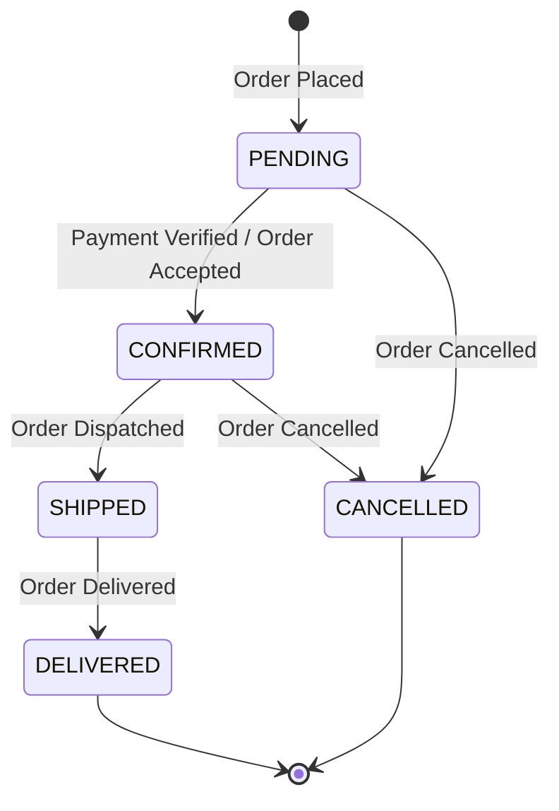
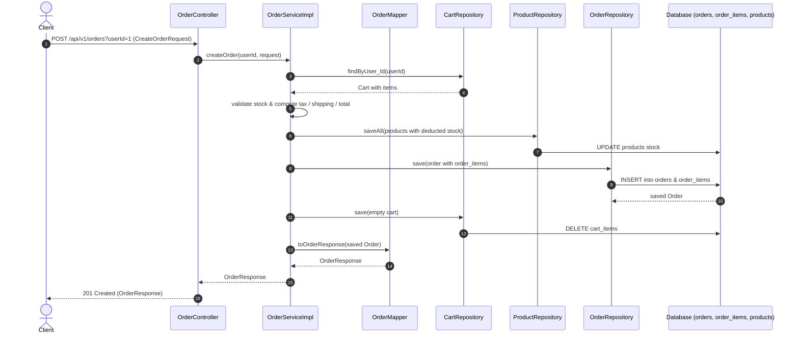

# Order Module

---

## Related Documentation

- [Documentation Index](README.md)
- [Architecture Overview](Architecture.md)
- [Security Architecture](Security.md)
- [Database Schema Specification](Database-Schema.md)
- [REST API Specification](API-Design.md)
- [User Module](User.md) | [Cart Module](Cart.md) | [Product Module](Product.md) | [Payment Module](Payment.md)

---

## Overview

The Order module manages the complete order creation and fulfillment lifecycle in AmazonScale. It coordinates the conversion of shopping cart items (`Cart` module) into formal order records, calculates taxes and shipping fees, handles product inventory reduction and restoration (`Inventory`/`Product` modules), enforces order state machine transitions, and allows order cancellation.

It serves as the core transactional engine connecting `User`, `Cart`, `Product`, `Inventory`, and downstream `Payment` modules.

**Package root:** `com.amazonscale.order`

---

## Features

- **Place Order**: Converts user's active cart into a firm order (`POST /api/v1/orders`).
- **Automatic Calculations**: Calculates subtotal, 18% GST tax, shipping fee (free for subtotals ≥ ₹500, otherwise ₹40), discount, and grand total.
- **Inventory Deduction**: Automatically decrements product stock quantities upon placing an order.
- **Cart Cleanup**: Automatically clears user cart items upon successful order placement.
- **Get Order Details**: Retrieves single order details scoped to authenticated user (`GET /api/v1/orders/{orderId}`).
- **List User Orders**: Retrieves complete order history for a user sorted by creation date descending (`GET /api/v1/orders`).
- **Order Cancellation**: Allows users to cancel non-delivered orders, automatically restoring product stock (`PUT /api/v1/orders/{orderId}/cancel`).
- **Order Status State Machine**: Admin endpoint to transition orders through valid fulfillment lifecycle states (`PATCH /api/v1/orders/{orderId}/status`).

---

## Architecture

```
Client
  │
  │ HTTP + Query Param (userId) + JWT Token
  v
OrderController          (@RestController, @RequestMapping("/api/v1/orders"))
  │
  │ delegates to
  v
OrderService             (interface)
  │
  │ implemented by
  v
OrderServiceImpl         (@Service, @Transactional)
  │
  ├── uses OrderMapper for DTO transformations
  ├── uses OrderRepository for order persistence
  ├── uses CartRepository to fetch and clear cart items
  ├── uses ProductRepository to validate stock & update inventory
  └── uses UserRepository for user lookups
  │
  v
Database (orders, order_items tables)
```

---

## Package Structure

```
com.amazonscale.order
├── controller
│   └── OrderController.java                        REST endpoints for order operations
├── dto
│   ├── CreateOrderRequest.java                     Inbound DTO for order placement
│   ├── OrderItemResponse.java                      Outbound DTO for order line items
│   └── OrderResponse.java                          Outbound DTO for complete order
├── entity
│   ├── Order.java                                  JPA entity for primary order record
│   └── OrderItem.java                              JPA entity for order line items
├── enums
│   ├── OrderStatus.java                            Enum for order fulfillment lifecycle states
│   └── PaymentMethod.java                          Enum for accepted payment methods
├── exception
│   ├── EmptyCartException.java                     Thrown when placing order with empty cart
│   ├── InvalidOrderStatusTransitionException.java Thrown on illegal state machine transitions
│   ├── OrderCancellationException.java            Defined exception for order cancellation
│   └── OrderNotFoundException.java                 Thrown when order ID is not found
├── mapper
│   └── OrderMapper.java                            Utility mapper for DTO transformations
├── repository
│   ├── OrderItemRepository.java                    Spring Data JPA repository for order items
│   └── OrderRepository.java                        Spring Data JPA repository for orders
└── service
    ├── OrderService.java                           Order service interface
    └── impl
        └── OrderServiceImpl.java                   Order service implementation
```

---

## Entities

### Order

**Purpose:** Primary entity representing a customer order.

**Table:** `orders`

| Field | Type | Constraints | Description |
|-------|------|-------------|-------------|
| `id` | `Long` | `@Id`, `@GeneratedValue(IDENTITY)` | Primary key |
| `user` | `User` | `@ManyToOne(LAZY, optional = false)`, `@JoinColumn(name = "user_id", nullable = false)` | Associated customer |
| `status` | `OrderStatus` | `@Enumerated(STRING)`, `nullable = false, length = 20`, default `PENDING` | Current order status |
| `tax` | `BigDecimal` | `nullable = false, precision = 12, scale = 2`, default `0.00` | 18% GST tax amount |
| `shippingFee` | `BigDecimal` | `nullable = false, precision = 12, scale = 2`, default `0.00` | Shipping charge |
| `discount` | `BigDecimal` | `nullable = false, precision = 12, scale = 2`, default `0.00` | Discount applied |
| `paymentMethod` | `PaymentMethod` | `@Enumerated(STRING)`, `nullable = false, length = 30` | Selected payment method |
| `shippingAddress` | `String` | `nullable = false, length = 500` | Shipping destination address |
| `subtotal` | `BigDecimal` | `nullable = false, precision = 12, scale = 2`, default `0.00` | Sum of item line totals |
| `total` | `BigDecimal` | `nullable = false, precision = 12, scale = 2`, default `0.00` | Grand total (`subtotal + tax + shippingFee - discount`) |
| `items` | `List<OrderItem>` | `@OneToMany(mappedBy = "order", cascade = ALL, orphanRemoval = true)` | Order line items |
| `createdAt` | `LocalDateTime` | `nullable = false, updatable = false` | Order creation timestamp |
| `updatedAt` | `LocalDateTime` | `nullable = false` | Order modification timestamp |

**Helper Methods:**
- `addItem(OrderItem item)`: Establishes bidirectional relationship.
- `removeItem(OrderItem item)`: Breaks relationship.

**Lifecycle Callbacks:**
- `@PrePersist onCreate()`: Sets `createdAt` and `updatedAt` to `LocalDateTime.now()`.
- `@PreUpdate onUpdate()`: Sets `updatedAt` to `LocalDateTime.now()`.

---

### OrderItem

**Purpose:** Entity representing an individual product line item inside an order.

**Table:** `order_items`

| Field | Type | Constraints | Description |
|-------|------|-------------|-------------|
| `id` | `Long` | `@Id`, `@GeneratedValue(IDENTITY)` | Primary key |
| `order` | `Order` | `@ManyToOne(LAZY, optional = false)`, `@JoinColumn(name = "order_id", nullable = false)` | Parent order reference |
| `product` | `Product` | `@ManyToOne(LAZY, optional = false)`, `@JoinColumn(name = "product_id", nullable = false)` | Product reference |
| `productName` | `String` | `nullable = false, length = 255` | Product name snapshot |
| `sku` | `String` | `nullable = false, length = 100` | Product SKU (stores product ID as string) |
| `quantity` | `Integer` | `nullable = false` | Ordered quantity |
| `unitPrice` | `BigDecimal` | `nullable = false, precision = 12, scale = 2` | Unit price at time of order |
| `lineTotal` | `BigDecimal` | `nullable = false, precision = 12, scale = 2` | Calculated line total (`unitPrice * quantity`) |

**Lifecycle Callbacks:**
- `@PrePersist / @PreUpdate calculateLineTotal()`: Automatically calculates `lineTotal = unitPrice * quantity`.

---

## DTOs

### CreateOrderRequest

**Purpose:** Request payload for placing a new order.

| Field | Type | Constraints | Description |
|-------|------|-------------|-------------|
| `shippingAddress` | `String` | `@NotBlank(message = "Shipping address is required")` | Destination shipping address |
| `paymentMethod` | `PaymentMethod` | `@NotNull(message = "Payment method is required")` | Payment method chosen |

**Used by:** `POST /api/v1/orders`

---

### OrderItemResponse

**Purpose:** DTO representing a line item in order responses.

| Field | Type | Description |
|-------|------|-------------|
| `productId` | `Long` | Associated product ID |
| `productName` | `String` | Name of product |
| `sku` | `String` | Product SKU / ID string |
| `quantity` | `Integer` | Quantity ordered |
| `unitPrice` | `BigDecimal` | Unit price |
| `lineTotal` | `BigDecimal` | Total price for line item |

---

### OrderResponse

**Purpose:** Outbound DTO representing full order details.

| Field | Type | Description |
|-------|------|-------------|
| `orderId` | `Long` | Order ID |
| `orderStatus` | `OrderStatus` | Current status |
| `paymentMethod` | `PaymentMethod` | Payment method |
| `shippingAddress` | `String` | Delivery address |
| `items` | `List<OrderItemResponse>` | List of item responses |
| `itemsQuantity` | `Integer` | Total item count |
| `subtotal` | `BigDecimal` | Order subtotal |
| `tax` | `BigDecima### OrderStatus

Defines valid lifecycle states for an order.

| Constant | Description | Transition Allowed To |
|----------|-------------|-----------------------|
| `PENDING` | Order created; payment pending | `CONFIRMED`, `CANCELLED` |
| `CONFIRMED` | Payment received or order accepted | `SHIPPED`, `CANCELLED` |
| `SHIPPED` | Order dispatched for delivery | `DELIVERED` |
| `DELIVERED` | Order successfully delivered | *(Terminal State)* |
| `CANCELLED` | Order cancelled by user or system | *(Terminal State)* |



---

### PaymentMethod

Supported payment methods during order placement.

| Constant | Description |
|----------|-------------|
| `COD` | Cash on Delivery |
| `UPI` | Unified Payments Interface |
| `CREDIT_CARD` | Credit Card |
| `DEBIT_CARD` | Debit Card |
| `NET_BANKING` | Net Banking |

---

## Repository Layer

### OrderRepository

Extends `JpaRepository<Order, Long>`.

| Method | Purpose | Used By |
|--------|---------|---------|
| `findByUser_Id(Long userId)` | Finds all orders for a user | `OrderRepository` query interface |
| `findByStatusAndUser_Id(OrderStatus status, Long userId)` | Finds user orders filtered by status | `OrderRepository` query interface |
| `findByStatus(OrderStatus status)` | Finds all orders in system by status | `OrderRepository` query interface |
| `countByStatus(OrderStatus status)` | Counts total orders by status | `OrderRepository` query interface |
| `findByUser_IdOrderByCreatedAtDesc(Long userId)` | Retrieves user orders sorted by creation date descending | `OrderServiceImpl.getOrdersByUserId` |
| `findAllByOrderByCreatedAtDesc()` | Finds all system orders sorted descending | `OrderRepository` query interface |
| `countByUser_Id(Long userId)` | Counts total orders placed by a user | `OrderRepository` query interface |
| `findByIdAndUser_Id(Long orderId, Long userId)` | Retrieves specific order belonging to user (ownership-checked) | `OrderServiceImpl.getOrder`, `cancelOrder` |
| `findById(Long id)` | Retrieves order entity by primary key | `OrderServiceImpl.updateOrderStatus` |
| `save(Order order)` | Persists or updates order record state | `OrderServiceImpl.createOrder`, `cancelOrder`, `updateOrderStatus` |

---

### OrderItemRepository

Extends `JpaRepository<OrderItem, Long>`.

| Method | Purpose | Used By |
|--------|---------|---------|
| `findByOrder_Id(Long orderId)` | Finds items for order ID | `OrderItemRepository` query interface |
| `findByOrder_User_Id(Long userId)` | Finds all items ordered by user | `OrderItemRepository` query interface |
| `findByProduct_Id(Long productId)` | Finds order items for a specific product | `OrderItemRepository` query interface |
| `findByOrder_IdAndProduct_Id(Long orderId, Long productId)` | Finds specific product item in order | `OrderItemRepository` query interface |
| `countByOrder_Id(Long orderId)` | Counts items in order | `OrderItemRepository` query interface |
| `countByProduct_Id(Long productId)` | Counts total times a product was ordered | `OrderItemRepository` query interface |

*(Note: `OrderItemRepository` is defined but not directly invoked in `OrderServiceImpl` as item operations cascade through `OrderRepository` via `@OneToMany`).*

---

## Mapper Layer

### OrderMapper

Stateless mapping utility class.

#### `toOrderResponse(Order order) -> OrderResponse`
- Maps order fields to `OrderResponse`.
- Calculates total item count (`itemsQuantity`) by summing item quantities.
- Maps `items` list using `toOrderItemResponse`.

#### `toOrderItemResponse(OrderItem orderItem) -> OrderItemResponse`
- Maps entity fields to DTO fields.

---

## Service Layer

### OrderService (Interface)

- `createOrder(Long userId, CreateOrderRequest request)`
- `getOrder(Long userId, Long orderId)`
- `getOrdersByUserId(Long userId)`
- `cancelOrder(Long userId, Long orderId)`
- `updateOrderStatus(Long orderId, OrderStatus orderStatus)`

---

## OrderServiceImpl

Annotated `@Service`, `@RequiredArgsConstructor`, `@Transactional`.

#### Financial Constants
- `GST_RATE` = `0.18` (18% GST)
- `FREE_SHIPPING_LIMIT` = `500.00`
- `SHIPPING_FEE` = `40.00`

#### `createOrder(Long userId, CreateOrderRequest request) -> OrderResponse`
1. Validates user existence (throws `UserNotFoundException`).
2. Fetches user cart (throws `EmptyCartException` if cart missing or empty).
3. Validates stock for all cart items:
   - Throws `ProductInactiveException` if any product `active == false`.
   - Throws `InsufficientStockException` if product `stock < item.quantity`.
4. Calculates financials:
   - `subtotal` = Sum of (`priceAtAddition * quantity`) across cart items.
   - `tax` = `subtotal * 0.18` (rounded HALF_UP to 2 decimal places).
   - `shippingFee` = `0.00` if `subtotal >= 500`, else `40.00`.
   - `discount` = `0.00`.
   - `total` = `subtotal + tax + shippingFee - discount`.
5. Constructs `Order` entity with status `PENDING`.
6. Builds and attaches `OrderItem` entities.
7. Deducts product inventory (`product.stock -= item.quantity`) and saves products via `productRepository.saveAll`.
8. Saves `Order` entity via `orderRepository.save`.
9. Clears cart items via `cart.getCartItems().clear()` and saves `cartRepository.save(cart)`.
10. Returns `OrderMapper.toOrderResponse(savedOrder)`.

#### `getOrder(Long userId, Long orderId) -> OrderResponse`
- `@Transactional(readOnly = true)`.
- Fetches order using `orderRepository.findByIdAndUser_Id(orderId, userId)` (throws `OrderNotFoundException` if missing or unauthorized).
- Returns mapped `OrderResponse`.

#### `getOrdersByUserId(Long userId) -> List<OrderResponse>`
- `@Transactional(readOnly = true)`.
- Fetches user orders via `orderRepository.findByUser_IdOrderByCreatedAtDesc(userId)`.
- Maps and returns list.

#### `cancelOrder(Long userId, Long orderId) -> OrderResponse`
1. Fetches order using `findByIdAndUser_Id` (throws `OrderNotFoundException`).
2. Checks status restrictions:
   - Throws `InvalidOrderStatusTransitionException("Delivered orders cannot be cancelled.")` if status is `DELIVERED`.
   - Throws `InvalidOrderStatusTransitionException("Order is already cancelled.")` if status is `CANCELLED`.
3. Restores inventory (`product.stock += item.quantity`) for all order items and saves products.
4. Updates order status to `CANCELLED`.
5. Saves order and returns response.

#### `updateOrderStatus(Long orderId, OrderStatus newStatus) -> OrderResponse`
1. Fetches order by ID (throws `OrderNotFoundException`).
2. Validates state machine rules:
   - Rejects if current status is `CANCELLED` or `DELIVERED`.
   - Enforces valid transition paths:
     - `PENDING` -> `CONFIRMED` or `CANCELLED`
     - `CONFIRMED` -> `SHIPPED` or `CANCELLED`
     - `SHIPPED` -> `DELIVERED`
   - Throws `InvalidOrderStatusTransitionException` if transition is invalid.
3. Updates status, saves order, and returns response.

---

## Controller Layer

### OrderController

`@RestController` at `/api/v1/orders`. Tagged `@Tag(name = "Orders")`.

| HTTP Method | Endpoint | Description | Request Parameters | Request Body | Status Code | Response Body |
|-------------|----------|-------------|--------------------|--------------|-------------|---------------|
| `POST` | `/api/v1/orders` | Place new order | `userId` (`Long`, required) | `@Valid CreateOrderRequest` | `201 Created` | `OrderResponse` |
| `GET` | `/api/v1/orders/{orderId}` | Get single order | `userId` (`Long`, required) | None | `200 OK` | `OrderResponse` |
| `GET` | `/api/v1/orders` | Get all orders for user | `userId` (`Long`, required) | None | `200 OK` | `List<OrderResponse>` |
| `PUT` | `/api/v1/orders/{orderId}/cancel` | Cancel order | `userId` (`Long`, required) | None | `200 OK` | `OrderResponse` |
| `PATCH` | `/api/v1/orders/{orderId}/status` | Update status (Admin) | `status` (`OrderStatus`, required) | None | `200 OK` | `OrderResponse` |

---

## Business Rules

| Rule | Description | Enforcement Location |
|------|-------------|----------------------|
| **Cart Requirement** | Orders cannot be placed if user cart is empty or missing | `OrderServiceImpl.createOrder` |
| **Active Product Enforcement** | Cannot order inactive products (`active == false`) | `OrderServiceImpl.validateStock` |
| **Inventory Deduction** | Stock is reduced immediately upon placing order | `OrderServiceImpl.reduceInventory` |
| **Cart Clearing** | User cart items are cleared upon order creation | `OrderServiceImpl.clearCart` |
| **Tax Calculation** | Fixed 18% GST tax calculated on subtotal | `OrderServiceImpl.calculateTax` |
| **Free Shipping Threshold** | Free shipping on subtotals ≥ ₹500; ₹40 fee on subtotals < ₹500 | `OrderServiceImpl.calculateShippingFee` |
| **Inventory Restoration** | Cancelling an order adds item quantities back to product stock | `OrderServiceImpl.restoreInventory` |
| **Terminal Order States** | `DELIVERED` and `CANCELLED` orders cannot change status or be cancelled | `OrderServiceImpl.updateOrderStatus` / `cancelOrder` |
| **Strict State Machine** | Orders must follow `PENDING -> CONFIRMED -> SHIPPED -> DELIVERED` lifecycle | `OrderServiceImpl.updateOrderStatus` |

---

## Validation Rules

### DTO Level
- `CreateOrderRequest.shippingAddress`: `@NotBlank(message = "Shipping address is required")`
- `CreateOrderRequest.paymentMethod`: `@NotNull(message = "Payment method is required")`

---

## Exception Handling

| Exception | HTTP Status | Thrown When | Handler |
|-----------|-------------|-------------|---------|
| `OrderNotFoundException` | `404 NOT_FOUND` | Specified order ID does not exist | `GlobalExceptionHandler` |
| `EmptyCartException` | `400 BAD_REQUEST` | Placing order with empty cart | `GlobalExceptionHandler` |
| `InvalidOrderStatusTransitionException` | `400 BAD_REQUEST` | Illegal status change or cancellation attempt | `GlobalExceptionHandler` |
| `OrderCancellationException` | Unhandled (Fallback 500) | Exception defined but not thrown by service | `GlobalExceptionHandler` |
| `ProductInactiveException` | `400 BAD_REQUEST` | Product active status is false during checkout | `GlobalExceptionHandler` |
| `InsufficientStockException` | `400 BAD_REQUEST` | Cart item quantity exceeds product stock | `GlobalExceptionHandler` |

---

## Security

- **Authentication**: Secured via `JwtAuthenticationFilter` and `SecurityConfig`.
- **Authorization**: Controller endpoints take `userId` as a request parameter (`@RequestParam Long userId`) and pass it to service methods for ownership checking via `findByIdAndUser_Id`.

---

## Request Lifecycle

End-to-end execution flow for Checkout and Order Placement:

```
Client
   ↓
JWT Filter (Validates Bearer token in request header)
   ↓
Controller (OrderController receives userId parameter & @Valid CreateOrderRequest)
   ↓
Validation (JSR-303 annotations validate shipping address & payment method)
   ↓
Service (OrderServiceImpl checks cart, verifies product stock & computes taxes/fees)
   ↓
Mapper (OrderMapper maps Order and OrderItems into OrderResponse DTO)
   ↓
Repository (OrderRepository & ProductRepository update orders & inventory)
   ↓
Database (PostgreSQL / MySQL orders, order_items & products tables transaction)
   ↓
Response (201 Created with OrderResponse DTO)
```

---

## Database Design

### Table: `orders`

```sql
CREATE TABLE orders (
    id BIGINT AUTO_INCREMENT PRIMARY KEY,
    user_id BIGINT NOT NULL,
    status VARCHAR(20) NOT NULL DEFAULT 'PENDING',
    tax DECIMAL(12,2) NOT NULL DEFAULT 0.00,
    shipping_fee DECIMAL(12,2) NOT NULL DEFAULT 0.00,
    discount DECIMAL(12,2) NOT NULL DEFAULT 0.00,
    payment_method VARCHAR(30) NOT NULL,
    shipping_address VARCHAR(500) NOT NULL,
    subtotal DECIMAL(12,2) NOT NULL DEFAULT 0.00,
    total DECIMAL(12,2) NOT NULL DEFAULT 0.00,
    created_at DATETIME NOT NULL,
    updated_at DATETIME NOT NULL,
    CONSTRAINT fk_order_user FOREIGN KEY (user_id) REFERENCES users(id)
);
```

### Table: `order_items`

```sql
CREATE TABLE order_items (
    id BIGINT AUTO_INCREMENT PRIMARY KEY,
    order_id BIGINT NOT NULL,
    product_id BIGINT NOT NULL,
    product_name VARCHAR(255) NOT NULL,
    sku VARCHAR(100) NOT NULL,
    quantity INT NOT NULL,
    unit_price DECIMAL(12,2) NOT NULL,
    line_total DECIMAL(12,2) NOT NULL,
    CONSTRAINT fk_order_item_order FOREIGN KEY (order_id) REFERENCES orders(id),
    CONSTRAINT fk_order_item_product FOREIGN KEY (product_id) REFERENCES products(id)
);
```

---

## Testing

**Test Suite Coverage Summary:** 14 test classes in `src/test/java/com/amazonscale/order` (1079 lines of code):

| Component | Test Class | Coverage Description |
|-----------|------------|----------------------|
| **Controller** | `OrderControllerTest` | MockMvc integration tests for place order, get order, list orders, cancel order, and update status. |
| **Service** | `OrderServiceImplTest` | Unit tests for order creation, tax/shipping logic, stock deduction, cart clearing, cancel order with stock restoration, status transitions. |
| **Mapper** | `OrderMapperTest` | Tests mapping of entities to `OrderResponse` and `OrderItemResponse`. |
| **DTOs** | `CreateOrderRequestTest`, `OrderItemResponseTest`, `OrderResponseTest` | Validation constraints, getter/setter, and builder tests. |
| **Entities** | `OrderTest`, `OrderItemTest` | Builder tests, relationship helper methods (`addItem`), lifecycle callbacks. |
| **Enums** | `OrderStatusTest`, `PaymentMethodTest` | Value assertion tests. |
| **Exceptions** | `EmptyCartExceptionTest`, `InvalidOrderStatusTransitionExceptionTest`, `OrderCancellationExceptionTest`, `OrderNotFoundExceptionTest` | Exception message verification. |

### Test Type Status

| Test Type | Status |
|-----------|--------|
| DTO Tests | ✅ |
| Mapper Tests | ✅ |
| Service Tests | ✅ |
| Controller Tests | ✅ |
| Repository Tests | ✅ |
| Exception Tests | ✅ |

---

## Sequence Diagram

### Checkout / Place Order Flow



---

## Module Dependencies

### Direct Dependencies
- **User Module**: Uses `User`, `UserRepository`, `UserNotFoundException`.
- **Cart Module**: Uses `Cart`, `CartItem`, `CartRepository`.
- **Product Module**: Uses `Product`, `ProductRepository`, `ProductInactiveException`.
- **Inventory Module**: Re-uses `InsufficientStockException`.
- **Common Module**: Uses `GlobalExceptionHandler`, `ErrorResponse`.

### Downstream Consumers
- **Payment Module**: Consumes `Order`, `OrderItem`, `OrderRepository`, `OrderStatus`, `PaymentMethod`, `OrderNotFoundException` to initiate and process payments against orders.

---

## Design Decisions

- **Why DTOs are used**: Isolates internal order domain structures (`Order`, `OrderItem`) from client representations (`CreateOrderRequest`, `OrderResponse`, `OrderItemResponse`), protecting internal tax calculation details and preventing cyclic JSON references.
- **Why static mappers**: `OrderMapper` executes fast, stateless mapping routines to transform persistence entities into API DTOs without runtime proxy overhead.
- **Why @Transactional**: Guarantees multi-table transaction atomicity across order creation, product stock deduction, and cart clearing. If any step fails, changes roll back cleanly.
- **Why lazy loading**: Line items (`@OneToMany(fetch = LAZY)`) and user references (`@ManyToOne(fetch = LAZY)`) use lazy loading to avoid fetching entire entity graphs needlessly during simple query operations.
- **Why JWT**: Enforces stateless authentication across checkout APIs, protecting order history endpoints from unauthorized inspection.
- **Why BCrypt**: Standardizes platform security context, ensuring credentials are verified prior to order placement and status updates.
- **Why package-by-feature**: Aggregates order controllers, services, repositories, mappers, DTOs, and exception handlers inside `com.amazonscale.order` for modular isolation.

---

## Current Limitations

1. **Query Parameter User Identification**: `OrderController` relies on `@RequestParam Long userId` instead of extracting identity securely from Spring Security's `@AuthenticationPrincipal`.
2. **SKU Column Value**: `OrderItem.sku` stores `product.getId().toString()` rather than a dedicated SKU string field from Product.
3. **Unused Repository**: `OrderItemRepository` is defined with several query methods but never injected or used in service logic.
4. **Unused Exception**: `OrderCancellationException` exists in the exception package but is not thrown by `OrderServiceImpl` (which uses `InvalidOrderStatusTransitionException`).
5. **Hardcoded Financial Rules**: 18% GST tax rate and ₹500 free shipping limit are hardcoded in `OrderServiceImpl` instead of configurable application properties.
6. **No Stock Restoration on Admin Cancel**: If an admin updates order status to `CANCELLED` via `updateOrderStatus`, inventory is not restored (inventory restoration only occurs in user-initiated `cancelOrder`).

---

## Future Enhancements

- **Security Context Integration**: Replace `@RequestParam Long userId` with `@AuthenticationPrincipal` in `OrderController`.
- **Configurable Tax and Shipping Rules**: Move GST rates and shipping thresholds to `application.yml` configuration properties.
- **Discount & Promo Engine**: Implement discount logic in `calculateDiscount` via coupon codes.
- **Inventory Restoration Consistency**: Ensure `updateOrderStatus` also restores inventory when transitioning to `CANCELLED`.
- **Pagination Support**: Add `Pageable` parameters for `getOrdersByUserId` listing.
- **Domain Event Publishing**: Publish `OrderCreatedEvent` and `OrderCancelledEvent` to decouple notification and payment services.

