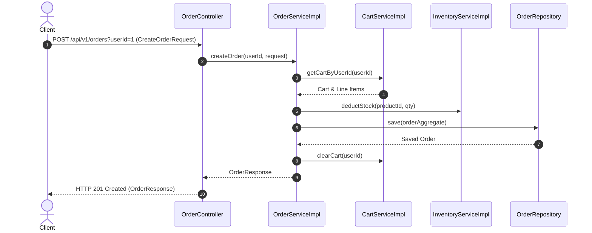
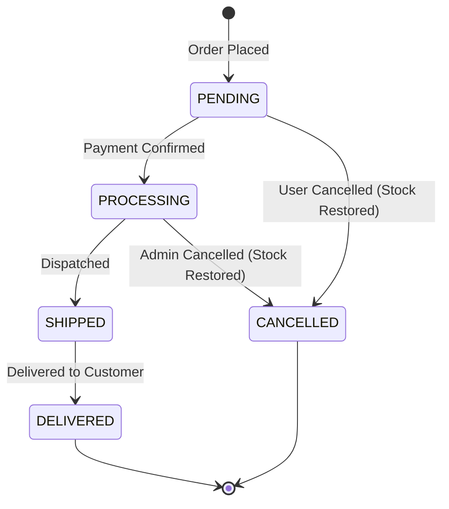

# Order Module Specification

---

## 1. Overview
The **Order Module** processes customer checkouts, creates order header and item snapshots, computes tax and shipping fees, manages status state machine transitions, and executes order cancellations for **AmazonScale**.

---

## 2. Purpose
Provides transactional order fulfillment processing, snapshot item recording, stock deduction, and order state management.

---

## 3. Architecture
Located under `com.amazonscale.order`, implementing clean layer isolation across controllers, services, repositories, and entities.

---

## 4. Package Structure
```
com.amazonscale.order
├── controller
│   └── OrderController.java
├── dto
│   ├── CreateOrderRequest.java
│   ├── OrderItemResponse.java
│   └── OrderResponse.java
├── entity
│   ├── Order.java
│   ├── OrderItem.java
│   └── OrderStatus.java
├── exception
│   ├── EmptyCartException.java
│   ├── InvalidOrderStatusTransitionException.java
│   ├── OrderCancellationException.java
│   └── OrderNotFoundException.java
├── mapper
│   └── OrderMapper.java
├── repository
│   ├── OrderItemRepository.java
│   └── OrderRepository.java
└── service
    ├── OrderService.java
    └── impl
        └── OrderServiceImpl.java
```

---

## 5. Components
- **`OrderController`**: REST controller handling `/api/v1/orders`.
- **`OrderServiceImpl`**: Orchestrates checkout execution, inventory deduction, order calculation, state transitions, and cancellation stock restoration.
- **`OrderRepository`**: Database repository for `orders`.
- **`OrderItemRepository`**: Database repository for `order_items`.
- **`OrderMapper`**: Entity-to-DTO conversion component.

---

## 6. Database Design
- **Tables**: `orders`, `order_items`
- **`orders` Columns**:
  - `id` BIGINT AUTO_INCREMENT PRIMARY KEY
  - `user_id` BIGINT NOT NULL
  - `status` VARCHAR(20) NOT NULL DEFAULT 'PENDING'
  - `subtotal` DECIMAL(12,2) NOT NULL DEFAULT 0.00
  - `tax` DECIMAL(12,2) NOT NULL DEFAULT 0.00
  - `shipping_fee` DECIMAL(12,2) NOT NULL DEFAULT 0.00
  - `discount` DECIMAL(12,2) NOT NULL DEFAULT 0.00
  - `total` DECIMAL(12,2) NOT NULL DEFAULT 0.00
  - `payment_method` VARCHAR(30) NOT NULL
  - `shipping_address` VARCHAR(500) NOT NULL
  - `created_at` DATETIME NOT NULL
  - `updated_at` DATETIME NOT NULL
- **`order_items` Columns**:
  - `id` BIGINT AUTO_INCREMENT PRIMARY KEY
  - `order_id` BIGINT NOT NULL
  - `product_id` BIGINT NOT NULL
  - `product_name` VARCHAR(255) NOT NULL
  - `sku` VARCHAR(100) NOT NULL
  - `quantity` INT NOT NULL
  - `unit_price` DECIMAL(12,2) NOT NULL
  - `line_total` DECIMAL(12,2) NOT NULL
- **Indexes**: `idx_order_user`, `idx_order_status`, `idx_order_item_order`

---

## 7. Entity Relationships
- `Order` N:1 `User` (`JoinColumn(name = "user_id")`)
- `Order` 1:N `OrderItem` (`mappedBy = "order"`, `cascade = ALL`, `orphanRemoval = true`)
- `OrderItem` N:1 `Product` (`JoinColumn(name = "product_id")`)

---

## 8. DTOs
- **`CreateOrderRequest`**: `shippingAddress`, `paymentMethod`.
- **`OrderItemResponse`**: `id`, `productId`, `productName`, `sku`, `quantity`, `unitPrice`, `lineTotal`.
- **`OrderResponse`**: `id`, `userId`, `status`, `items`, `subtotal`, `tax`, `shippingFee`, `discount`, `total`, `shippingAddress`, `paymentMethod`, `createdAt`, `updatedAt`.

---

## 9. Repository Layer
- **`OrderRepository`**:
  - `List<Order> findByUserId(Long userId)`
  - `List<Order> findByStatus(OrderStatus status)`
- **`OrderItemRepository`**:
  - `List<OrderItem> findByOrderId(Long orderId)`

---

## 10. Service Layer
- **`OrderService`**:
  - `OrderResponse createOrder(Long userId, CreateOrderRequest request)`
  - `OrderResponse getOrderById(Long orderId)`
  - `List<OrderResponse> getOrdersByUserId(Long userId)`
  - `OrderResponse cancelOrder(Long orderId)`
  - `OrderResponse updateOrderStatus(Long orderId, OrderStatus status)`

---

## 11. Controller Layer
- `POST /api/v1/orders` -> `createOrder()` -> HTTP `201 Created`
- `GET /api/v1/orders/{id}` -> `getOrderById()` -> HTTP `200 OK`
- `GET /api/v1/orders/user/{userId}` -> `getOrdersByUserId()` -> HTTP `200 OK`
- `POST /api/v1/orders/{id}/cancel` -> `cancelOrder()` -> HTTP `200 OK`
- `PUT /api/v1/orders/{id}/status` -> `updateOrderStatus()` -> HTTP `200 OK`

---

## 12. Business Rules
1. **Cart Emptiness Guard**: Cannot place an order with an empty shopping cart (`EmptyCartException`).
2. **Stock Verification & Deduction**: Order checkout verifies stock and deducts physical inventory.
3. **Tax & Shipping Calculation**: Tax is calculated as 18% of subtotal; shipping is flat rate ₹50 (free above ₹500).
4. **State Machine Transitions**: Status updates follow valid state machine flow (`PENDING` -> `PROCESSING` -> `SHIPPED` -> `DELIVERED`). Invalid transitions throw `InvalidOrderStatusTransitionException`.
5. **Order Cancellation Guard**: Orders can only be cancelled while in `PENDING` or `PROCESSING` state (`OrderCancellationException`). Cancelling an order restores inventory stock.

---

## 13. Validation
- `shippingAddress`: `@NotBlank`, `@Size(max = 500)`.
- `paymentMethod`: `@NotBlank`.

---

## 14. Exception Handling
- `OrderNotFoundException` -> HTTP `404 Not Found`.
- `EmptyCartException` -> HTTP `400 Bad Request`.
- `OrderCancellationException` -> HTTP `400 Bad Request`.
- `InvalidOrderStatusTransitionException` -> HTTP `400 Bad Request`.

---

## 15. Security
Protected by JWT Bearer token authentication in Spring Security.

---

## 16. API Reference

### `POST /api/v1/orders`
- **Query Parameter**: `userId` (Long, required)
- **Request**: `CreateOrderRequest`
- **Response**: `201 Created` (`OrderResponse`)

### `GET /api/v1/orders/{id}`
- **Response**: `200 OK` (`OrderResponse`)

### `POST /api/v1/orders/{id}/cancel`
- **Response**: `200 OK` (`OrderResponse`)

---

## 17. Request Flow
HTTP Client Request -> `OrderController` -> `OrderServiceImpl` (`@Transactional`) -> Stock Check & Deduction -> Order & OrderItem DB Creation -> Clear Cart -> Return `OrderResponse`.

---

## 18. Sequence Diagram



---

## 19. Mermaid Diagrams



---

## 20. Testing Overview
Covered by JUnit 5 tests in `src/test/java/com/amazonscale/order`:
- `OrderServiceImplTest`: Order placement, stock deduction, tax/shipping logic, state transitions, cancellation logic.
- `OrderControllerTest`: MockMvc endpoint tests.

---

## 21. Known Limitations
1. Hardcoded 18% tax calculation in domain service code.

---

## 22. Future Improvements
Refer to technical recommendations:
- [Order Recommendations](recommendations/Order-Recommendations.md)

---

## 23. References
- [Architecture Documentation](Architecture.md)
- [Database Schema Documentation](Database-Schema.md)
