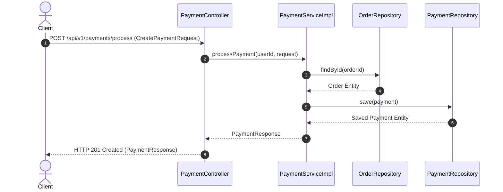
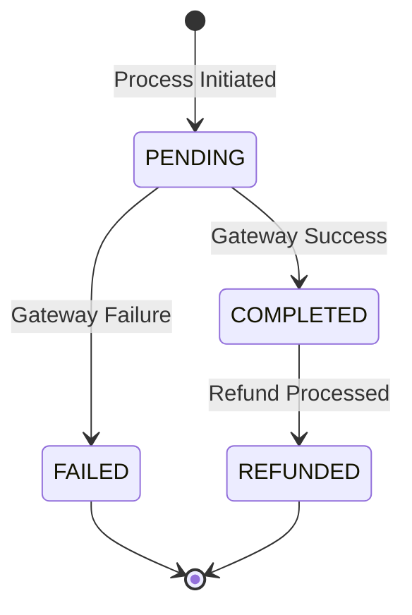

# Payment Module Specification

---

## 1. Overview
The **Payment Module** handles financial transaction processing, payment gateway interaction, payment verification, transaction status tracking, and refund processing for **AmazonScale**.

---

## 2. Purpose
Provides secure transaction processing connecting placed orders with mock/real payment gateways and maintaining financial transaction records.

---

## 3. Architecture
Located in `com.amazonscale.payment`, enforcing clean separation across controllers, domain services, repositories, DTOs, and mappers.

---

## 4. Package Structure
```
com.amazonscale.payment
├── controller
│   └── PaymentController.java
├── dto
│   ├── CreatePaymentRequest.java
│   ├── PaymentResponse.java
│   └── RefundRequest.java
├── entity
│   └── Payment.java
├── enums
│   ├── PaymentGateway.java
│   └── PaymentStatus.java
├── exception
│   ├── InvalidPaymentException.java
│   ├── PaymentFailedException.java
│   └── PaymentNotFoundException.java
├── mapper
│   └── PaymentMapper.java
├── repository
│   └── PaymentRepository.java
└── service
    ├── PaymentService.java
    └── impl
        └── PaymentServiceImpl.java
```

---

## 5. Components
- **`PaymentController`**: Exposes REST endpoints (`/api/v1/payments`).
- **`PaymentServiceImpl`**: Handles payment processing, transaction verification, and refund state changes.
- **`PaymentRepository`**: Database repository for `payments`.
- **`PaymentMapper`**: Converts between request DTOs, entities, and response DTOs.

---

## 6. Database Design
- **Table Name**: `payments`
- **Primary Key**: `id` (`BIGINT`, Auto-Increment)
- **Columns**:
  - `id` BIGINT AUTO_INCREMENT PRIMARY KEY
  - `order_id` BIGINT NOT NULL
  - `transaction_id` VARCHAR(100) NOT NULL UNIQUE
  - `amount` DECIMAL(12,2) NOT NULL
  - `currency` VARCHAR(3) NOT NULL DEFAULT 'INR'
  - `payment_method` VARCHAR(30) NOT NULL
  - `gateway` VARCHAR(30) NOT NULL
  - `status` VARCHAR(20) NOT NULL DEFAULT 'PENDING'
  - `refund_reason` VARCHAR(255) NULL
  - `created_at` DATETIME NOT NULL
  - `updated_at` DATETIME NOT NULL
- **Indexes**: `uk_payment_txn` (`transaction_id` UNIQUE), `idx_payment_order` (`order_id`)

---

## 7. Entity Relationships
- `Payment` N:1 `Order` (`JoinColumn(name = "order_id")`)

---

## 8. DTOs
- **`CreatePaymentRequest`**: `orderId`, `paymentMethod`, `amount`, `transactionId`.
- **`RefundRequest`**: `reason`.
- **`PaymentResponse`**: `id`, `orderId`, `transactionId`, `amount`, `currency`, `paymentMethod`, `gateway`, `status`, `refundReason`, `createdAt`, `updatedAt`.

---

## 9. Repository Layer
- **`PaymentRepository`**: Extends `JpaRepository<Payment, Long>`
  - `Optional<Payment> findByOrderId(Long orderId)`
  - `Optional<Payment> findByTransactionId(String transactionId)`
  - `boolean existsByTransactionId(String transactionId)`

---

## 10. Service Layer
- **`PaymentService`**:
  - `PaymentResponse processPayment(Long userId, CreatePaymentRequest request)`
  - `PaymentResponse getPaymentById(Long userId, Long paymentId)`
  - `PaymentResponse getPaymentByOrderId(Long userId, Long orderId)`
  - `PaymentResponse refundPayment(Long userId, Long paymentId, RefundRequest request)`

---

## 11. Controller Layer
- `POST /api/v1/payments/process` -> `processPayment()` -> HTTP `201 Created`
- `GET /api/v1/payments/{id}` -> `getPaymentById()` -> HTTP `200 OK`
- `GET /api/v1/payments/order/{orderId}` -> `getPaymentByOrderId()` -> HTTP `200 OK`
- `POST /api/v1/payments/{id}/refund` -> `refundPayment()` -> HTTP `200 OK`

---

## 12. Business Rules
1. **Transaction Uniqueness**: Transaction IDs must be globally unique (`InvalidPaymentException`).
2. **Order Amount Matching**: Payment amount must exactly match order total (`InvalidPaymentException`).
3. **Refund Eligibility Guard**: Refunds are permitted exclusively for payments with status `COMPLETED` (`InvalidPaymentException`).

---

## 13. Validation
- `orderId`: `@NotNull`.
- `paymentMethod`: `@NotBlank`.
- `amount`: `@NotNull`, `@Positive`.
- `transactionId`: `@NotBlank`, `@Size(max = 100)`.

---

## 14. Exception Handling
- `PaymentNotFoundException` -> HTTP `404 Not Found`.
- `PaymentFailedException` -> HTTP `400 Bad Request`.
- `InvalidPaymentException` -> HTTP `400 Bad Request`.

---

## 15. Security
Requires JWT authentication token and custom `X-User-Id` header for ownership authorization checks.

---

## 16. API Reference

### `POST /api/v1/payments/process`
- **Headers**: `Authorization: Bearer <JWT>`, `X-User-Id: <userId>`
- **Request**: `CreatePaymentRequest`
- **Response**: `201 Created` (`PaymentResponse`)

### `POST /api/v1/payments/{id}/refund`
- **Headers**: `Authorization: Bearer <JWT>`, `X-User-Id: <userId>`
- **Request**: `RefundRequest`
- **Response**: `200 OK` (`PaymentResponse`)

---

## 17. Request Flow
Client HTTP Request -> `PaymentController` -> `PaymentServiceImpl` (`@Transactional`) -> `Order` Validation -> `PaymentRepository` -> `PaymentMapper` -> JSON Response.

---

## 18. Sequence Diagram



---

## 19. Mermaid Diagrams



---

## 20. Testing Overview
Verified via unit tests in `src/test/java/com/amazonscale/payment`:
- `PaymentServiceImplTest`: Payment processing, amount validation, refund state machine transitions.
- `PaymentControllerTest`: MockMvc controller endpoint tests.

---

## 21. Known Limitations
1. Uses `X-User-Id` header in addition to standard JWT bearer security principal.

---

## 22. Future Improvements
See technical recommendations:
- [Payment Recommendations](recommendations/Payment-Recommendations.md)

---

## 23. References
- [Architecture Documentation](Architecture.md)
- [Database Schema Documentation](Database-Schema.md)
