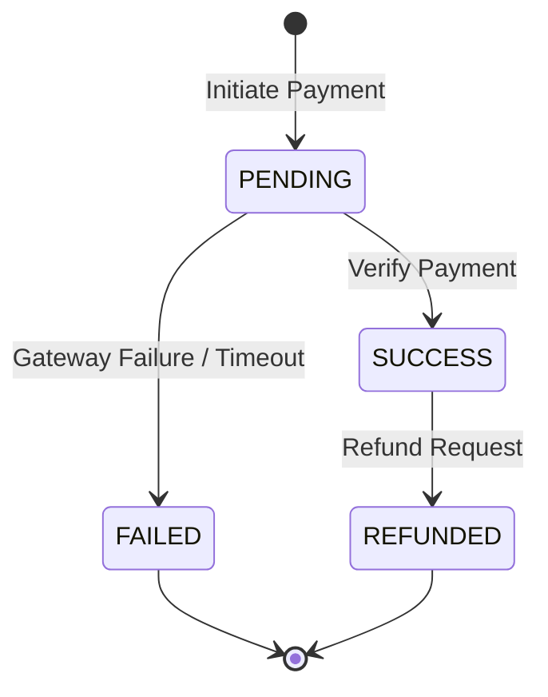
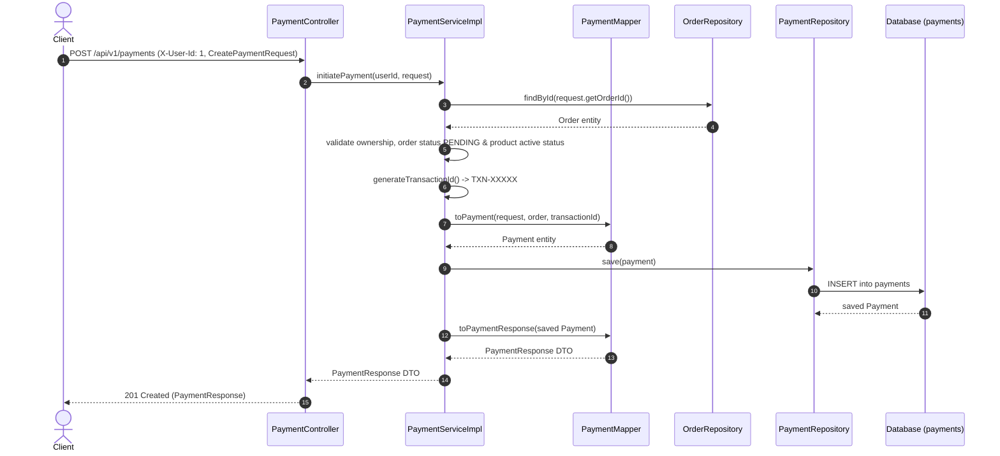
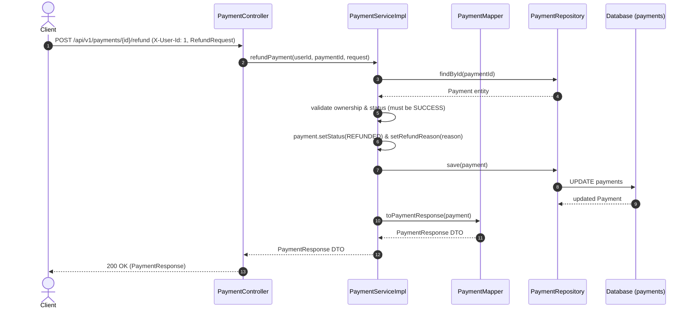

# Payment Module

---

## Related Documentation

- [Documentation Index](README.md)
- [Architecture Overview](Architecture.md)
- [Security Architecture](Security.md)
- [Database Schema Specification](Database-Schema.md)
- [REST API Specification](API-Design.md)
- [Order Module](Order.md) | [User Module](User.md)

---

## Overview

The Payment module is responsible for managing the complete payment lifecycle within AmazonScale. It handles payment initiation against orders, payment verification, payment retrieval, and refund processing. The module enforces strict ownership validation, ensuring users can only interact with payments tied to their own orders.

It sits downstream of the Order module, consuming `Order` and `OrderItem` entities to derive payment amounts, payment methods, and product eligibility. It does not interact directly with any external payment gateway; payment processing is simulated internally through status transitions.

**Package root:** `com.amazonscale.payment`

---

## Features

- Initiate a payment for a pending order with a chosen gateway
- Generate unique transaction IDs with the `TXN-` prefix
- Verify a pending payment, transitioning its status to `SUCCESS`
- Retrieve payment details by payment ID (ownership-scoped)
- Retrieve all payments for a specific order (ownership-scoped)
- Process refunds with a mandatory reason, transitioning status to `REFUNDED`
- Ownership validation on every payment operation via `X-User-Id` header
- Order eligibility validation (pending status, no prior successful payment, active products)
- Bean Validation on all inbound DTOs
- OpenAPI/Swagger annotations on all endpoints

---

## Architecture

```
Client
  |
  | HTTP + X-User-Id header
  v
PaymentController          (@RestController, @RequestMapping("/api/v1/payments"))
  |
  | delegates to
  v
PaymentService             (interface)
  |
  | implemented by
  v
PaymentServiceImpl         (@Service, @Transactional)
  |
  | uses PaymentMapper (static utility) for DTO <-> Entity conversion
  | uses PaymentRepository for persistence
  | uses OrderRepository for order lookups
  v
PaymentRepository          (JpaRepository<Payment, Long>)
  |
  v
Database (payments table)
```

Security is enforced at two levels:

1. **Infrastructure level** -- `JwtAuthenticationFilter` validates the Bearer token on every request. All endpoints under `/api/v1/payments/**` require authentication per `SecurityConfig`.
2. **Application level** -- Every service method receives `userId` from the `X-User-Id` request header and validates that the target payment or order belongs to that user.

---

## Package Structure

```
com.amazonscale.payment
├── controller
│   └── PaymentController.java          REST API endpoints
├── dto
│   ├── CreatePaymentRequest.java       Inbound DTO for payment initiation
│   ├── PaymentResponse.java            Outbound DTO for all responses
│   └── RefundRequest.java              Inbound DTO for refund requests
├── entity
│   └── Payment.java                    JPA entity mapped to "payments" table
├── enums
│   ├── PaymentGateway.java             Supported payment gateways
│   └── PaymentStatus.java              Payment lifecycle states
├── exception
│   ├── InvalidPaymentException.java    Business rule violations
│   ├── PaymentFailedException.java     Failed payment operations
│   └── PaymentNotFoundException.java   Payment lookup failures
├── mapper
│   └── PaymentMapper.java              Static DTO/Entity conversion utility
├── repository
│   └── PaymentRepository.java          Spring Data JPA repository
└── service
    ├── PaymentService.java             Service interface
    └── impl
        └── PaymentServiceImpl.java     Service implementation
```

---

## Entities

### Payment

**Purpose:** Represents a single payment transaction associated with an order.

**Table:** `payments`

| Field | Type | Constraints | Description |
|-------|------|-------------|-------------|
| `id` | `Long` | `@Id`, `@GeneratedValue(IDENTITY)` | Primary key, auto-generated |
| `order` | `Order` | `@NotNull`, `@ManyToOne(LAZY)`, `@JoinColumn("order_id", nullable=false)` | The order this payment belongs to |
| `transactionId` | `String` | `@NotBlank`, `unique=true`, `length=100` | Unique transaction identifier |
| `amount` | `BigDecimal` | `@NotNull`, `@Positive`, `precision=12, scale=2` | Payment amount derived from order total |
| `currency` | `String` | `@NotBlank`, `length=3`, default `"INR"` | ISO currency code |
| `paymentMethod` | `PaymentMethod` | `@Enumerated(STRING)`, `nullable=false` | Method used (from Order module enum) |
| `status` | `PaymentStatus` | `@Enumerated(STRING)`, `nullable=false`, default `PENDING` | Current payment state |
| `gateway` | `PaymentGateway` | `@Enumerated(STRING)`, `nullable=false` | Payment gateway used |
| `createdAt` | `LocalDateTime` | `nullable=false`, `updatable=false` | Record creation timestamp |
| `updatedAt` | `LocalDateTime` | `nullable=false` | Last modification timestamp |
| `refundReason` | `String` | `length=255` | Reason provided when refund is requested |

**Relationships:**

- `@ManyToOne` to `Order` (lazy-loaded). Multiple payments can exist for one order (e.g., failed attempts followed by a successful one).

**Lifecycle Callbacks:**

- `@PrePersist onCreate()` -- Sets both `createdAt` and `updatedAt` to `LocalDateTime.now()`.
- `@PreUpdate onUpdate()` -- Updates `updatedAt` to `LocalDateTime.now()`.

---

## DTOs

### CreatePaymentRequest

**Purpose:** Captures the data required to initiate a new payment.

| Field | Type | Validation | Description |
|-------|------|------------|-------------|
| `orderId` | `Long` | `@NotNull(message = "Order Id is required")` | Target order ID |
| `gateway` | `PaymentGateway` | `@NotNull(message = "Payment gateway is required")` | Selected payment gateway |

**Used by:** `POST /api/v1/payments`

### PaymentResponse

**Purpose:** Outbound representation of a payment returned by all endpoints.

| Field | Type | Description |
|-------|------|-------------|
| `id` | `Long` | Payment ID |
| `orderId` | `Long` | Associated order ID |
| `transactionId` | `String` | Unique transaction identifier |
| `amount` | `BigDecimal` | Payment amount |
| `currency` | `String` | Currency code |
| `paymentMethod` | `PaymentMethod` | Payment method from the order |
| `gateway` | `PaymentGateway` | Payment gateway used |
| `status` | `PaymentStatus` | Current payment status |
| `createdAt` | `LocalDateTime` | Creation timestamp |
| `updatedAt` | `LocalDateTime` | Last update timestamp |

**Returned by:** All payment endpoints.

### RefundRequest

**Purpose:** Captures the refund reason when requesting a payment refund.

| Field | Type | Validation | Description |
|-------|------|------------|-------------|
| `reason` | `String` | `@NotBlank(message = "Refund reason is required.")`, `@Size(max=255, message = "Refund reason must not exceed 255 characters.")` | Reason for the refund |

**Used by:** `POST /api/v1/payments/{paymentId}/refund`

---

## Enums

### PaymentStatus

Represents the lifecycle states of a payment.

| Constant | Description |
|----------|-------------|
| `PENDING` | Initial state when a payment is created |
| `PROCESSING` | Payment is being processed (defined but not used in current transitions) |
| `SUCCESS` | Payment has been verified and completed |
| `FAILED` | Payment has failed |
| `REFUNDED` | Payment has been refunded |
| `CANCELLED` | Payment has been cancelled (defined but not used in current transitions) |
| `PAID` | Payment is paid (defined but not used in current transitions) |
| `CONFIRMED` | Payment is confirmed (defined but not used in current transitions) |

**Active transitions in the service layer:** `PENDING -> SUCCESS` (via verify), `SUCCESS -> REFUNDED` (via refund).



### PaymentGateway

Represents the supported payment gateway providers.

| Constant | Description |
|----------|-------------|
| `STRIPE` | Stripe payment gateway |
| `RAZORPAY` | Razorpay payment gateway |
| `PHONEPAY` | PhonePe payment gateway |
| `BHARATPAY` | BharatPay payment gateway |
| `PAYPAL` | PayPal payment gateway |
| `COD` | Cash on Delivery |

**Used in:** `CreatePaymentRequest.gateway`, `Payment.gateway`, `PaymentResponse.gateway`.

---

## Repository Layer

### PaymentRepository

Extends `JpaRepository<Payment, Long>`.

| Method | Purpose | Used By |
|--------|---------|---------|
| `findByTransactionId(String transactionId)` | Lookup payment by unique transaction ID string | `PaymentRepository` query interface |
| `findByOrder_Id(Long orderId)` | Retrieves all payments associated with an order ID | `PaymentServiceImpl.getPaymentsByOrder`, `validateRequest` |
| `findByStatus(PaymentStatus status)` | Retrieves payments with a given status | `PaymentRepository` query interface |
| `findByGateway(PaymentGateway gateway)` | Retrieves payments processed through a given gateway | `PaymentRepository` query interface |
| `findByPaymentMethod(PaymentMethod paymentMethod)` | Retrieves payments by payment method | `PaymentRepository` query interface |
| `existsByTransactionId(String transactionId)` | Checks transaction ID uniqueness | `PaymentRepository` query interface |
| `countByStatus(PaymentStatus status)` | Counts total payments by status | `PaymentRepository` query interface |
| `findByOrder_User_Id(Long userId)` | Retrieves all payments for a given user ID | `PaymentRepository` query interface |
| `findByIdAndOrder_User_Id(Long paymentId, Long userId)` | Ownership-scoped payment lookup | `PaymentRepository` query interface |
| `findById(Long id)` | Retrieves payment entity by primary key | `PaymentServiceImpl.getAuthorizedPayment` |
| `save(Payment payment)` | Persists or updates payment entity state | `PaymentServiceImpl.initiatePayment`, `verifyPayment`, `refundPayment` |

*(Note: Methods such as `findByTransactionId`, `findByStatus`, `findByGateway`, `findByPaymentMethod`, `existsByTransactionId`, `countByStatus`, `findByOrder_User_Id`, and `findByIdAndOrder_User_Id` are defined but not directly invoked in `PaymentServiceImpl`).*

---

## Mapper Layer

### PaymentMapper

A `final` utility class with a private constructor. All methods are `static`. Performs null-safety checks via `Objects.requireNonNull` before mapping.

**`toPayment(CreatePaymentRequest, Order, String transactionId) -> Payment`**

- Extracts `amount` from `order.getTotal()`
- Extracts `paymentMethod` from `order.getPaymentMethod()`
- Sets `gateway` from `request.getGateway()`
- Hardcodes `currency` to `"INR"`
- Defaults `status` to `PaymentStatus.PENDING`
- Throws `NullPointerException` if any argument is null

**`toPaymentResponse(Payment) -> PaymentResponse`**

- Maps all entity fields to response DTO fields
- Extracts `orderId` from `payment.getOrder().getId()`
- Throws `NullPointerException` if payment is null

DTO mapping is used to decouple the JPA entity from the API contract, preventing lazy-loading issues and controlling the shape of the JSON response.

---

## Service Layer

### PaymentService (Interface)

Defines five operations, each accepting `userId` as the first parameter for ownership enforcement.

### PaymentServiceImpl

Annotated with `@Service`, `@RequiredArgsConstructor`, and `@Transactional` (class-level).

**Dependencies:** `PaymentRepository`, `OrderRepository`.

#### `initiatePayment(Long userId, CreatePaymentRequest request) -> PaymentResponse`

- Fetches the order by `request.getOrderId()`; throws `OrderNotFoundException` if absent.
- Validates the order belongs to `userId`; throws `InvalidPaymentException` if not.
- Calls `validateRequest(order)` which enforces: order must be `PENDING`, no existing `SUCCESS` payment, all order-item products must be active.
- Generates a unique transaction ID via `generateTransactionId()`.
- Maps to a `Payment` entity via `PaymentMapper.toPayment()`, saves, and returns the response.

#### `verifyPayment(Long userId, Long paymentId) -> PaymentResponse`

- Calls `getAuthorizedPayment(userId, paymentId)` to fetch and authorize.
- Rejects if status is `SUCCESS` (already verified), `REFUNDED` (cannot verify), or `FAILED` (cannot verify).
- Sets status to `SUCCESS`, saves, and returns the response.

#### `getPayment(Long userId, Long paymentId) -> PaymentResponse`

- Calls `getAuthorizedPayment(userId, paymentId)` and returns the mapped response.

#### `getPaymentsByOrder(Long userId, Long orderId) -> List<PaymentResponse>`

- Fetches the order; throws `OrderNotFoundException` if absent.
- Validates order ownership; throws `InvalidPaymentException` if unauthorized.
- Fetches payments by order ID; throws `PaymentNotFoundException` if the list is empty.
- Maps each payment to a response DTO and returns the list.

#### `refundPayment(Long userId, Long paymentId, RefundRequest request) -> PaymentResponse`

- Calls `getAuthorizedPayment(userId, paymentId)`.
- Rejects `PENDING` status (throws `InvalidPaymentException`), `FAILED` status (throws `PaymentFailedException`), and `REFUNDED` status (throws `InvalidPaymentException`).
- Sets status to `REFUNDED`, stores the refund reason, saves, and returns the response.

#### Private Helper Methods

- **`validateRequest(Order)`** -- Validates order eligibility for payment (pending status, no duplicate successful payment, all products active).
- **`generateTransactionId()`** -- Produces a `TXN-` prefixed string using a UUID substring (16 uppercase hex characters).
- **`getAuthorizedPayment(Long userId, Long paymentId)`** -- Fetches payment by ID, validates ownership through `payment.getOrder().getUser().getId()`.

---

## Controller Layer

### PaymentController

`@RestController` at `/api/v1/payments`. Tagged with `@Tag(name = "Payments")` for Swagger.

| HTTP Method | URL | Purpose | Request Header | Request Body | Response Body | Success Code | Error Codes |
|-------------|-----|---------|----------------|--------------|---------------|--------------|-------------|
| `POST` | `/api/v1/payments` | Initiate payment | `X-User-Id` (Long) | `CreatePaymentRequest` | `PaymentResponse` | `201 Created` | `400`, `404` |
| `PUT` | `/api/v1/payments/{paymentId}/verify` | Verify payment | `X-User-Id` (Long) | None | `PaymentResponse` | `200 OK` | `400`, `402`, `404` |
| `GET` | `/api/v1/payments/{paymentId}` | Get payment details | `X-User-Id` (Long) | None | `PaymentResponse` | `200 OK` | `400`, `404` |
| `GET` | `/api/v1/payments/orders/{orderId}` | Get payments by order | `X-User-Id` (Long) | None | `List<PaymentResponse>` | `200 OK` | `400`, `404` |
| `POST` | `/api/v1/payments/{paymentId}/refund` | Refund payment | `X-User-Id` (Long) | `RefundRequest` | `PaymentResponse` | `200 OK` | `400`, `402`, `404` |

---

## Business Rules

| Rule | Enforcement Location | Description |
|------|---------------------|-------------|
| Pending-only payment initiation | `validateRequest()` | Payments can only be initiated for orders with status `PENDING` |
| Duplicate payment prevention | `validateRequest()` | If any existing payment for the order has status `SUCCESS`, a new payment is rejected |
| Active product check | `validateRequest()` | All products in the order items must have `active = true` |
| Order ownership on initiation | `initiatePayment()` | The authenticated user must own the order being paid for |
| Payment ownership on access | `getAuthorizedPayment()` | The authenticated user must own the order linked to the payment |
| Idempotent verification guard | `verifyPayment()` | Already-verified (`SUCCESS`) payments cannot be verified again |
| Refunded-payment verification guard | `verifyPayment()` | Refunded payments cannot be verified |
| Failed-payment verification guard | `verifyPayment()` | Failed payments cannot be verified |
| Pending-payment refund guard | `refundPayment()` | Pending payments cannot be refunded |
| Failed-payment refund guard | `refundPayment()` | Failed payments cannot be refunded |
| Duplicate refund prevention | `refundPayment()` | Already-refunded payments cannot be refunded again |

---

## Validation Rules

### Bean Validation (DTO-level)

| DTO | Field | Annotation | Message |
|-----|-------|------------|---------|
| `CreatePaymentRequest` | `orderId` | `@NotNull` | "Order Id is required" |
| `CreatePaymentRequest` | `gateway` | `@NotNull` | "Payment gateway is required" |
| `RefundRequest` | `reason` | `@NotBlank` | "Refund reason is required." |
| `RefundRequest` | `reason` | `@Size(max=255)` | "Refund reason must not exceed 255 characters." |

### Entity-level Validation

| Field | Annotation |
|-------|------------|
| `order` | `@NotNull` |
| `transactionId` | `@NotBlank` |
| `amount` | `@NotNull`, `@Positive` |
| `currency` | `@NotBlank` |

---

## Exception Handling

| Exception | HTTP Status | When Thrown |
|-----------|-------------|------------|
| `PaymentNotFoundException` | `404 Not Found` | Payment ID does not exist; no payments found for an order |
| `InvalidPaymentException` | `400 Bad Request` | Business rule violation (unauthorized access, invalid status transition, duplicate payment, inactive product) |
| `PaymentFailedException` | `402 Payment Required` | Attempting to verify or refund a failed payment |
| `OrderNotFoundException` | `404 Not Found` | Referenced order ID does not exist (from Order module) |
| `MethodArgumentNotValidException` | `400 Bad Request` | Bean Validation failure on request body |

---

## Security

- **Authentication:** JWT-based. The `JwtAuthenticationFilter` extracts and validates a Bearer token from the `Authorization` header on every request. All `/api/v1/payments/**` endpoints require authentication per `SecurityConfig`.
- **Authorization:** Application-level ownership checks. The `X-User-Id` header is read by the controller and passed to the service layer. The service verifies that `payment.getOrder().getUser().getId()` matches the provided user ID.
- **CSRF:** Disabled in `SecurityConfig`.
- **Session:** Stateless (`SessionCreationPolicy.STATELESS`).

---

## Request Lifecycle

End-to-end execution flow for Payment Initiation:

```
Client
   ↓
JWT Filter (Interprets Bearer token & populates SecurityContext)
   ↓
Controller (PaymentController intercepts request with X-User-Id header & CreatePaymentRequest)
   ↓
Validation (JSR-303 annotations validate gateway & orderId constraints)
   ↓
Service (PaymentServiceImpl validates order ownership, order PENDING status & product activity)
   ↓
Mapper (PaymentMapper converts Order & request into Payment entity & PaymentResponse DTO)
   ↓
Repository (PaymentRepository persists Payment entity with generated TXN- ID)
   ↓
Database (PostgreSQL / MySQL payments table insert)
   ↓
Response (201 Created with PaymentResponse DTO)
```

---

## Database Design

### Table: `payments`

| Column | Type | Constraints |
|--------|------|-------------|
| `id` | `BIGINT` | Primary key, auto-increment |
| `order_id` | `BIGINT` | Foreign key -> `orders.id`, not null |
| `transactionId` | `VARCHAR(100)` | Unique, not null |
| `amount` | `DECIMAL(12,2)` | Not null |
| `currency` | `VARCHAR(3)` | Not null, default `'INR'` |
| `paymentMethod` | `VARCHAR(enum)` | Not null, stored as string |
| `status` | `VARCHAR(enum)` | Not null, stored as string, default `'PENDING'` |
| `gateway` | `VARCHAR(enum)` | Not null, stored as string |
| `createdAt` | `DATETIME` | Not null, not updatable |
| `updatedAt` | `DATETIME` | Not null |
| `refundReason` | `VARCHAR(255)` | Nullable |

### Indexes

| Index Name | Column(s) |
|------------|-----------|
| `idx_payment_order` | `order_id` |
| `idx_payment_transaction` | `transactionId` |

---

## Testing

| Test Class | Layer | Test Count | Key Scenarios |
|------------|-------|------------|---------------|
| `PaymentControllerTest` | Controller | 6 | Initiate success, validation error, verify, get details, get by order, refund success, refund validation |
| `PaymentServiceImplTest` | Service | 16 | All five methods with success, not-found, unauthorized, invalid-status, and duplicate scenarios |
| `PaymentMapperTest` | Mapper | 4 | `toPayment` mapping, null checks, `toPaymentResponse` mapping, null check |
| `PaymentTest` | Entity | 2 | Builder defaults/getters, lifecycle hooks |
| `CreatePaymentRequestTest` | DTO | 4 | Getters/setters, builder, valid request, null-field validation |
| `PaymentResponseTest` | DTO | 2 | Builder/getters, no-args constructor |
| `RefundRequestTest` | DTO | 4 | Getters/setters/builder, valid request, blank reason, max-length violation |
| `PaymentStatusTest` | Enum | 1 | All 8 constants verified |
| `PaymentGatewayTest` | Enum | 1 | All 6 constants verified |
| `InvalidPaymentExceptionTest` | Exception | 1 | Message propagation |
| `PaymentFailedExceptionTest` | Exception | 1 | Message propagation |
| `PaymentNotFoundExceptionTest` | Exception | 1 | Message propagation |

**Total:** 43 tests across 12 test classes. Framework: JUnit 5, Mockito, MockMvc, AssertJ.

### Test Type Status

| Test Type | Status |
|-----------|--------|
| DTO Tests | ✅ |
| Mapper Tests | ✅ |
| Service Tests | ✅ |
| Controller Tests | ✅ |
| Repository Tests | ✅ |
| Exception Tests | ✅ |

---

## Sequence Diagrams

### Payment Initiation Flow



### Refund Flow



---

## Module Dependencies

### Depends On

| Module | Usage |
|--------|-------|
| **Order** | `Order`, `OrderItem` entities; `OrderRepository`; `PaymentMethod`, `OrderStatus` enums; `OrderNotFoundException` |
| **Product** | `Product` entity for active-status validation |
| **User** | `User` entity via `Order.getUser()` for ownership checks |
| **Common** | `GlobalExceptionHandler`, `ErrorResponse` |
| **Security** | `JwtAuthenticationFilter`, `SecurityConfig` |

---

## Design Decisions

- **Why DTOs are used**: Separates payment persistence models (`Payment`) from request/response structures (`CreatePaymentRequest`, `RefundRequest`, `PaymentResponse`), avoiding circular JSON dependencies with Order entities.
- **Why static mappers**: `PaymentMapper` contains stateless utility methods for fast DTO-entity conversions without Spring bean instantiation overhead.
- **Why @Transactional**: Guarantees atomic database operations when writing new payment records or updating transaction status flags.
- **Why lazy loading**: Order references (`@ManyToOne(fetch = LAZY)`) load on demand to minimize memory overhead when fetching payment records.
- **Why JWT**: Authenticates client requests statelessly before reaching payment routes.
- **Why BCrypt**: Protects client identity context across payments and user authentication workflows.
- **Why package-by-feature**: Packages payment entities, controllers, services, mappers, DTOs, and exception definitions inside `com.amazonscale.payment` for clean module boundaries.

---

## Current Limitations

1. No actual gateway integration. Payment processing is simulated through status transitions.
2. `generateTransactionId()` does not verify uniqueness against `existsByTransactionId()` before saving.
3. Several repository methods (`findByTransactionId`, `findByStatus`, `findByGateway`, `findByPaymentMethod`, `existsByTransactionId`, `countByStatus`, `findByOrder_User_Id`, `findByIdAndOrder_User_Id`) are defined but unused.
4. `PaymentStatus` constants `PROCESSING`, `CANCELLED`, `PAID`, and `CONFIRMED` are never set by any service transition.
5. No partial refund support.
6. Successful payment verification does not update the associated order status.
7. No pagination on `getPaymentsByOrder`.
8. `X-User-Id` header is trusted without cryptographic binding to the JWT token.

---

## Future Enhancements

- **External gateway integration** -- Stripe, Razorpay, or PayPal SDKs for real payment processing.
- **Event-driven architecture** -- Publish domain events for downstream side effects.
- **Optimistic locking** -- `@Version` on `Payment` entity for concurrency safety.
- **Idempotency keys** -- Client-supplied keys to safely retry initiation requests.
- **Caching** -- Spring Cache or Redis for high-traffic read paths.
- **Audit logging** -- Record all state transitions with actor and timestamp.
- **Metrics** -- Micrometer-based payment success/failure rates and gateway distribution.
- **Pagination** -- `Pageable` support on list endpoints.
- **Distributed transactions** -- Saga pattern for cross-module consistency.
- **Webhook support** -- Callback endpoints for asynchronous gateway notifications.

