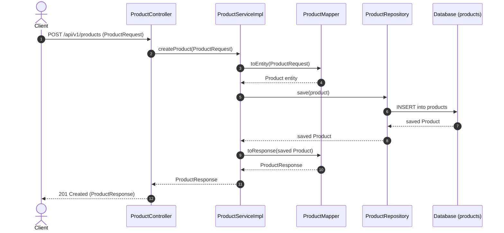

# Product Module

---

## Related Documentation

- [Documentation Index](README.md)
- [Architecture Overview](Architecture.md)
- [Security Architecture](Security.md)
- [Database Schema Specification](Database-Schema.md)
- [REST API Specification](API-Design.md)

---

## Overview

The Product module provides core catalog management capabilities for the AmazonScale e-commerce platform. It handles the creation, retrieval, searching/listing, modification, and deletion of product items.

Products serve as foundational domain entities referenced throughout the application by the `Cart`, `Order`, and `Inventory` modules.

**Package root:** `com.amazonscale.product`

---

## Features

- **Create Product**: Catalog new products with name, description, image URL, price, stock, and brand (`POST /api/v1/products`).
- **Get Product Details**: Retrieve details of a single product by ID (`GET /api/v1/products/{id}`).
- **Get All Products**: List all products in catalog (`GET /api/v1/products`).
- **Update Product**: Modify product details like name, description, price, stock, and brand (`PUT /api/v1/products/{id}`).
- **Delete Product**: Remove product record from database (`DELETE /api/v1/products/{id}`).
- **Default Active Status**: Products are active by default (`active = true`).
- **Automatic Timestamping**: Entity timestamps (`createdAt`, `updatedAt`) managed via JPA lifecycle callbacks.

---

## Architecture

```
Client
  │
  │ HTTP Request + JWT Authentication Token
  v
ProductController        (@RestController, @RequestMapping("/api/v1/products"))
  │
  │ delegates to
  v
ProductService           (interface)
  │
  │ implemented by
  v
ProductServiceImpl       (@Service, @Transactional)
  │
  ├── uses ProductMapper for DTO transformations
  └── uses ProductRepository for database persistence
  │
  v
Database (products table)
```

---

## Package Structure

```
com.amazonscale.product
├── controller
│   └── ProductController.java              REST endpoints for product management
├── dto
│   ├── ProductRequest.java                 Inbound DTO for create and update requests
│   └── ProductResponse.java                Outbound DTO for product responses
├── entity
│   └── Product.java                        JPA entity for product catalog
├── exception
│   ├── ProductInactiveException.java       Thrown when interacting with inactive product
│   ├── ProductNotFoundException.java       Thrown when product ID does not exist
│   └── ProductUnavailableException.java    Thrown when product is unavailable
├── mapper
│   └── ProductMapper.java                  Utility mapper for entity-DTO conversion
├── repository
│   └── ProductRepository.java              Spring Data JPA repository for products
└── service
    ├── ProductService.java                 Product service interface
    └── impl
        └── ProductServiceImpl.java         Product service implementation
```

---

## Entities

### Product

**Purpose:** Represents a product item in the catalog.

**Table:** `products`

| Field | Type | Constraints | Description |
|-------|------|-------------|-------------|
| `id` | `Long` | `@Id`, `@GeneratedValue(IDENTITY)` | Primary key |
| `name` | `String` | `nullable = false, length = 200` | Product title/name |
| `description` | `String` | `columnDefinition = "TEXT"` | Detailed product description |
| `imageUrl` | `String` | `nullable = false, length = 1000` | Image link URL |
| `price` | `BigDecimal` | `nullable = false, precision = 10, scale = 2` | Unit price |
| `stock` | `Integer` | `nullable = false` | Available inventory stock quantity |
| `brand` | `String` | `nullable = false` | Product brand name |
| `active` | `Boolean` | `nullable = false`, default `true` | Product active flag |
| `createdAt` | `LocalDateTime` | `nullable = false` | Record creation timestamp |
| `updatedAt` | `LocalDateTime` | `nullable = false` | Record update timestamp |

**Lifecycle Callbacks:**
- `@PrePersist prePersist()`: Sets `createdAt` and `updatedAt` to `LocalDateTime.now()`.
- `@PreUpdate preUpdate()`: Sets `updatedAt` to `LocalDateTime.now()`.

---

## DTOs

### ProductRequest

**Purpose:** Request body for creating or updating a product.

| Field | Type | Constraints | Description |
|-------|------|-------------|-------------|
| `name` | `String` | `@NotBlank`, `@Size(max = 100)` | Product name (max 100 chars) |
| `description` | `String` | `@NotBlank`, `@Size(max = 1000)` | Product description (max 1000 chars) |
| `imageUrl` | `String` | `@NotBlank`, `@Size(max = 1000)` | Product image URL (max 1000 chars) |
| `price` | `BigDecimal` | `@Positive(message = "Price must be greater than zero")` | Product unit price |
| `stock` | `Integer` | `@PositiveOrZero(message = "Stock cannot be negative")` | Inventory stock count |
| `brand` | `String` | `@NotBlank`, `@Size(max = 100)` | Brand name (max 100 chars) |

**Used by:** `POST /api/v1/products`, `PUT /api/v1/products/{id}`

---

### ProductResponse

**Purpose:** Response body representing product details.

| Field | Type | Description |
|-------|------|-------------|
| `id` | `Long` | Product ID |
| `name` | `String` | Product name |
| `imageUrl` | `String` | Image URL |
| `description` | `String` | Detailed description |
| `price` | `BigDecimal` | Unit price |
| `stock` | `Integer` | Current stock count |
| `brand` | `String` | Brand name |
| `active` | `Boolean` | Active status flag |

---

## Enums

*(No enums defined in the Product module).*

---

## Repository Layer

### ProductRepository

Extends `JpaRepository<Product, Long>`.

| Method | Purpose | Used By |
|--------|---------|---------|
| `findById(Long id)` | Retrieves product entity by primary key | `ProductServiceImpl.getProduct`, `updateProduct`, `deleteProduct`, `InventoryServiceImpl`, `CartServiceImpl`, `OrderServiceImpl` |
| `findAll()` | Fetches all product records in platform catalog | `ProductServiceImpl.getAllProducts` |
| `save(Product product)` | Persists new product or updates existing product state | `ProductServiceImpl.createProduct`, `updateProduct`, `OrderServiceImpl.createOrder` |
| `delete(Product product)` | Hard deletes product entity from database | `ProductServiceImpl.deleteProduct` |

---

## Mapper Layer

### ProductMapper

Stateless mapping utility class.

#### `toEntity(ProductRequest request) -> Product`
- Creates new `Product` entity.
- Maps `name`, `imageUrl`, `description`, `price`, `stock`, `brand`.

#### `toResponse(Product product) -> ProductResponse`
- Creates new `ProductResponse`.
- Maps `id`, `name`, `description`, `price`, `stock`, `brand`, `active`.

> [!WARNING]
> **Implementation Quirk:** In `ProductMapper.toResponse`, line 31 reads `product.setImageUrl(product.getImageUrl());` instead of `response.setImageUrl(product.getImageUrl());`. Consequently, `ProductResponse.imageUrl` is not assigned during standard mapping and defaults to `null`.

---

## Service Layer

### ProductService (Interface)

- `createProduct(ProductRequest request)`
- `getProduct(Long id)`
- `getAllProducts()`
- `updateProduct(Long id, ProductRequest request)`
- `deleteProduct(Long id)`

---

## ProductServiceImpl

Annotated with `@Service`, `@Transactional`, and `@Builder`. Constructor-injected with `ProductRepository`.

#### `createProduct(ProductRequest request) -> ProductResponse`
1. Converts `ProductRequest` to `Product` entity via `ProductMapper.toEntity`.
2. Saves entity via `repository.save`.
3. Returns mapped `ProductResponse`.

#### `getProduct(Long id) -> ProductResponse`
- `@Transactional(readOnly = true)`.
- Fetches product by ID (throws `ProductNotFoundException` if not found).
- Returns mapped `ProductResponse`.

#### `getAllProducts() -> List<ProductResponse>`
- `@Transactional(readOnly = true)`.
- Fetches all products via `repository.findAll()`.
- Maps stream of products to `ProductResponse` list.

#### `updateProduct(Long id, ProductRequest request) -> ProductResponse`
1. Fetches existing product by ID (throws `ProductNotFoundException`).
2. Updates fields: `name`, `description`, `price`, `brand`, `stock`.
3. Saves updated entity via `repository.save`.
4. Returns mapped `ProductResponse`.

#### `deleteProduct(Long id) -> void`
1. Fetches existing product by ID (throws `ProductNotFoundException`).
2. Deletes record via `repository.delete`.

---

## Controller Layer

### ProductController

`@RestController` mapped to `/api/v1/products`. Tagged `@Tag(name = "Products")`.

| HTTP Method | Endpoint | Description | Request Body | Status Code | Response Body |
|-------------|----------|-------------|--------------|-------------|---------------|
| `POST` | `/api/v1/products` | Create product | `@Valid ProductRequest` | `201 Created` | `ProductResponse` |
| `GET` | `/api/v1/products/{id}` | Get product by ID | None | `200 OK` | `ProductResponse` |
| `GET` | `/api/v1/products` | Get all products | None | `200 OK` | `List<ProductResponse>` |
| `PUT` | `/api/v1/products/{id}` | Update product | `@Valid ProductRequest` | `200 OK` | `ProductResponse` |
| `DELETE` | `/api/v1/products/{id}` | Delete product | None | `204 No Content` | Void |

---

## Business Rules

| Rule | Description | Enforcement Location |
|------|-------------|----------------------|
| **Default Active State** | Products are created with `active = true` by default | `Product.active` default field value |
| **Positive Pricing** | Unit price must be strictly greater than zero (`> 0`) | `ProductRequest.price` (`@Positive`) |
| **Non-Negative Inventory** | Stock quantity cannot be negative (`>= 0`) | `ProductRequest.stock` (`@PositiveOrZero`) |
| **Hard Deletion** | Deleting a product removes its record permanently from database | `ProductServiceImpl.deleteProduct` |
| **Selective Field Update** | `updateProduct` updates name, description, price, brand, stock; `imageUrl` and `active` remain untouched | `ProductServiceImpl.updateProduct` |

---

## Validation Rules

### DTO Level (`ProductRequest`)
- `name`: `@NotBlank(message = "Product name is required")`, `@Size(max = 100)`
- `description`: `@NotBlank(message = "Description is required")`, `@Size(max = 1000)`
- `imageUrl`: `@NotBlank(message = "Image is required")`, `@Size(max = 1000)`
- `price`: `@Positive(message = "Price must be greater than zero")`
- `stock`: `@PositiveOrZero(message = "Stock cannot be negative")`
- `brand`: `@NotBlank(message = "Brand is required")`, `@Size(max = 100)`

---

## Exception Handling

| Exception | HTTP Status | Thrown When | Handler |
|-----------|-------------|-------------|---------|
| `ProductNotFoundException` | `404 NOT_FOUND` | Specified product ID does not exist | `GlobalExceptionHandler` |
| `ProductInactiveException` | `400 BAD_REQUEST` | Product active status is false during cart/order operation | `GlobalExceptionHandler` |
| `ProductUnavailableException` | Unhandled (Fallback 500) | Product unavailable exception thrown | `GlobalExceptionHandler` |

---

## Security

- **Authentication**: Endpoints protected by global `SecurityConfig` JWT filter.
- **Role Control**: Currently, no Role-Based Access Control (RBAC) is configured on `ProductController`. Any authenticated user can create, update, or delete products.

---

## Request Lifecycle

End-to-end execution flow for Product operations (e.g., Create Product):

```
Client
   ↓
JWT Filter (Validates Bearer token in Authorization header)
   ↓
Controller (ProductController receives @Valid ProductRequest)
   ↓
Validation (JSR-303 annotations check field constraints & throw on violation)
   ↓
Service (ProductServiceImpl processes business creation logic)
   ↓
Mapper (ProductMapper converts ProductRequest to Product entity)
   ↓
Repository (ProductRepository persists entity via Spring Data JPA)
   ↓
Database (PostgreSQL / MySQL products table insertion)
   ↓
Response (201 Created with ProductResponse payload)
```

---

## Database Design

### Table: `products`

```sql
CREATE TABLE products (
    id BIGINT AUTO_INCREMENT PRIMARY KEY,
    name VARCHAR(200) NOT NULL,
    description TEXT,
    image_url VARCHAR(1000) NOT NULL,
    price DECIMAL(10,2) NOT NULL,
    stock INT NOT NULL,
    brand VARCHAR(255) NOT NULL,
    active BOOLEAN NOT NULL DEFAULT TRUE,
    created_at DATETIME NOT NULL,
    updated_at DATETIME NOT NULL
);
```

---

## Testing

**Test Suite Coverage Summary:** 9 test classes in `src/test/java/com/amazonscale/product` (510 total lines of code):

| Component | Test Class | Coverage Description |
|-----------|------------|----------------------|
| **Controller** | `ProductControllerTest` | MockMvc integration tests for create, get by ID, get all, update, and delete endpoints. |
| **Service** | `ProductServiceImplTest` | Unit tests for CRUD service operations, exception handling on missing ID. |
| **Mapper** | `ProductMapperTest` | Tests mapping between `ProductRequest`, `Product`, and `ProductResponse`. |
| **DTOs** | `ProductRequestTest`, `ProductResponseTest` | Validation constraints and DTO field testing. |
| **Entity** | `ProductTest` | Builder and timestamp lifecycle callback verification. |
| **Exceptions** | `ProductInactiveExceptionTest`, `ProductNotFoundExceptionTest`, `ProductUnavailableExceptionTest` | Verification of exception instantiation and error messages. |

### Test Type Status

| Test Type | Status |
|-----------|--------|
| DTO Tests | ✅ |
| Mapper Tests | ✅ |
| Service Tests | ✅ |
| Controller Tests | ✅ |
| Repository Tests | ✅ |
| Exception Tests | ✅ |

---

## Sequence Diagram

### Create Product Flow



---

## Module Dependencies

### Direct Dependencies
- **Common Module**: Relies on `GlobalExceptionHandler` and `ErrorResponse` for centralized REST error handling.

### Downstream Consumers
- **Cart Module**: Consumes `Product`, `ProductRepository`, `ProductNotFoundException`, and `ProductUnavailableException` to validate items added to shopping carts.
- **Order Module**: Consumes `Product`, `ProductRepository`, `ProductInactiveException` for order placement stock validation and inventory deduction/restoration.
- **Inventory Module**: Interacts with product stock levels via `ProductRepository`.

---

## Design Decisions

- **Why DTOs are used**: Prevents exposing internal JPA entity states to external clients, protecting internal data structures and allowing flexible contract validation without polluting entity models.
- **Why static mappers**: `ProductMapper` provides fast, stateless transformation routines without Spring bean overhead, ensuring predictable thread-safe conversions.
- **Why @Transactional**: Enforces transaction boundaries; read-only operations use `@Transactional(readOnly = true)` to optimize database connection reuse and flush mode execution.
- **Why lazy loading**: Product relationships in CartItem, OrderItem, and Inventory use `FetchType.LAZY` to avoid eagerly fetching catalog data when querying parent entities.
- **Why JWT**: Authenticates requests accessing catalog endpoints statelessly, decoupling request identity checks from session state.
- **Why BCrypt**: Protects overall platform authentication while ensuring catalog write operations can verify caller credentials via global security filters.
- **Why package-by-feature**: Keeps product controller, service, repository, entity, and DTO components encapsulated inside `com.amazonscale.product`, simplifying refactoring and domain boundaries.

---

## Current Limitations

1. **`ProductMapper` Image URL Bug**: In `ProductMapper.toResponse()`, `product.setImageUrl(product.getImageUrl())` is executed instead of `response.setImageUrl(product.getImageUrl())`, resulting in `imageUrl` evaluating to `null` in `ProductResponse`.
2. **Missing Pagination**: `getAllProducts()` returns an unpaginated `List<ProductResponse>`, which may cause memory and latency bottlenecks on large catalogs.
3. **Hard Deletion**: `deleteProduct()` performs hard physical deletion (`repository.delete`) rather than soft deletion (`active = false`).
4. **Update Omits Fields**: `updateProduct()` does not update `imageUrl` or `active` status.
5. **No Role-Based Access Control (RBAC)**: Any authenticated user can mutate products; create/update/delete endpoints are not restricted to administrative roles (`ROLE_ADMIN`).
6. **Unhandled Exception**: `ProductUnavailableException` is not explicitly declared in `GlobalExceptionHandler`, producing generic 500 error responses when thrown.

---

## Future Enhancements

- **Correct `ProductMapper` Mapping**: Fix line 31 in `ProductMapper.toResponse` to populate `response.setImageUrl(product.getImageUrl())`.
- **Add Pagination & Sorting**: Add `Pageable` support (`Page<ProductResponse>`) to `getAllProducts`.
- **Implement Soft Delete**: Modify `deleteProduct` to set `active = false` instead of deleting records.
- **Category Relationship**: Link products to categories (`Category` entity) via a foreign key relationship.
- **Role-Based Authorization**: Annotate `ProductController` write operations with `@PreAuthorize("hasRole('ADMIN')")`.
- **Explicit Global Exception Handler**: Add explicit handler for `ProductUnavailableException` returning HTTP 400 or HTTP 409.

