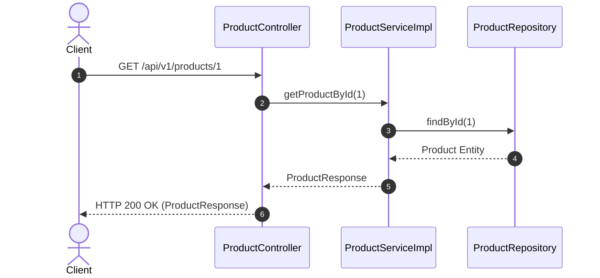
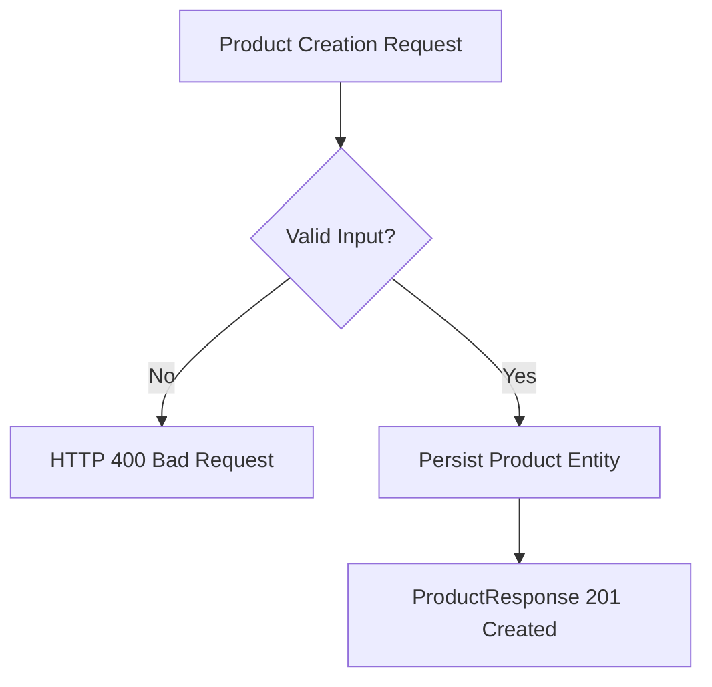

# Product Module Specification

---

## 1. Overview
The **Product Module** manages physical item catalog listings, descriptions, price attributes, active status flags, seller associations, and product DTO mappings for **AmazonScale**.

---

## 2. Purpose
Provides core catalog CRUD capabilities for managing products available for purchase across the platform.

---

## 3. Architecture
Located under `com.amazonscale.product`, leveraging clean layer separation across controllers, services, repositories, DTOs, and mappers.

---

## 4. Package Structure
```
com.amazonscale.product
├── controller
│   └── ProductController.java
├── dto
│   ├── ProductRequest.java
│   └── ProductResponse.java
├── entity
│   └── Product.java
├── exception
│   ├── ProductInactiveException.java
│   ├── ProductNotFoundException.java
│   └── ProductUnavailableException.java
├── mapper
│   └── ProductMapper.java
├── repository
│   └── ProductRepository.java
└── service
    ├── ProductService.java
    └── impl
        └── ProductServiceImpl.java
```

---

## 5. Components
- **`ProductController`**: Exposes `/api/v1/products` REST endpoints.
- **`ProductServiceImpl`**: Enforces catalog business logic and soft active/inactive status rules.
- **`ProductRepository`**: Performs JPA queries against the `products` table.
- **`ProductMapper`**: Maps between `ProductRequest`, `Product` entity, and `ProductResponse`.

---

## 6. Database Design
- **Table Name**: `products`
- **Primary Key**: `id` (`BIGINT`, Auto-Increment)
- **Columns**:
  - `id` BIGINT AUTO_INCREMENT PRIMARY KEY
  - `name` VARCHAR(255) NOT NULL
  - `description` TEXT NULL
  - `price` DECIMAL(10,2) NOT NULL
  - `stock` INT NOT NULL DEFAULT 0
  - `image_url` VARCHAR(500) NULL
  - `active` BOOLEAN NOT NULL DEFAULT TRUE
  - `category_id` BIGINT NOT NULL
  - `seller_id` BIGINT NOT NULL
  - `created_at` DATETIME NOT NULL
  - `updated_at` DATETIME NOT NULL
- **Indexes**: `idx_product_category`, `idx_product_seller`, `idx_product_active`

---

## 7. Entity Relationships
- `Product` N:1 `Category` (`JoinColumn(name = "category_id")`)
- `Product` N:1 `User` (`JoinColumn(name = "seller_id")`)
- `Product` 1:1 `Inventory` (`mappedBy = "product"`)

---

## 8. DTOs
- **`ProductRequest`**: `name`, `description`, `price`, `stock`, `imageUrl`, `categoryId`, `sellerId`.
- **`ProductResponse`**: `id`, `name`, `description`, `price`, `stock`, `imageUrl`, `active`, `categoryId`, `sellerId`, `createdAt`, `updatedAt`.

---

## 9. Repository Layer
- **`ProductRepository`**: Extends `JpaRepository<Product, Long>`
  - `List<Product> findByCategoryId(Long categoryId)`
  - `List<Product> findByActiveTrue()`

---

## 10. Service Layer
- **`ProductService`**:
  - `ProductResponse createProduct(ProductRequest request)`
  - `ProductResponse getProductById(Long id)`
  - `List<ProductResponse> getAllProducts()`
  - `ProductResponse updateProduct(Long id, ProductRequest request)`
  - `void deleteProduct(Long id)`

---

## 11. Controller Layer
- `POST /api/v1/products` -> `createProduct()` -> HTTP `201 Created`
- `GET /api/v1/products/{id}` -> `getProductById()` -> HTTP `200 OK`
- `GET /api/v1/products` -> `getAllProducts()` -> HTTP `200 OK`
- `PUT /api/v1/products/{id}` -> `updateProduct()` -> HTTP `200 OK`
- `DELETE /api/v1/products/{id}` -> `deleteProduct()` -> HTTP `204 No Content`

---

## 12. Business Rules
1. **Price Constraint**: Product prices must be positive (`BigDecimal > 0`).
2. **Stock Non-Negativity**: Stock counts cannot be negative.
3. **Active Flag Guard**: Products marked `active = false` cannot be purchased in cart/order checkouts (`ProductInactiveException`).

---

## 13. Validation
- `name`: `@NotBlank`, `@Size(max = 255)`.
- `price`: `@NotNull`, `@Positive`.
- `stock`: `@NotNull`, `@PositiveOrZero`.
- `categoryId`: `@NotNull`.
- `sellerId`: `@NotNull`.

---

## 14. Exception Handling
- `ProductNotFoundException` -> HTTP `404 Not Found`.
- `ProductInactiveException` -> HTTP `400 Bad Request`.
- `ProductUnavailableException` -> HTTP `400 Bad Request`.

---

## 15. Security
Protected by Spring Security filter chain. Requires valid JWT Bearer token for request execution.

---

## 16. API Reference

### `POST /api/v1/products`
- **Request**: `ProductRequest`
- **Response**: `201 Created` (`ProductResponse`)

### `GET /api/v1/products/{id}`
- **Response**: `200 OK` (`ProductResponse`)

### `GET /api/v1/products`
- **Response**: `200 OK` (`List<ProductResponse>`)

### `PUT /api/v1/products/{id}`
- **Request**: `ProductRequest`
- **Response**: `200 OK` (`ProductResponse`)

### `DELETE /api/v1/products/{id}`
- **Response**: `204 No Content`

---

## 17. Request Flow
Client Request -> `ProductController` -> `ProductServiceImpl` -> `ProductRepository` -> `ProductMapper` -> JSON Response.

---

## 18. Sequence Diagram



---

## 19. Mermaid Diagrams



---

## 20. Testing Overview
Covered by JUnit 5 tests in `src/test/java/com/amazonscale/product`:
- `ProductServiceImplTest`: Validates creation, lookup, status checks.
- `ProductControllerTest`: Validates endpoint mappings via MockMvc.

---

## 21. Known Limitations
1. Stock maintained redundantly across Product and Inventory entities.
2. Collection endpoint unpaginated.

---

## 22. Future Improvements
Refer to technical recommendations:
- [Product Recommendations](recommendations/Product-Recommendations.md)

---

## 23. References
- [Architecture Documentation](Architecture.md)
- [Database Schema Documentation](Database-Schema.md)
