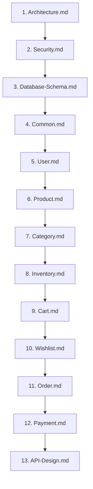

# AmazonScale Documentation Index

---

## Overview

Welcome to the **AmazonScale** technical documentation hub. AmazonScale is a high-performance, modular enterprise e-commerce platform built with **Java 21** and **Spring Boot 4.0.7**. 

This index provides a comprehensive directory, reading order, and quick-reference map for software engineers, software architects, and system administrators working on or integrating with the AmazonScale codebase.

---

## Suggested Onboarding Path

For new developers and technical architects, we recommend following the onboarding path below to build a progressive understanding of system architecture, security models, data contracts, and domain business rules:

---

## Documentation Map

Below is a complete directory of all system and module documentation files available in the `docs/` directory:

| Document | Category | Short Description |
|----------|----------|-------------------|
| [**Architecture.md**](Architecture.md) | Core System | High-level system architecture, package structure, layering, deployment design, transaction boundaries, and request lifecycles. |
| [**Security.md**](Security.md) | Infrastructure | Authentication and authorization design, JWT lifecycle, Spring Security filter chain, password encoding, and security context handling. |
| [**Database-Schema.md**](Database-Schema.md) | Data Layer | Relational database schema, ER diagrams, foreign key relationships, indexing strategy, and entity lifecycle hooks. |
| [**Common.md**](Common.md) | Infrastructure | Centralized exception handling (`@RestControllerAdvice`), standard `ErrorResponse` DTO, and OpenAPI / Swagger 3 configuration. |
| [**User.md**](User.md) | Domain Module | User registration, authentication endpoints, BCrypt password hashing, role definitions (`ADMIN`, `SELLER`, `CUSTOMER`), and user identity management. |
| [**Product.md**](Product.md) | Domain Module | Product catalog CRUD management, active status filtering, pricing models, stock management, and product DTO mappings. |
| [**Category.md**](Category.md) | Domain Module | Hierarchical product category taxonomy, parent-child tree relationships, self-parenting hierarchy loop protection, and category uniqueness rules. |
| [**Inventory.md**](Inventory.md) | Domain Module | Warehouse stock management, 1-to-1 product inventory records, reserved stock calculation, low stock thresholds, and stock deletion guards. |
| [**Cart.md**](Cart.md) | Domain Module | User shopping cart state management, line item addition, quantity aggregation, real-time stock validation, and subtotal/total calculations. |
| [**Wishlist.md**](Wishlist.md) | Domain Module | Custom customer wishlists, wishlist item prioritization, item notes, default wishlist management, and duplication protection. |
| [**Order.md**](Order.md) | Domain Module | Order placement engine, tax (18% GST) and shipping fee rules, order fulfillment state machine, stock deduction, and order cancellation. |
| [**Payment.md**](Payment.md) | Domain Module | Payment transaction processing, mock payment gateway integrations, transaction verification, refund state machine, and ownership validation. |
| [**API-Design.md**](API-Design.md) | REST API | Complete REST API specification, standard headers, request/response contracts, validation rules, HTTP status codes, and endpoint summary matrix. |

---

## Technical Recommendations Directory

Identified technical debt and architectural improvement specifications are documented in `docs/recommendations/`:

- [**Architecture Recommendations**](recommendations/Architecture-Recommendations.md)
- [**Database Recommendations**](recommendations/Database-Recommendations.md)
- [**Security Recommendations**](recommendations/Security-Recommendations.md)
- [**API Design Recommendations**](recommendations/API-Design-Recommendations.md)
