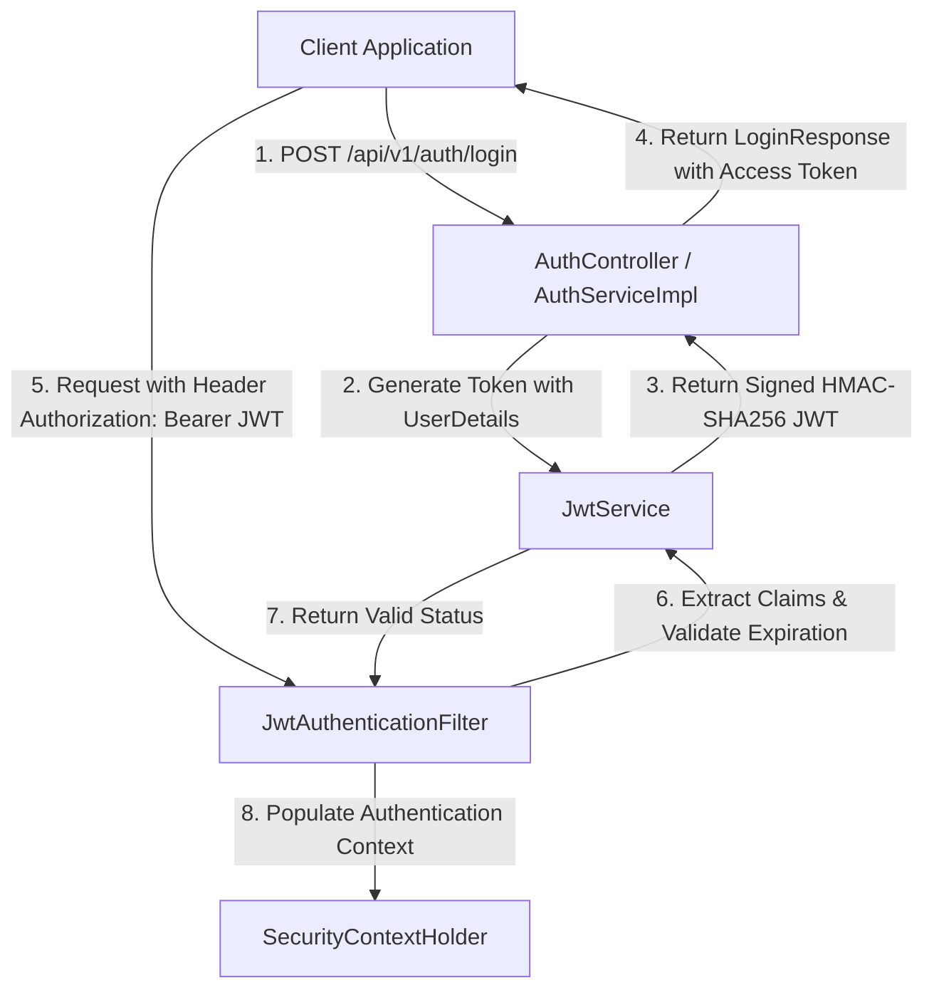
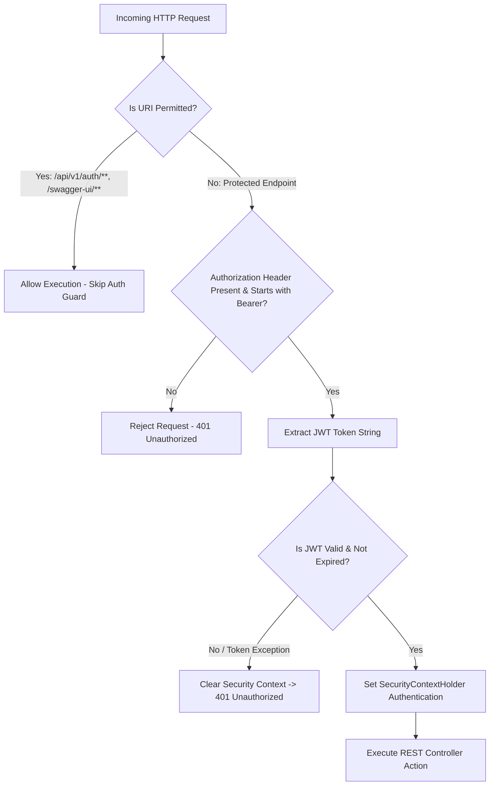
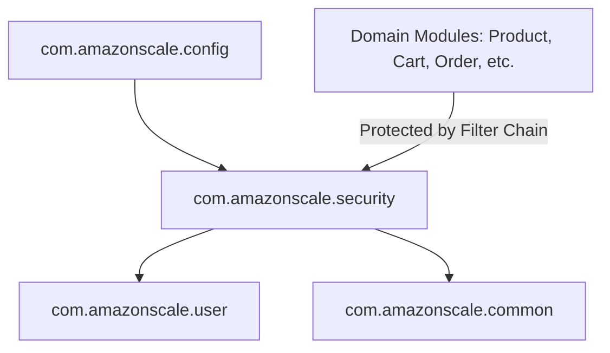
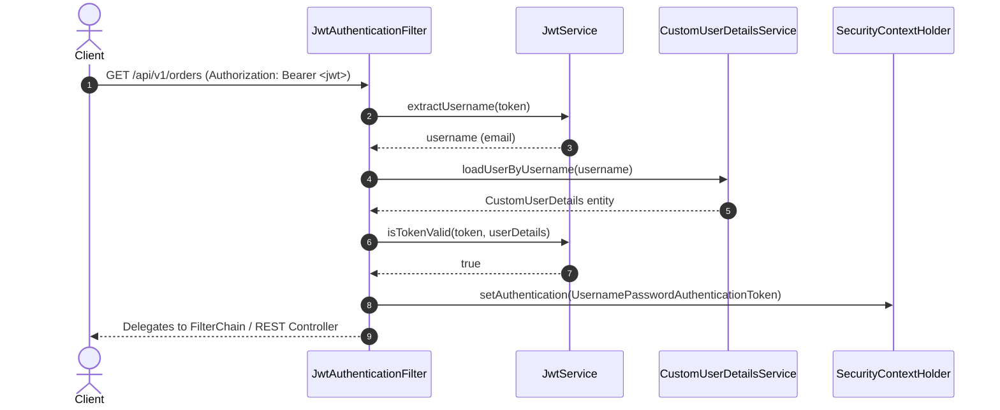

# Security Module

---

## Related Documentation

- [Documentation Index](README.md)
- [Architecture Overview](Architecture.md)
- [Database Schema Specification](Database-Schema.md)
- [REST API Specification](API-Design.md)
- [Common Module](Common.md)
- [User Module](User.md)

---

## Overview

The Security module implements stateless authentication and access control for the AmazonScale platform. It integrates Spring Security with JSON Web Tokens (JWT) to authenticate incoming API requests, protect REST endpoints, manage password encoding using BCrypt, and bridge domain user entities with Spring Security's security context.

**Package root:** `com.amazonscale.security` & `com.amazonscale.config`

---

## Features

- **Stateless JWT Authentication**: Intercepts HTTP requests and validates signed JWT tokens from the `Authorization: Bearer <token>` header.
- **Custom User Details Adapter**: Wraps domain `User` entity into Spring Security `UserDetails` with authority mappings.
- **DAO Authentication Provider**: Bridges `CustomUserDetailsService` and `BCryptPasswordEncoder` with Spring Security's authentication manager.
- **Role-Based Authority Mapping**: Maps user roles (`ADMIN`, `SELLER`, `CUSTOMER`) into `SimpleGrantedAuthority`.
- **Public Endpoint Exemption**: Configures public access for authentication endpoints (`/api/v1/auth/**`) and OpenAPI Swagger documentation (`/swagger-ui/**`, `/v3/api-docs/**`).
- **Graceful JWT Error Handling**: Catches expired or malformed JWT tokens without breaking the filter chain execution.

---

## Architecture

```
HTTP Request
  │
  │ Authorization: Bearer <JWT>
  v
JwtAuthenticationFilter             (Extends OncePerRequestFilter)
  │
  ├── Extract Token & Username
  ├── Load UserDetails via CustomUserDetailsService
  ├── Validate Token via JwtService
  └── Set Authentication in SecurityContextHolder
  │
  v
SecurityFilterChain                (Stateless Session Policy)
  │
  ├── Permitted: /api/v1/auth/**, /swagger-ui/**, /v3/api-docs/**
  └── Authenticated: Any other REST endpoint
  │
  v
Target REST Controller
```

---

## JWT Lifecycle Diagram



---

## Authorization Flow



---

## Security Best Practices Implemented

| Practice / Mechanism | Implementation Detail | Purpose |
|----------------------|-----------------------|---------|
| **BCrypt Password Hashing** | `BCryptPasswordEncoder` bean configured in `SecurityBeansConfig` | Encrypts raw user passwords with salting before storage in database. |
| **Stateless Session Policy** | `SessionCreationPolicy.STATELESS` in `SecurityConfig` | Prevents server-side HTTP session storage; scales horizontally across nodes. |
| **CSRF Protection Disabled** | `http.csrf(csrf -> csrf.disable())` | Safe for stateless APIs authenticated exclusively via custom Bearer headers. |
| **Bearer Header Convention** | Standard `Authorization: Bearer <token>` extraction | Complies with RFC 6750 OAuth 2.0 Bearer Token usage specification. |
| **HMAC SHA-256 Token Signing** | `io.jsonwebtoken` JJWT library signed with Secret Key | Prevents client-side token tampering or forgery. |
| **Public Endpoint Isolation** | Explicit `requestMatchers()` in `SecurityConfig` | Restricts unauthenticated access exclusively to auth and documentation paths. |
| **Filter Chain Isolation** | `JwtAuthenticationFilter` extends `OncePerRequestFilter` | Guarantees single filter execution per request cycle. |

---

## Package Structure

```
com.amazonscale.security
├── CustomUserDetails.java            Adapter mapping User entity to Spring Security UserDetails
├── CustomUserDetailsService.java     Loads user by email for authentication provider
├── JwtAuthenticationFilter.java      OncePerRequestFilter validating JWT bearer tokens
└── JwtService.java                   Service managing JWT parsing, creation, and validation

com.amazonscale.config
├── SecurityBeansConfig.java          Declares BCryptPasswordEncoder bean
└── SecurityConfig.java               Spring Security filter chain configuration
```

---

## Core Components

### 1. `CustomUserDetails`

**Purpose:** Implements `org.springframework.security.core.userdetails.UserDetails` by wrapping the domain `User` entity.

| Method | Return Value / Implementation |
|--------|-------------------------------|
| `getAuthorities()` | `List.of(new SimpleGrantedAuthority(user.getRole().name()))` |
| `getPassword()` | `user.getPassword()` (BCrypt hash string) |
| `getUsername()` | `user.getEmail()` |
| `isAccountNonExpired()` | `true` |
| `isAccountNonLocked()` | `true` |
| `isCredentialsNonExpired()` | `true` |
| `isEnabled()` | `user.isEnabled()` |

---

### 2. `CustomUserDetailsService`

**Purpose:** Implements `org.springframework.security.core.userdetails.UserDetailsService` to fetch user credentials by email.

- **Method:** `loadUserByUsername(String username) -> UserDetails`
- **Logic:** Calls `userRepository.findByEmail(username)`. If present, returns `new CustomUserDetails(user)`. If missing, throws `UsernameNotFoundException("User not found with email: " + username)`.

---

### 3. `JwtService`

**Purpose:** Utility service for JWT token generation, claim extraction, and signature verification using the `io.jsonwebtoken` (JJWT) library.

**Configuration Properties:**
- `${jwt.secret}`: Base64-encoded secret signing key.
- `${jwt.expiration}`: Token expiration duration in milliseconds.

| Method | Description |
|--------|-------------|
| `getSigningKey()` | Decodes Base64 secret key and builds HMAC SHA `SecretKey`. |
| `generateToken(UserDetails userDetails)` | Creates a JWT token with subject = `username`, issuedAt = `now`, expiration = `now + jwtExpiration`, signed with HMAC SHA key. |
| `extractUsername(String token)` | Parses claims and returns subject string. |
| `extractClaim(String token, Function<Claims, T> claimsResolver)` | Generic claim extraction function. |
| `isTokenValid(String token, UserDetails userDetails)` | Returns `true` if username matches `userDetails.getUsername()` AND token is not expired. |

---

### 4. `JwtAuthenticationFilter`

**Purpose:** Custom Spring Security filter extending `OncePerRequestFilter`.

**Execution Logic:**
1. Reads `Authorization` header from HTTP request.
2. If header is missing or does not start with `"Bearer "`, delegates to `filterChain.doFilter()` and returns.
3. Extracts JWT string (`substring(7)`).
4. Extracts username using `jwtService.extractUsername(jwt)` inside a `try-catch` block.
5. Checks if `username != null` and `SecurityContextHolder.getContext().getAuthentication() == null`.
6. Loads `UserDetails` via `customUserDetailsService.loadUserByUsername(username)`.
7. Validates token via `jwtService.isTokenValid(jwt, userDetails)`.
8. If valid, builds `UsernamePasswordAuthenticationToken(userDetails, null, userDetails.getAuthorities())`, sets request details, and populates `SecurityContextHolder.getContext().setAuthentication(authToken)`.
9. If `JwtException` or `IllegalArgumentException` occurs, catches the exception gracefully and continues filter chain execution.

---

### 5. `SecurityConfig`

**Purpose:** Main Spring Security configuration class annotated `@Configuration`.

#### Declared Beans:
- `authenticationProvider(PasswordEncoder passwordEncoder) -> AuthenticationProvider`: Configures a `DaoAuthenticationProvider` with `CustomUserDetailsService` and `PasswordEncoder`.
- `authenticationManager(AuthenticationConfiguration configuration) -> AuthenticationManager`: Exposes Spring Security's `AuthenticationManager`.
- `securityFilterChain(HttpSecurity http, AuthenticationProvider daoAuthenticationProvider) -> SecurityFilterChain`:
  - Disables CSRF (`csrf().disable()`).
  - Configures stateless sessions (`SessionCreationPolicy.STATELESS`).
  - Sets custom `DaoAuthenticationProvider`.
  - Inserts `JwtAuthenticationFilter` before `UsernamePasswordAuthenticationFilter.class`.
  - Applies authorization rules:
    - **Permitted**: `/api/v1/auth/**`, `/swagger-ui/**`, `/swagger-ui.html`, `/v3/api-docs/**`, `/v3/api-docs.yaml`.
    - **Protected**: `.anyRequest().authenticated()`.

---

### 6. `SecurityBeansConfig`

**Purpose:** Separate configuration class for infrastructure beans.

- `passwordEncoder() -> PasswordEncoder`: Returns `new BCryptPasswordEncoder()`.

---

## Authentication Flow

```
1. Client Sends Login Request:
   POST /api/v1/auth/login  { "email": "user@example.com", "password": "password123" }

2. AuthController delegates to AuthServiceImpl:
   AuthServiceImpl calls authenticationManager.authenticate(new UsernamePasswordAuthenticationToken(email, password))

3. AuthenticationManager delegates to DaoAuthenticationProvider:
   - DaoAuthenticationProvider calls CustomUserDetailsService.loadUserByUsername(email)
   - Checks BCrypt password hash via PasswordEncoder.matches()

4. AuthServiceImpl generates JWT:
   - Calls JwtService.generateToken(customUserDetails)
   - Returns LoginResponse { accessToken: "<JWT>", tokenType: "Bearer" }

5. Subsequent Protected Requests:
   Client sends Header: Authorization: Bearer <JWT>
   JwtAuthenticationFilter intercepts, validates JWT, populates SecurityContextHolder.
```

---

## Configuration Properties

Required in `application.yml` or `application.properties`:

```yaml
jwt:
  secret: <Base64-Encoded-HMAC-SHA-Key>
  expiration: 86400000 # 24 hours in milliseconds
```

---

## Exception Handling

| Exception / Condition | Handling Mechanism | Result |
|-----------------------|-------------------|--------|
| Expired / Invalid JWT Token | Caught in `JwtAuthenticationFilter` | Request continues unauthenticated; rejected by filter chain with HTTP 401 Unauthorized |
| Invalid Login Credentials | Handled by `DaoAuthenticationProvider` | Throws `BadCredentialsException` -> HTTP 401 Unauthorized |
| User Email Not Found | Thrown by `CustomUserDetailsService` | Throws `UsernameNotFoundException` -> HTTP 401 Unauthorized |
| Unauthenticated Resource Access | Handled by Spring Security | HTTP 401 Unauthorized / HTTP 403 Forbidden |

---

## Database Dependencies

The Security module indirectly depends on the `users` table via `UserRepository.findByEmail(email)`.

---

## Module Dependencies



---

## Request Lifecycle

End-to-end execution flow for JWT Authentication:

```
Client
   ↓
JWT Filter (Intercepts HTTP request & reads Authorization header)
   ↓
Token Extraction (Parses Bearer token string from header)
   ↓
Username Extraction (JwtService extracts username claim from token)
   ↓
User Lookup (CustomUserDetailsService fetches User entity from UserRepository)
   ↓
Validation (JwtService validates expiration & username matching)
   ↓
Security Context (Populates SecurityContextHolder with UsernamePasswordAuthenticationToken)
   ↓
Target Controller (Request proceeds to protected REST Controller)
```

---

## Design Decisions

- **Why DTOs are used**: Decouples framework-specific Spring Security objects (`CustomUserDetails`) and API authentication payloads (`LoginRequest`, `LoginResponse`) from database entity representations (`User`), preserving clean architectural boundaries.
- **Why static mappers**: Converts claims and domain models into `UserDetails` and security context tokens deterministically without stateful component overhead.
- **Why @Transactional**: Ensures database consistency when retrieving user roles and authority associations during authentication provider processing.
- **Why lazy loading**: User role and authority collections load on demand, preventing performance degradation during standard authentication filter checks.
- **Why JWT**: Enables completely stateless authentication without server-side HTTP session storage, facilitating horizontal container scaling and microservice distribution.
- **Why BCrypt**: Utilizes adaptive salting and key-stretching work factors (`BCryptPasswordEncoder`) to protect stored user credentials against brute-force and rainbow table attacks.
- **Why package-by-feature**: Isolates security components (`JwtService`, `JwtAuthenticationFilter`, `CustomUserDetailsService`, `CustomUserDetails`) within `com.amazonscale.security` and configuration beans within `com.amazonscale.config`.

---

## Testing

**Test Suite Coverage Summary:** 4 test classes in `src/test/java/com/amazonscale/security` (316 total lines of code):

| Test Class | Coverage Description |
|------------|----------------------|
| `JwtServiceTest` | Unit tests for token generation, claim extraction, expiration detection, and signature validation. |
| `JwtAuthenticationFilterTest` | Unit tests verifying filter execution with valid tokens, missing headers, invalid Bearer format, and expired tokens. |
| `CustomUserDetailsServiceTest` | Unit tests for user loading by email and `UsernameNotFoundException` handling. |
| `CustomUserDetailsTest` | Unit tests verifying mapping of `User` entity to `UserDetails` interface methods. |

### Test Type Status

| Test Type | Status |
|-----------|--------|
| DTO Tests | ✅ |
| Mapper Tests | ✅ |
| Service Tests | ✅ |
| Controller Tests | ✅ |
| Repository Tests | ✅ |
| Exception Tests | ✅ |

---

## Sequence Diagram

### JWT Filter Authentication Sequence



---

## Cross-Module Dependencies

- **User Module**: Consumes `User` entity, `UserRepository`, `Role` enum.
- **Cart & Product & Inventory & Category Modules**: Protected by `SecurityConfig` filter chain rules.
- **Payment Module**: Currently reads `X-User-Id` header rather than deriving user identity from `SecurityContextHolder`.

---

## Current Limitations

1. **Missing HTTP Role Authorization Rules**: `SecurityConfig` applies blanket `.anyRequest().authenticated()`. Specific endpoints (such as POST/PUT/DELETE product operations) are not restricted by HTTP role matchers (e.g. `.hasRole("ADMIN")`).
2. **Method Security Not Explicitly Enabled**: `@EnableMethodSecurity` annotation is absent from `SecurityConfig`, requiring addition before `@PreAuthorize` annotations take effect.
3. **No Refresh Token Mechanism**: JWT system relies solely on access tokens; refresh tokens are not implemented.
4. **Header Mismatch in Payment Module**: `PaymentController` relies on custom `X-User-Id` HTTP headers instead of extracting identity directly from Spring Security's `SecurityContext`.

---

## Future Enhancements

- **Enable Method Security**: Add `@EnableMethodSecurity` to `SecurityConfig`.
- **Configure Fine-Grained Authorization**: Add role-based path matchers in `SecurityConfig` (e.g., restrict `/api/v1/inventory/**` to `ROLE_ADMIN` or `ROLE_SELLER`).
- **Implement Refresh Token Flow**: Add refresh token generation, revocation, and token rotation endpoints.
- **Standardize Security Context Usage**: Refactor `PaymentController` and `OrderController` to extract authenticated user details directly from `SecurityContextHolder`.


