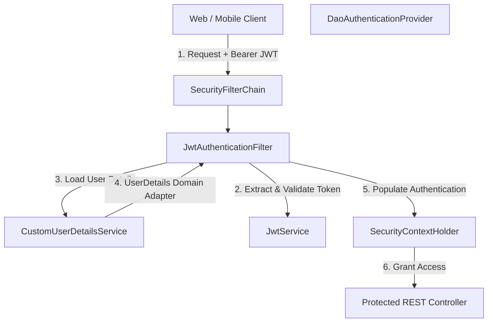
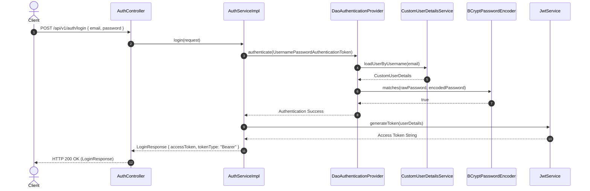
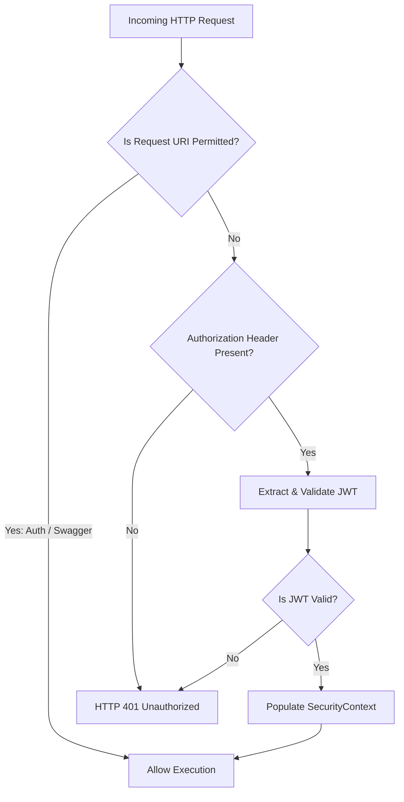
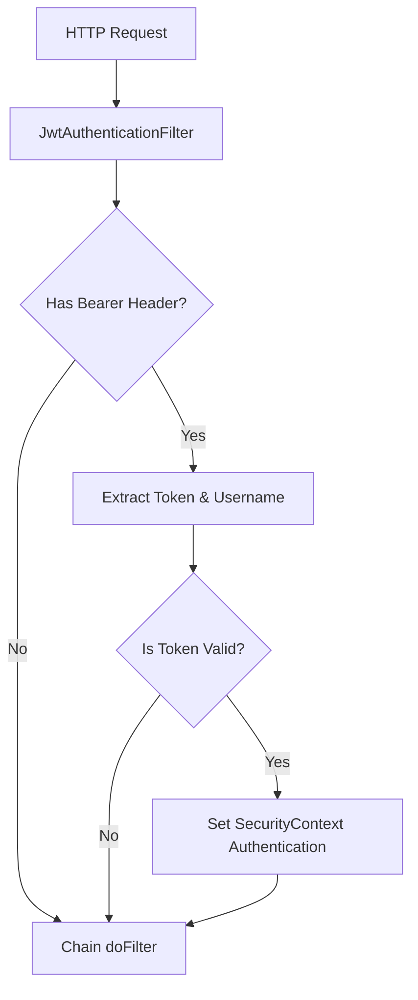
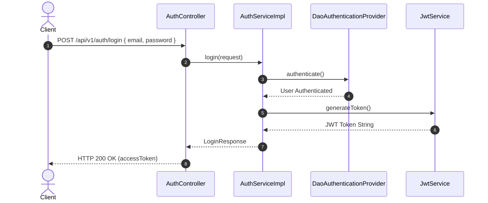
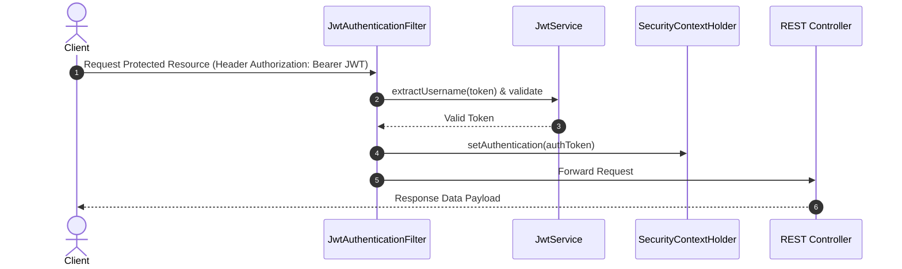

# AmazonScale Security Architecture Specification

---

## Related Documentation

- [Documentation Index](README.md)
- [Architecture Overview](Architecture.md)
- [Database Schema Specification](Database-Schema.md)
- [REST API Specification](API-Design.md)
- [Security Recommendations](recommendations/Security-Recommendations.md)

---

# Overview

### Purpose
The Security module manages authentication, identity verification, authorization, and endpoint protection for the AmazonScale platform.

### Security Goals
1. **Stateless Identity Verification**: Authenticate API consumers on every request using cryptographically signed JSON Web Tokens (JWT) without maintaining HTTP sessions.
2. **Robust Password Hashing**: Protect stored user passwords using adaptive BCrypt key stretching.
3. **Least Privilege Authorization**: Enforce authenticated identity checks across domain endpoints.

### Authentication Strategy
Authentication relies on standard OAuth 2.0 / RFC 6750 HTTP `Authorization: Bearer <token>` headers. The API issues signed HMAC-SHA256 tokens upon successful user credential verification (`/api/v1/auth/login`).

### Authorization Strategy
Access decisions are enforced by Spring Security filter chains. Requests to non-permitted URIs require a valid JWT token. Permitted public URIs are restricted exclusively to identity creation, credential authentication, and OpenAPI documentation endpoints.

---

# Security Architecture

---

# Authentication

### Login Flow
1. Client submits email and raw password to `POST /api/v1/auth/login`.
2. `AuthServiceImpl` delegates to `AuthenticationManager.authenticate()`.
3. `DaoAuthenticationProvider` retrieves user credentials via `CustomUserDetailsService`.
4. `BCryptPasswordEncoder` verifies password hash match.
5. `JwtService.generateToken()` constructs signed access token.
6. API returns token payload (`LoginResponse`) to client.

### Credential Validation
Inputs are validated at the controller boundary using `@Valid`. Passwords must satisfy string length constraints (`8-100` characters).

### UserDetailsService
`CustomUserDetailsService` loads `User` entities by email from `UserRepository`. Returns `CustomUserDetails` implementing Spring Security `UserDetails`.

### Password Encoding
Raw passwords are hashed using `BCryptPasswordEncoder` before persistence. Raw plain-text passwords are never stored.

### JWT Generation
Tokens are generated using `io.jsonwebtoken` JJWT library, signed with HMAC-SHA256, containing `subject` (user email), `issuedAt`, and `expiration`.

### AuthenticationManager
Configured via `AuthenticationConfiguration.getAuthenticationManager()`.

---

# Authorization

### Role-Based Access
User roles are mapped via `Role` enum (`ADMIN`, `SELLER`, `CUSTOMER`).

### Granted Authorities
`CustomUserDetails.getAuthorities()` maps the user role into a `SimpleGrantedAuthority` (e.g. `ROLE_CUSTOMER`, `ROLE_ADMIN`, `ROLE_SELLER`).

### Protected Resources
All REST endpoints outside `/api/v1/auth/**` and OpenAPI paths require valid authentication credentials.

### Public Resources
Endpoints explicitly permitted in `SecurityConfig`:
- `/api/v1/auth/register`
- `/api/v1/auth/login`
- `/swagger-ui/**`
- `/swagger-ui.html`
- `/v3/api-docs/**`
- `/v3/api-docs.yaml`

### SecurityContext
`SecurityContextHolder` maintains the `Authentication` token for the duration of the request execution thread.

### Access Decisions
Handled automatically by `SecurityFilterChain` `authorizeHttpRequests` matchers.

---

# JWT

- **Token Creation**: Standard claims set: `sub` (email), `iat` (issued at), `exp` (expiration).
- **Claims**: Extracted via generic function resolvers in `JwtService`.
- **Expiration**: Configured via `${jwt.expiration}` in `application.yml` (default 24 hours).
- **Signing Algorithm**: HMAC SHA-256 (`io.jsonwebtoken.SignatureAlgorithm.HS256`).
- **Secret Key Usage**: Base64 decoded key converted via `Keys.hmacShaKeyFor()`.
- **Validation**: Verifies matching username and checks `expiration.after(new Date())`.
- **Token Parsing**: Uses `Jwts.parserBuilder()`.
- **Refresh Tokens**: Not implemented.

---

# Spring Security Configuration

- **SecurityFilterChain**: Configured via `http.csrf().disable()`, `sessionCreationPolicy(STATELESS)`, `addFilterBefore(JwtAuthenticationFilter, UsernamePasswordAuthenticationFilter.class)`.
- **AuthenticationProvider**: `DaoAuthenticationProvider` configured with `CustomUserDetailsService` and `BCryptPasswordEncoder`.
- **PasswordEncoder**: `BCryptPasswordEncoder` bean declared in `SecurityBeansConfig`.
- **AuthenticationEntryPoint**: Not implemented.
- **Session Policy**: `SessionCreationPolicy.STATELESS`.
- **CSRF**: Disabled for stateless API security.
- **CORS**: Not explicitly configured in `SecurityConfig`.
- **Headers**: Standard Spring Security response headers.

---

# Security Filters

### `JwtAuthenticationFilter`
- **Purpose**: Intercepts every incoming HTTP request (`OncePerRequestFilter`).
- **Execution Order**: Precedes `UsernamePasswordAuthenticationFilter`.
- **Responsibilities**:
  1. Inspects `Authorization` header.
  2. Extracts Bearer token string.
  3. Parses username from token.
  4. Validates token signature and expiration.
  5. Instantiates `UsernamePasswordAuthenticationToken` and sets `SecurityContextHolder`.
  6. Passes execution along `filterChain.doFilter()`.

---

# Protected Endpoints

| HTTP Method | URI Path | Required Authentication | Required Role | Controller |
|-------------|----------|-------------------------|---------------|------------|
| `POST` | `/api/v1/products` | Bearer JWT | Authenticated | `ProductController` |
| `GET` | `/api/v1/products/{id}` | Bearer JWT | Authenticated | `ProductController` |
| `GET` | `/api/v1/products` | Bearer JWT | Authenticated | `ProductController` |
| `PUT` | `/api/v1/products/{id}` | Bearer JWT | Authenticated | `ProductController` |
| `DELETE` | `/api/v1/products/{id}` | Bearer JWT | Authenticated | `ProductController` |
| `POST` | `/api/v1/inventory` | Bearer JWT | Authenticated | `InventoryController` |
| `GET` | `/api/v1/inventory/{id}` | Bearer JWT | Authenticated | `InventoryController` |
| `GET` | `/api/v1/inventory` | Bearer JWT | Authenticated | `InventoryController` |
| `GET` | `/api/v1/inventory/product/{productId}` | Bearer JWT | Authenticated | `InventoryController` |
| `PUT` | `/api/v1/inventory/{id}` | Bearer JWT | Authenticated | `InventoryController` |
| `DELETE` | `/api/v1/inventory/{id}` | Bearer JWT | Authenticated | `InventoryController` |
| `POST` | `/api/v1/categories` | Bearer JWT | Authenticated | `CategoryController` |
| `GET` | `/api/v1/categories/{id}` | Bearer JWT | Authenticated | `CategoryController` |
| `GET` | `/api/v1/categories` | Bearer JWT | Authenticated | `CategoryController` |
| `PUT` | `/api/v1/categories/{id}` | Bearer JWT | Authenticated | `CategoryController` |
| `DELETE` | `/api/v1/categories/{id}` | Bearer JWT | Authenticated | `CategoryController` |
| `GET` | `/api/v1/cart` | Bearer JWT | Authenticated | `CartController` |
| `POST` | `/api/v1/cart/items` | Bearer JWT | Authenticated | `CartController` |
| `PUT` | `/api/v1/cart/items/{itemId}` | Bearer JWT | Authenticated | `CartController` |
| `DELETE` | `/api/v1/cart/items/{itemId}` | Bearer JWT | Authenticated | `CartController` |
| `DELETE` | `/api/v1/cart` | Bearer JWT | Authenticated | `CartController` |
| `POST` | `/api/v1/orders` | Bearer JWT | Authenticated | `OrderController` |
| `GET` | `/api/v1/orders/{id}` | Bearer JWT | Authenticated | `OrderController` |
| `GET` | `/api/v1/orders/user/{userId}` | Bearer JWT | Authenticated | `OrderController` |
| `POST` | `/api/v1/orders/{id}/cancel` | Bearer JWT | Authenticated | `OrderController` |
| `PUT` | `/api/v1/orders/{id}/status` | Bearer JWT | Authenticated | `OrderController` |
| `POST` | `/api/v1/payments/process` | Bearer JWT + `X-User-Id` | Authenticated | `PaymentController` |
| `GET` | `/api/v1/payments/{id}` | Bearer JWT + `X-User-Id` | Authenticated | `PaymentController` |
| `GET` | `/api/v1/payments/order/{orderId}` | Bearer JWT + `X-User-Id` | Authenticated | `PaymentController` |
| `POST` | `/api/v1/payments/{id}/refund` | Bearer JWT + `X-User-Id` | Authenticated | `PaymentController` |
| `POST` | `/api/v1/wishlists` | Bearer JWT | Authenticated | `WishlistController` |
| `GET` | `/api/v1/wishlists` | Bearer JWT | Authenticated | `WishlistController` |
| `GET` | `/api/v1/wishlists/{id}` | Bearer JWT | Authenticated | `WishlistController` |
| `PUT` | `/api/v1/wishlists/{id}` | Bearer JWT | Authenticated | `WishlistController` |
| `DELETE` | `/api/v1/wishlists/{id}` | Bearer JWT | Authenticated | `WishlistController` |
| `POST` | `/api/v1/wishlists/{id}/items` | Bearer JWT | Authenticated | `WishlistController` |
| `DELETE` | `/api/v1/wishlists/items/{itemId}` | Bearer JWT | Authenticated | `WishlistController` |

---

# Public Endpoints

| HTTP Method | URI Path | Description / Reason for Exemption |
|-------------|----------|-----------------------------------|
| `POST` | `/api/v1/auth/register` | Identity registration (public account creation) |
| `POST` | `/api/v1/auth/login` | Authentication credential exchange for JWT access token |
| `GET` | `/swagger-ui/**` | Interactive OpenAPI documentation portal |
| `GET` | `/v3/api-docs/**` | OpenAPI JSON schema specification endpoints |

---

# User Authentication Flow

---

# Request Authorization Flow

---

# Password Security

- **Hashing Algorithm**: BCrypt Key Derivation Function.
- **Password Encoder**: `BCryptPasswordEncoder` initialized with default strength (10 rounds).
- **Password Storage**: Encrypted hash strings stored in `users.password` database column.

---

# Exception Handling

- **Authentication Failures**: Intercepted by `DaoAuthenticationProvider`, producing `BadCredentialsException` or `UsernameNotFoundException` -> HTTP 401 Unauthorized.
- **Expired / Invalid Tokens**: Caught in `JwtAuthenticationFilter` try-catch block, continuing execution unauthenticated -> rejected with HTTP 401.
- **Access Denied**: Handled by Spring Security framework.
- **Global Exception Handling**: Custom exceptions mapped by `GlobalExceptionHandler`.

---

# Security Best Practices

- **BCrypt Hashing**: Implemented.
- **Stateless Session Policy**: Implemented.
- **CSRF Protection Disabled**: Implemented for stateless APIs.
- **Bearer Token RFC 6750 Header Format**: Implemented.
- **OAuth2 Server / OIDC**: Not implemented.
- **MFA / 2FA**: Not implemented.
- **Rate Limiting**: Not implemented.

---

# Known Limitations

1. **Method Security Disabled**: `@EnableMethodSecurity` is omitted from `SecurityConfig`.
2. **No Refresh Token Flow**: Access tokens must be renewed via login upon expiration.
3. **Payment User ID Header**: Payment operations rely on custom `X-User-Id` headers.

---

# Future Improvements

Refer to security recommendations for implementation blueprints:

- [Security Recommendations](recommendations/Security-Recommendations.md)
