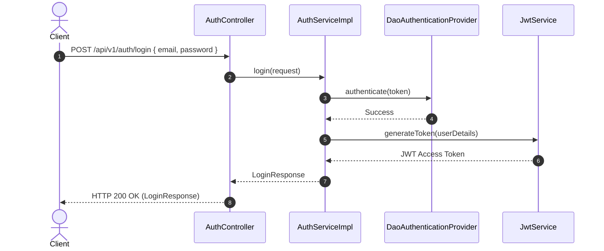
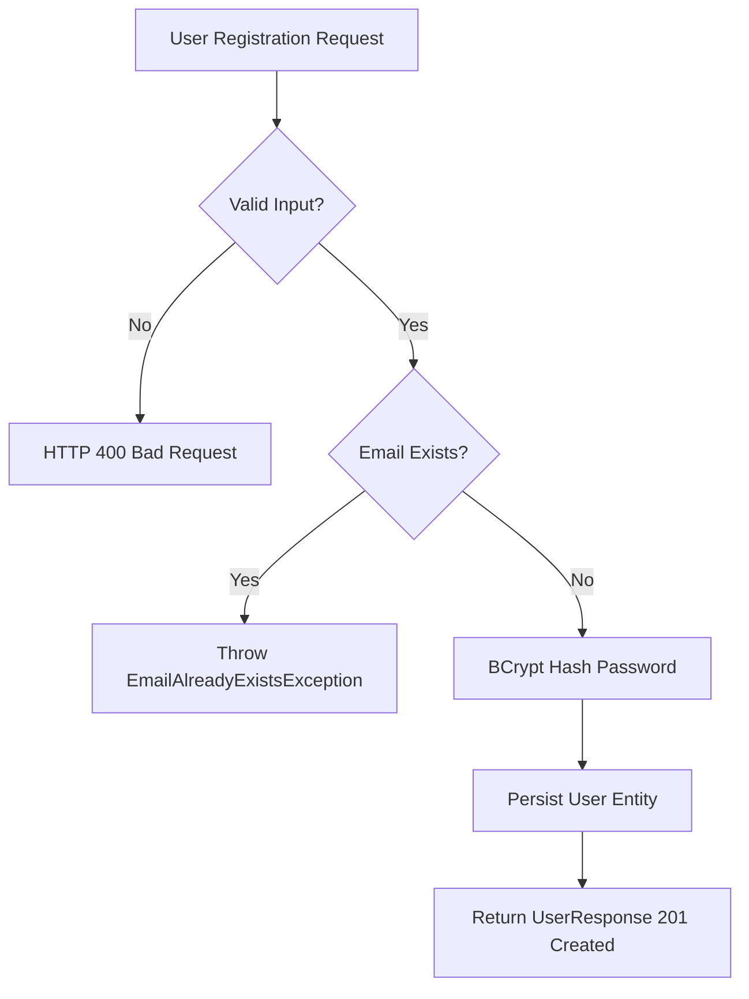

# User Module Specification

---

## 1. Overview
The **User Module** handles user identity management, account registration, BCrypt credential hashing, role definitions, and authentication payload exchange for the **AmazonScale** e-commerce platform.

---

## 2. Purpose
Provides core identity services required for client authentication, authorization enforcement, and entity association (ownership of products, carts, orders, payments, and wishlists).

---

## 3. Architecture
The User module follows the package-by-feature model, isolating user controllers, services, repositories, entities, DTOs, mappers, and exceptions inside `com.amazonscale.user`.

---

## 4. Package Structure
```
com.amazonscale.user
├── controller
│   ├── AuthController.java
│   └── UserController.java
├── dto
│   ├── LoginRequest.java
│   ├── LoginResponse.java
│   ├── UserRequest.java
│   └── UserResponse.java
├── entity
│   └── User.java
├── enums
│   └── Role.java
├── exception
│   ├── EmailAlreadyExistsException.java
│   └── UserNotFoundException.java
├── mapper
│   └── UserMapper.java
├── repository
│   └── UserRepository.java
└── service
    ├── AuthService.java
    ├── UserService.java
    └── impl
        ├── AuthServiceImpl.java
        └── UserServiceImpl.java
```

---

## 5. Components
- **`UserController`**: Handles account registration endpoint (`POST /api/v1/auth/register`).
- **`AuthController`**: Handles login credential verification endpoint (`POST /api/v1/auth/login`).
- **`UserServiceImpl`**: Encapsulates user registration logic, duplicate email checks, and BCrypt encoding.
- **`AuthServiceImpl`**: Delegates credential authentication to `AuthenticationManager` and issues JWT tokens.
- **`UserRepository`**: JPA repository interface for `users` table queries.
- **`UserMapper`**: Converts `UserRequest` to `User` entity and `User` entity to `UserResponse`.

---

## 6. Database Design
- **Table Name**: `users`
- **Primary Key**: `id` (`BIGINT`, Auto-Increment)
- **Columns**:
  - `id` BIGINT AUTO_INCREMENT PRIMARY KEY
  - `first_name` VARCHAR(50) NOT NULL
  - `last_name` VARCHAR(50) NOT NULL
  - `email` VARCHAR(100) NOT NULL UNIQUE
  - `password` VARCHAR(255) NOT NULL
  - `role` VARCHAR(20) NOT NULL
  - `enabled` BOOLEAN NOT NULL DEFAULT TRUE
  - `created_at` DATETIME NOT NULL
  - `updated_at` DATETIME NOT NULL

---

## 7. Entity Relationships
- `User` 1:1 `Cart` (`mappedBy = "user"`)
- `User` 1:N `Order` (`mappedBy = "user"`)
- `User` 1:N `Product` (`mappedBy = "seller"`)
- `User` 1:N `Wishlist` (`mappedBy = "user"`)

---

## 8. DTOs
- **`UserRequest`**: Registration payload (`firstName`, `lastName`, `email`, `password`).
- **`UserResponse`**: Safe public profile response (`id`, `firstName`, `lastName`, `email`, `role`, `enabled`, `createdAt`).
- **`LoginRequest`**: Authentication payload (`email`, `password`).
- **`LoginResponse`**: Access token response (`accessToken`, `tokenType`).

---

## 9. Repository Layer
- **`UserRepository`**: Extends `JpaRepository<User, Long>`.
  - `Optional<User> findByEmail(String email)`
  - `boolean existsByEmail(String email)`

---

## 10. Service Layer
- **`UserService`**: `UserResponse register(UserRequest request)`
- **`AuthService`**: `LoginResponse login(LoginRequest request)`

---

## 11. Controller Layer
- `POST /api/v1/auth/register` -> `UserController.register()` -> HTTP `201 Created`
- `POST /api/v1/auth/login` -> `AuthController.login()` -> HTTP `200 OK`

---

## 12. Business Rules
1. **Email Uniqueness**: User registration rejects duplicate email addresses (`EmailAlreadyExistsException`).
2. **Default Role**: Newly registered users are assigned `Role.CUSTOMER` by default.
3. **Password Security**: Raw passwords are hashed using `BCryptPasswordEncoder` prior to database insertion.
4. **Soft Account State**: `enabled = true` by default to support soft account disabling without removing transaction history.

---

## 13. Validation
- `email`: `@NotBlank`, `@Email`, max length 100.
- `password`: `@NotBlank`, `@Size(min = 8, max = 100)`.
- `firstName`: `@NotBlank`, max length 50.
- `lastName`: `@NotBlank`, max length 50.

---

## 14. Exception Handling
- `EmailAlreadyExistsException` -> Mapped by `GlobalExceptionHandler` to HTTP `400 Bad Request`.
- `UserNotFoundException` -> Mapped by `GlobalExceptionHandler` to HTTP `404 Not Found`.
- `BadCredentialsException` -> Mapped to HTTP `401 Unauthorized`.

---

## 15. Security
- Public endpoints: `/api/v1/auth/register`, `/api/v1/auth/login`.
- Authentication relies on Spring Security `DaoAuthenticationProvider` and `CustomUserDetailsService`.

---

## 16. API Reference

### `POST /api/v1/auth/register`
- **Request**: `UserRequest`
- **Response**: `201 Created` (`UserResponse`)

### `POST /api/v1/auth/login`
- **Request**: `LoginRequest`
- **Response**: `200 OK` (`LoginResponse`)

---

## 17. Request Flow
HTTP Client Request -> Controller `@Valid` DTO Check -> Service Logic -> UserRepository DB Execution -> Mapper Entity-to-DTO Conversion -> HTTP Response Payload.

---

## 18. Sequence Diagram



---

## 19. Mermaid Diagrams



---

## 20. Testing Overview
Covered by JUnit 5 and Mockito unit tests in `src/test/java/com/amazonscale/user`:
- `UserServiceImplTest`: Validates registration, duplicate email rejection, BCrypt hashing.
- `AuthServiceImplTest`: Verifies authentication credential handling and JWT issue.
- `UserControllerTest` & `AuthControllerTest`: Validates MockMvc endpoint contracts.

---

## 21. Known Limitations
1. Hardcoded customer role assignment on registration.
2. Lack of self-service user profile management endpoints (`GET /api/v1/users/me`).

---

## 22. Future Improvements
Refer to user module technical recommendations:
- [User Recommendations](recommendations/User-Recommendations.md)

---

## 23. References
- [Architecture Documentation](Architecture.md)
- [Security Documentation](Security.md)
- [Database Documentation](Database-Schema.md)
