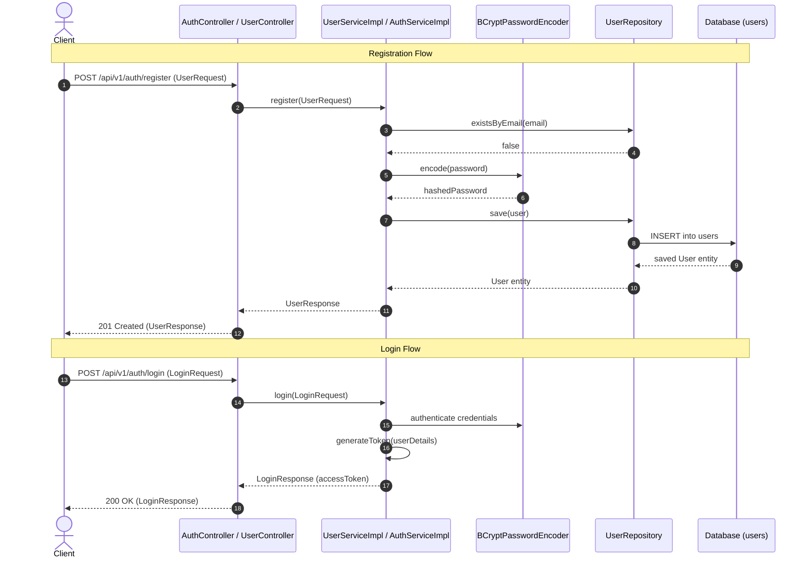

# User Module

---

## Related Documentation

- [Documentation Index](README.md)
- [Architecture Overview](Architecture.md)
- [Security Architecture](Security.md)
- [Database Schema Specification](Database-Schema.md)
- [REST API Specification](API-Design.md)

---

## Overview

The User module manages identity, registration, and authentication for the AmazonScale e-commerce platform. It provides public endpoints for user registration and JWT-based authentication, manages user roles (`ADMIN`, `SELLER`, `CUSTOMER`), and enforces BCrypt password hashing.

**Package root:** `com.amazonscale.user`

---

## Features

- **User Registration**: Register new user accounts with email uniqueness check and BCrypt password encryption (`POST /api/v1/auth/register`).
- **User Authentication (Login)**: Authenticate user credentials and issue JWT bearer tokens (`POST /api/v1/auth/login`).
- **Role Assignment**: Supports user roles (`ADMIN`, `SELLER`, `CUSTOMER`), defaulting new self-registrations to `CUSTOMER`.
- **Soft Enablement**: Tracks account active status (`enabled = true`) to preserve historical user data on account deactivation.
- **Automatic Timestamping**: Entity creation and update timestamps managed via `@PrePersist` and `@PreUpdate` callbacks.

---

## Architecture

```
Client
  │
  │ HTTP Requests (Public Auth Endpoints)
  v
AuthController / UserController   (@RestController, @RequestMapping("/api/v1/auth"))
  │
  ├── Login ───> AuthService / AuthServiceImpl ──> AuthenticationManager + JwtService ──> JWT Token
  │
  └── Register ─> UserService / UserServiceImpl ──> PasswordEncoder + UserRepository ───> Saved User
  │
  v
Database (users table)
```

---

## Package Structure

```
com.amazonscale.user
├── controller
│   ├── AuthController.java                  REST endpoint for authentication (login)
│   └── UserController.java                  REST endpoint for registration
├── dto
│   ├── LoginRequest.java                    Inbound DTO for user login credentials
│   ├── LoginResponse.java                   Outbound DTO containing JWT bearer token
│   ├── UserRequest.java                     Inbound DTO for user registration
│   └── UserResponse.java                    Outbound DTO for user account details
├── entity
│   └── User.java                            JPA entity for user account
├── enums
│   └── Role.java                            Enum representing user authorization roles
├── exception
│   ├── EmailAlreadyExistsException.java     Thrown on registration with existing email
│   └── UserNotFoundException.java          Thrown when user ID is not found
├── mapper
│   └── UserMapper.java                      Utility mapper for entity-DTO conversion
├── repository
│   └── UserRepository.java                  Spring Data JPA repository for users
└── service
    ├── AuthService.java                     Authentication service interface
    ├── UserService.java                     User service interface
    └── impl
        ├── AuthServiceImpl.java             Authentication service implementation
        └── UserServiceImpl.java             User service implementation
```

---

## Entities

### User

**Purpose:** Core identity entity representing platform users.

**Table:** `users`

| Field | Type | Constraints | Description |
|-------|------|-------------|-------------|
| `id` | `Long` | `@Id`, `@GeneratedValue(IDENTITY)` | Primary key |
| `firstName` | `String` | `nullable = false, length = 50` | User's first name |
| `lastName` | `String` | `nullable = false, length = 50` | User's last name |
| `email` | `String` | `nullable = false, unique = true, length = 100` | Unique email address (login credential) |
| `password` | `String` | `nullable = false, length = 255` | BCrypt encrypted password hash |
| `role` | `Role` | `@Enumerated(STRING)`, `nullable = false` | Assigned user role |
| `enabled` | `boolean` | `nullable = false`, default `true` | Account active flag |
| `createdAt` | `LocalDateTime` | `nullable = false, updatable = false` | Account creation timestamp |
| `updatedAt` | `LocalDateTime` | `nullable = false` | Account update timestamp |

**Lifecycle Callbacks:**
- `@PrePersist onCreate()`: Sets `createdAt` and `updatedAt` to `LocalDateTime.now()`.
- `@PreUpdate onUpdate()`: Sets `updatedAt` to `LocalDateTime.now()`.

---

## Enums

### Role

Enum defining authorization levels:

| Role Value | Description |
|------------|-------------|
| `ADMIN` | Platform administrator with elevated permissions |
| `SELLER` | Merchant/seller account managing products and inventory |
| `CUSTOMER` | Regular buyer account (default assigned role) |

---

## DTOs

### UserRequest

**Purpose:** Payload for registering a new user account.

| Field | Type | Constraints | Description |
|-------|------|-------------|-------------|
| `firstName` | `String` | `@NotBlank(message = "First name is required")`, `@Size(max = 50)` | First name |
| `lastName` | `String` | `@NotBlank(message = "Last name is required")`, `@Size(max = 50)` | Last name |
| `email` | `String` | `@NotBlank`, `@Email(message = "Invalid email format")`, `@Size(max = 100)` | Unique email address |
| `password` | `String` | `@NotBlank`, `@Size(min = 8, max = 100)` | Plain-text password (hashed by service) |
| `role` | `Role` | None | Requested role (overridden to `CUSTOMER` by service) |

**Used by:** `POST /api/v1/auth/register`

---

### UserResponse

**Purpose:** Response body returned after successful user registration.

| Field | Type | Description |
|-------|------|-------------|
| `id` | `Long` | User ID |
| `firstName` | `String` | First name |
| `lastName` | `String` | Last name |
| `email` | `String` | Registered email |
| `role` | `Role` | Assigned role |
| `enabled` | `boolean` | Account active status |
| `createdAt` | `LocalDateTime` | Registration timestamp |

---

### LoginRequest

**Purpose:** Payload for user login authentication.

| Field | Type | Constraints | Description |
|-------|------|-------------|-------------|
| `email` | `String` | `@NotBlank(message = "Email is required")`, `@Email` | User email address |
| `password` | `String` | `@NotBlank(message = "Password is required")` | Plain-text password |

**Used by:** `POST /api/v1/auth/login`

---

### LoginResponse

**Purpose:** Response body containing issued JWT access token.

| Field | Type | Description |
|-------|------|-------------|
| `accessToken` | `String` | Signed JWT bearer token |
| `tokenType` | `String` | Authorization scheme (`"Bearer"`) |

---

## Repository Layer

### UserRepository

Extends `JpaRepository<User, Long>`.

| Method | Purpose | Used By |
|--------|---------|---------|
| `findByEmail(String email)` | Fetches user entity record by unique email address | `CustomUserDetailsService.loadUserByUsername`, `AuthServiceImpl.login` |
| `existsByEmail(String email)` | Checks whether an email address is already registered in system | `UserServiceImpl.register` |

---

## Mapper Layer

### UserMapper

Stateless utility class with private constructor throwing `UnsupportedOperationException`.

#### `toEntity(UserRequest request) -> User`
- Maps `firstName`, `lastName`, `email`, `password`, `role`.

#### `toResponse(User user) -> UserResponse`
- Maps `id`, `firstName`, `lastName`, `email`, `role`, `enabled`, `createdAt`.

---

## Service Layer

### UserService (Interface)

- `register(UserRequest request) -> UserResponse`

### UserServiceImpl

Annotated `@Service`, `@Builder`. Constructor-injected with `UserRepository` and `PasswordEncoder`.

#### `register(UserRequest request) -> UserResponse`
1. Checks if email exists via `userRepository.existsByEmail(request.getEmail())` (throws `EmailAlreadyExistsException` if exists).
2. Converts request DTO to `User` entity via `UserMapper.toEntity`.
3. Encrypts plain-text password: `user.setPassword(passwordEncoder.encode(request.getPassword()))`.
4. Overrides role to `Role.CUSTOMER`: `user.setRole(Role.CUSTOMER)`.
5. Saves user entity to database via `userRepository.save`.
6. Returns mapped `UserResponse`.

---

### AuthService (Interface)

- `login(LoginRequest request) -> LoginResponse`

### AuthServiceImpl

Annotated `@Service`, `@Builder`. Constructor-injected with `AuthenticationManager` and `JwtService`.

#### `login(LoginRequest request) -> LoginResponse`
1. Authenticates credentials: `authenticationManager.authenticate(new UsernamePasswordAuthenticationToken(email, password))`.
2. Extracts principal as `CustomUserDetails`: `(CustomUserDetails) authentication.getPrincipal()`.
3. Generates signed JWT token: `jwtService.generateToken(userDetails)`.
4. Returns `new LoginResponse(token, "Bearer")`.

---

## Controller Layer

### UserController

`@RestController` mapped to `/api/v1/auth`.

| HTTP Method | Endpoint | Description | Request Body | Status Code | Response Body |
|-------------|----------|-------------|--------------|-------------|---------------|
| `POST` | `/api/v1/auth/register` | Register new user account | `@Valid UserRequest` | `201 Created` | `UserResponse` |

---

### AuthController

`@RestController` mapped to `/api/v1/auth`.

| HTTP Method | Endpoint | Description | Request Body | Status Code | Response Body |
|-------------|----------|-------------|--------------|-------------|---------------|
| `POST` | `/api/v1/auth/login` | Authenticate user & issue JWT | `@Valid LoginRequest` | `200 OK` | `LoginResponse` |

---

## Business Rules

| Rule | Description | Enforcement Location |
|------|-------------|----------------------|
| **Unique Email Requirement** | Email must be unique across all user accounts | `UserServiceImpl.register` & DB constraint |
| **Password Encryption** | Passwords must be hashed using BCrypt before persistence | `UserServiceImpl.register` |
| **Default Customer Role** | Public registrations are automatically assigned `Role.CUSTOMER` | `UserServiceImpl.register` |
| **Soft Enablement** | Accounts default to `enabled = true` to preserve user history upon deactivation | `User.enabled` default value |
| **Bearer Token Standard** | Authentication returns a JWT token with `"Bearer"` type | `AuthServiceImpl.login` |

---

## Validation Rules

### DTO Level
- `UserRequest`:
  - `firstName`: `@NotBlank(message = "First name is required")`, `@Size(max = 50)`
  - `lastName`: `@NotBlank(message = "Last name is required")`, `@Size(max = 50)`
  - `email`: `@NotBlank(message = "Email is required")`, `@Email(message = "Invalid email format")`, `@Size(max = 100)`
  - `password`: `@NotBlank(message = "Password is required")`, `@Size(min = 8, max = 100)`
- `LoginRequest`:
  - `email`: `@NotBlank(message = "Email is required")`, `@Email(message = "Invalid email")`
  - `password`: `@NotBlank(message = "Password is required")`

---

## Exception Handling

| Exception | HTTP Status | Thrown When | Handler |
|-----------|-------------|-------------|---------|
| `EmailAlreadyExistsException` | `409 CONFLICT` | Email already exists during registration | `GlobalExceptionHandler` |
| `UserNotFoundException` | `404 NOT_FOUND` | User ID is not found | `GlobalExceptionHandler` |
| `BadCredentialsException` | `401 UNAUTHORIZED` | Invalid email or password during login | `Spring Security` / `GlobalExceptionHandler` |

---

## Security

- **Public Endpoints**: `/api/v1/auth/**` endpoints are permitted without authentication in `SecurityConfig`.
- **JWT Generation**: Integrates with `JwtService` to sign tokens carrying user identity claims.
- **Security Context**: Integrates with `CustomUserDetails` via `AuthenticationManager`.

---

## Request Lifecycle

End-to-end execution flow for User Registration and Authentication requests:

```
Client
   ↓
JWT Filter (Permits /api/v1/auth/** without token check)
   ↓
Controller (UserController / AuthController receiving @Valid request payload)
   ↓
Validation (JSR-303 annotations check field constraints & throw on violation)
   ↓
Service (UserServiceImpl / AuthServiceImpl executing business logic)
   ↓
Mapper (UserMapper converting DTO to Entity or Entity to Response)
   ↓
Repository (UserRepository querying or inserting record via Spring Data JPA)
   ↓
Database (PostgreSQL / MySQL users table persistence)
   ↓
Response (201 Created with UserResponse OR 200 OK with LoginResponse JWT)
```

---

## Database Design

### Table: `users`

```sql
CREATE TABLE users (
    id BIGINT AUTO_INCREMENT PRIMARY KEY,
    first_name VARCHAR(50) NOT NULL,
    last_name VARCHAR(50) NOT NULL,
    email VARCHAR(100) NOT NULL UNIQUE,
    password VARCHAR(255) NOT NULL,
    role VARCHAR(255) NOT NULL,
    enabled BOOLEAN NOT NULL DEFAULT TRUE,
    created_at DATETIME NOT NULL,
    updated_at DATETIME NOT NULL
);
```

---

## Testing

**Test Suite Coverage Summary:** 13 test classes in `src/test/java/com/amazonscale/user` (573 total lines of code):

| Component | Test Class | Coverage Description |
|-----------|------------|----------------------|
| **Controllers** | `UserControllerTest`, `AuthControllerTest` | MockMvc integration tests for registration and login endpoints. |
| **Services** | `UserServiceImplTest`, `AuthServiceImplTest` | Unit tests for user registration, BCrypt encoding, email duplicate checks, authentication, and JWT token issuance. |
| **Mapper** | `UserMapperTest` | DTO-entity conversion tests and utility class enforcement test. |
| **DTOs** | `UserRequestTest`, `UserResponseTest`, `LoginRequestTest`, `LoginResponseTest` | Validation constraints, builder, and getter/setter tests. |
| **Entity & Enum** | `UserTest`, `RoleTest` | Entity builder, timestamp callback, and enum value tests. |
| **Exceptions** | `EmailAlreadyExistsExceptionTest`, `UserNotFoundExceptionTest` | Exception message assertion tests. |

### Test Type Status

| Test Type | Status |
|-----------|--------|
| DTO Tests | ✅ |
| Mapper Tests | ✅ |
| Service Tests | ✅ |
| Controller Tests | ✅ |
| Repository Tests | ✅ |
| Exception Tests | ✅ |

---

## Sequence Diagram

### Registration and Login Flows



---

## Module Dependencies

### Direct Dependencies
- **Security Module**: Uses `JwtService`, `CustomUserDetails`, `PasswordEncoder`, and `AuthenticationManager`.
- **Common Module**: Uses `GlobalExceptionHandler` and `ErrorResponse`.

### Downstream Consumers
- **Cart Module**: `Cart` entity links to `User`.
- **Order Module**: `Order` entity links to `User`.
- **Payment Module**: Passes `X-User-Id` for payment processing.

---

## Design Decisions

- **Why DTOs are used**: Isolates domain entities from client API contracts. Prevents raw password hashes or internal entity fields from leaking into JSON HTTP responses, and protects against mass-assignment vulnerabilities.
- **Why static mappers**: `UserMapper` uses stateless static utility methods to convert between DTOs and entities with minimal overhead, avoiding Spring bean lifecycle management and runtime reflection costs.
- **Why @Transactional**: Ensures database integrity during user registration, guaranteeing atomic transactions and automatically rolling back changes if an exception occurs.
- **Why lazy loading**: User relationships in downstream domain modules (such as Cart and Order) use `FetchType.LAZY` to prevent loading full user entity graphs when only primary key references are required.
- **Why JWT**: Enables completely stateless authentication across all platform microservices, eliminating server-side session state and allowing application nodes to scale horizontally without session replication.
- **Why BCrypt**: Hashing plain-text passwords with `BCryptPasswordEncoder` incorporates automatic random salting and adaptable work factor iterations, protecting stored credentials against rainbow table and brute-force attacks.
- **Why package-by-feature**: Grouping code into `com.amazonscale.user` aggregates controllers, services, repositories, DTOs, and entities into a cohesive module, enhancing maintainability and enforcing domain encapsulation.

---

## Current Limitations

1. **No Profile Management APIs**: Lack of GET/PUT user profile endpoints (e.g. `GET /api/v1/users/me` or `PUT /api/v1/users/profile`).
2. **Hardcoded Customer Role**: `UserRequest.role` field is ignored on registration; all new accounts are assigned `Role.CUSTOMER`. No dedicated endpoint exists to register `SELLER` or `ADMIN` accounts.
3. **No Password Reset Workflow**: Missing password reset and change-password capabilities.
4. **Split Auth Controllers**: `UserController` and `AuthController` are separate classes but mapped to the exact same base path `/api/v1/auth`.
5. **Missing OpenAPI Annotations**: Lacks Swagger `@Tag` and `@Operation` annotations on `UserController` and `AuthController`.

---

## Future Enhancements

- **User Profile APIs**: Add profile retrieval and update endpoints (`GET /api/v1/users/me`, `PUT /api/v1/users/me`).
- **Admin User Management**: Add endpoints for administrators to manage users and modify roles (`GET /api/v1/users`, `PUT /api/v1/users/{id}/role`).
- **Password Reset & Change**: Add endpoints for password reset requests and password changes.
- **Controller Restructuring**: Consolidate authentication endpoints under `AuthController` and move user management endpoints to `UserController` at `/api/v1/users`.
- **Swagger Documentation**: Add OpenAPI annotations (`@Tag`, `@Operation`) for Auth endpoints.

