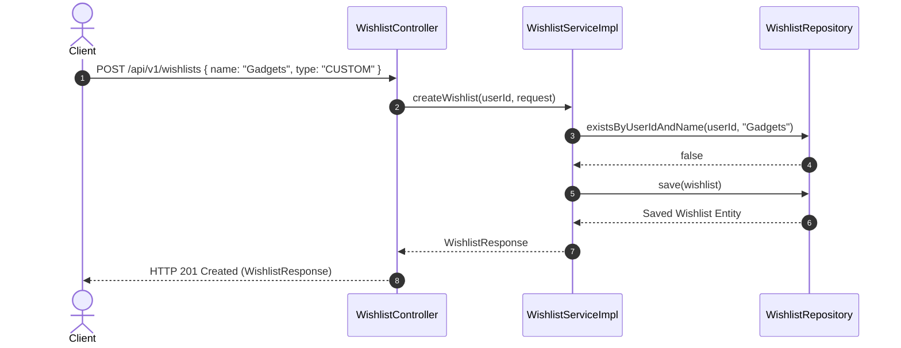
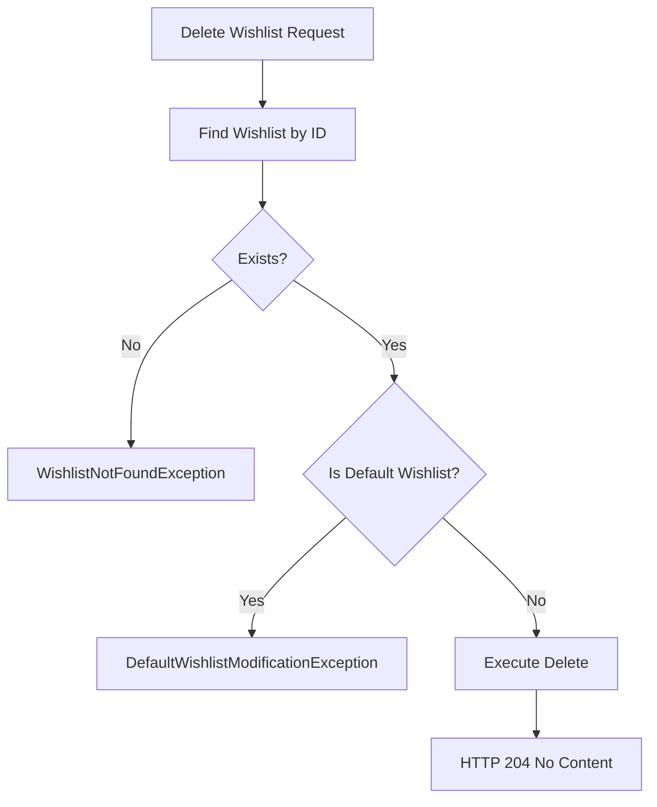

# Wishlist Module Specification

---

## 1. Overview
The **Wishlist Module** manages user-curated saved product lists, item priority levels, custom notes, default list rules, and wishlist item migrations for **AmazonScale**.

---

## 2. Purpose
Allows customers to save, organize, prioritize, and manage products for future purchasing.

---

## 3. Architecture
Located under `com.amazonscale.wishlists`, following standard package-by-feature layer structure.

---

## 4. Package Structure
```
com.amazonscale.wishlists
├── controller
│   └── WishlistController.java
├── dto
│   ├── request
│   │   ├── AddToWishlistRequest.java
│   │   ├── CreateWishlistRequest.java
│   │   ├── MoveWishlistItemRequest.java
│   │   └── UpdateWishlistRequest.java
│   └── response
│       ├── UserWishlistsResponse.java
│       ├── WishlistItemResponse.java
│       ├── WishlistResponse.java
│       └── WishlistSummaryResponse.java
├── entity
│   ├── Wishlist.java
│   └── WishlistItem.java
├── enums
│   ├── WishlistPriority.java
│   └── WishlistType.java
├── exception
│   ├── DefaultWishlistModificationException.java
│   ├── WishlistAlreadyExistsException.java
│   ├── WishlistItemAlreadyExistsException.java
│   ├── WishlistItemNotFoundException.java
│   └── WishlistNotFoundException.java
├── mapper
│   └── WishlistMapper.java
├── repository
│   ├── WishlistItemRepository.java
│   └── WishlistRepository.java
└── service
    ├── WishlistService.java
    └── impl
        └── WishlistServiceImpl.java
```

---

## 5. Components
- **`WishlistController`**: REST endpoint handler for `/api/v1/wishlists`.
- **`WishlistServiceImpl`**: Enforces default wishlist protection, duplicate item checks, and line migrations.
- **`WishlistRepository`**: Database access interface for `wishlists`.
- **`WishlistItemRepository`**: Database access interface for `wishlist_items`.
- **`WishlistMapper`**: Converts wishlist entities to response DTOs.

---

## 6. Database Design
- **Tables**: `wishlists`, `wishlist_items`
- **`wishlists` Columns**:
  - `id` BIGINT AUTO_INCREMENT PRIMARY KEY
  - `user_id` BIGINT NOT NULL
  - `name` VARCHAR(100) NOT NULL
  - `description` VARCHAR(500) NULL
  - `type` VARCHAR(20) NOT NULL
  - `is_default` BOOLEAN NOT NULL DEFAULT FALSE
  - `created_at` DATETIME NOT NULL
  - `updated_at` DATETIME NOT NULL
- **`wishlist_items` Columns**:
  - `id` BIGINT AUTO_INCREMENT PRIMARY KEY
  - `wishlist_id` BIGINT NOT NULL
  - `product_id` BIGINT NOT NULL
  - `note` VARCHAR(500) NULL
  - `priority` VARCHAR(20) NOT NULL DEFAULT 'MEDIUM'
  - `created_at` DATETIME NOT NULL
  - `updated_at` DATETIME NOT NULL
- **Indexes**: `uk_user_wishlist_name` (wishlists composite unique), `uk_wishlist_product` (wishlist_items composite unique)

---

## 7. Entity Relationships
- `Wishlist` N:1 `User` (`JoinColumn(name = "user_id")`)
- `Wishlist` 1:N `WishlistItem` (`mappedBy = "wishlist"`, `cascade = ALL`, `orphanRemoval = true`)
- `WishlistItem` N:1 `Product` (`JoinColumn(name = "product_id")`)

---

## 8. DTOs
- **`CreateWishlistRequest`**: `name`, `description`, `type`.
- **`UpdateWishlistRequest`**: `name`, `description`.
- **`AddToWishlistRequest`**: `productId`, `note`, `priority`.
- **`MoveWishlistItemRequest`**: `targetWishlistId`.
- **`WishlistResponse`**: `id`, `name`, `description`, `type`, `isDefault`, `items`, `itemCount`, `createdAt`, `updatedAt`.
- **`UserWishlistsResponse`**: `defaultWishlistId`, `wishlists`, `totalWishlists`.

---

## 9. Repository Layer
- **`WishlistRepository`**:
  - `List<Wishlist> findByUserId(Long userId)`
  - `Optional<Wishlist> findByUserIdAndIsDefaultTrue(Long userId)`
  - `boolean existsByUserIdAndName(Long userId, String name)`
- **`WishlistItemRepository`**:
  - `Optional<WishlistItem> findByWishlistIdAndProductId(Long wishlistId, Long productId)`

---

## 10. Service Layer
- **`WishlistService`**:
  - `WishlistResponse createWishlist(Long userId, CreateWishlistRequest request)`
  - `UserWishlistsResponse getUserWishlists(Long userId)`
  - `WishlistResponse getWishlistById(Long userId, Long wishlistId)`
  - `WishlistResponse updateWishlist(Long userId, Long wishlistId, UpdateWishlistRequest request)`
  - `void deleteWishlist(Long userId, Long wishlistId)`
  - `WishlistResponse addItemToWishlist(Long userId, Long wishlistId, AddToWishlistRequest request)`
  - `void removeItemFromWishlist(Long userId, Long itemId)`

---

## 11. Controller Layer
- `POST /api/v1/wishlists` -> `createWishlist()` -> HTTP `201 Created`
- `GET /api/v1/wishlists` -> `getUserWishlists()` -> HTTP `200 OK`
- `GET /api/v1/wishlists/{id}` -> `getWishlistById()` -> HTTP `200 OK`
- `PUT /api/v1/wishlists/{id}` -> `updateWishlist()` -> HTTP `200 OK`
- `DELETE /api/v1/wishlists/{id}` -> `deleteWishlist()` -> HTTP `204 No Content`
- `POST /api/v1/wishlists/{id}/items` -> `addItemToWishlist()` -> HTTP `200 OK`
- `DELETE /api/v1/wishlists/items/{itemId}` -> `removeItemFromWishlist()` -> HTTP `204 No Content`

---

## 12. Business Rules
1. **Default Wishlist Protection**: System automatically creates a default wishlist (`isDefault = true`). Default wishlists cannot be renamed or deleted (`DefaultWishlistModificationException`).
2. **Name Uniqueness**: A user cannot have two wishlists with identical names (`WishlistAlreadyExistsException`).
3. **Item Uniqueness**: A product can only appear once inside a given wishlist (`WishlistItemAlreadyExistsException`).

---

## 13. Validation
- `name`: `@NotBlank`, `@Size(max = 100)`.
- `productId`: `@NotNull`.
- `note`: `@Size(max = 500)`.

---

## 14. Exception Handling
- `WishlistNotFoundException` -> HTTP `404 Not Found`.
- `WishlistItemNotFoundException` -> HTTP `404 Not Found`.
- `WishlistAlreadyExistsException` -> HTTP `400 Bad Request`.
- `WishlistItemAlreadyExistsException` -> HTTP `400 Bad Request`.
- `DefaultWishlistModificationException` -> HTTP `400 Bad Request`.

---

## 15. Security
Authenticated via Spring Security JWT context. Access restricted to resource owner.

---

## 16. API Reference

### `POST /api/v1/wishlists`
- **Request**: `CreateWishlistRequest`
- **Response**: `201 Created` (`WishlistResponse`)

### `GET /api/v1/wishlists`
- **Response**: `200 OK` (`UserWishlistsResponse`)

### `GET /api/v1/wishlists/{id}`
- **Response**: `200 OK` (`WishlistResponse`)

### `POST /api/v1/wishlists/{id}/items`
- **Request**: `AddToWishlistRequest`
- **Response**: `200 OK` (`WishlistResponse`)

---

## 17. Request Flow
HTTP Request -> `WishlistController` -> `WishlistServiceImpl` (`@Transactional`) -> `WishlistRepository` -> `WishlistMapper` -> JSON Response.

---

## 18. Sequence Diagram



---

## 19. Mermaid Diagrams



---

## 20. Testing Overview
Tested via unit tests in `src/test/java/com/amazonscale/wishlists`:
- `WishlistServiceImplTest`: List creation, default protection, item additions, duplicate prevention.
- `WishlistControllerTest`: MockMvc REST tests.

---

## 21. Known Limitations
1. Wishlists cannot be shared publicly with non-owner users.

---

## 22. Future Improvements
See technical recommendations:
- [Wishlist Recommendations](recommendations/Wishlist-Recommendations.md)

---

## 23. References
- [Architecture Documentation](Architecture.md)
- [Database Schema Documentation](Database-Schema.md)